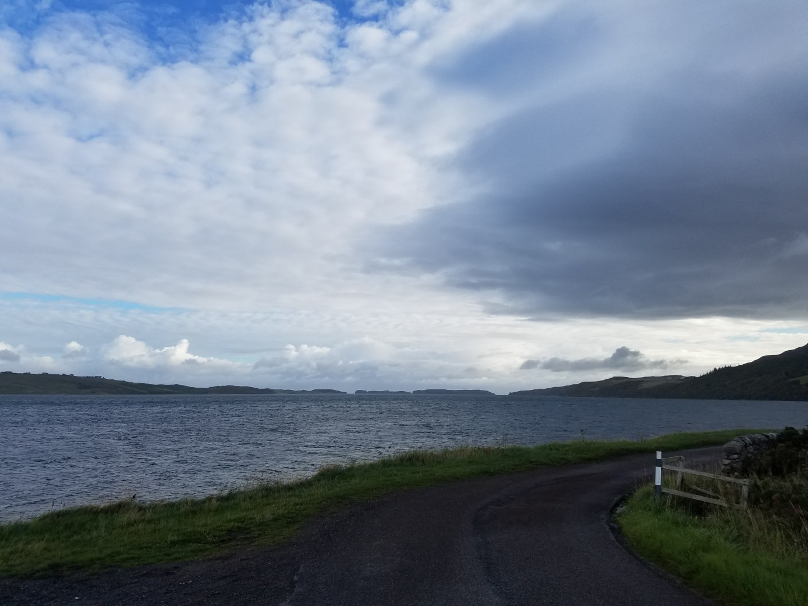
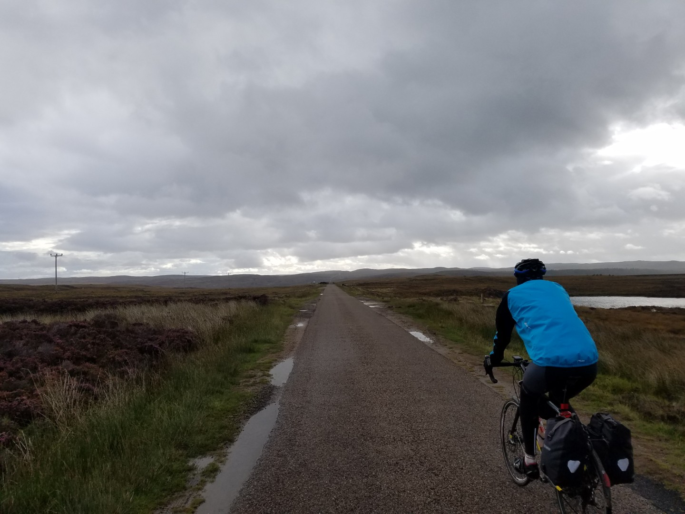
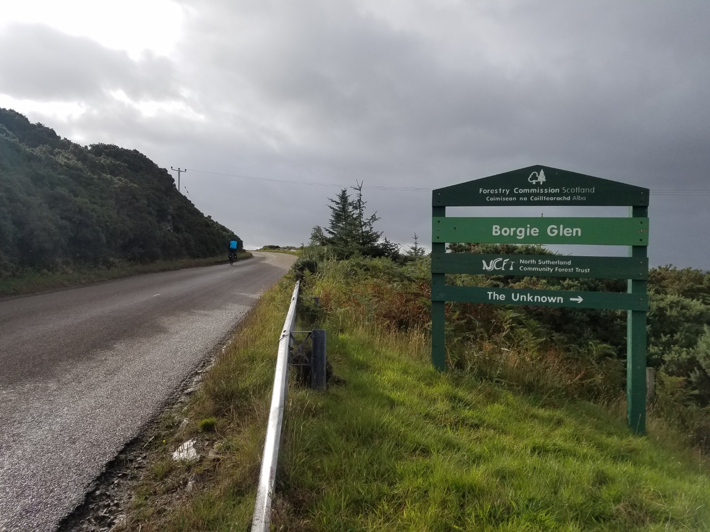
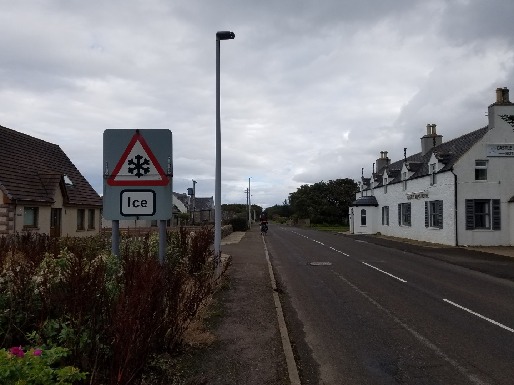
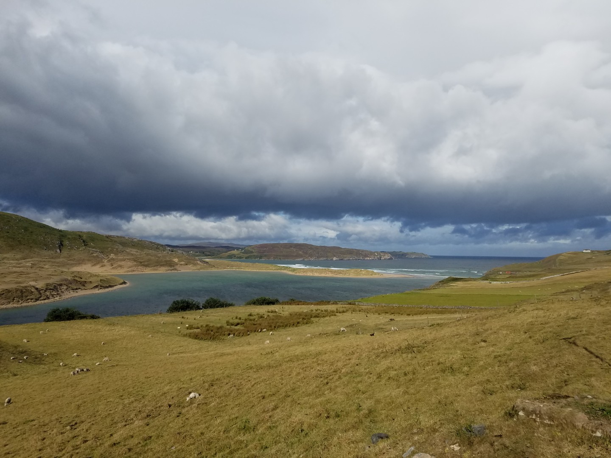
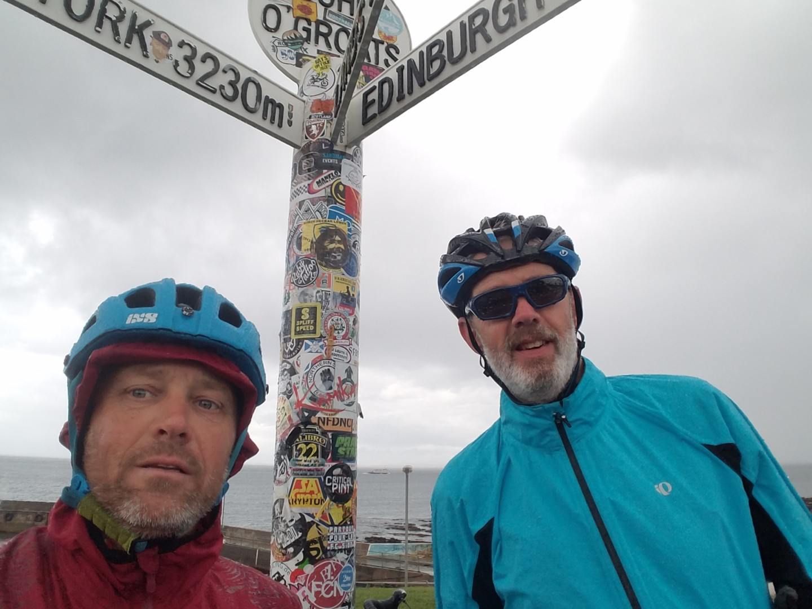

---
tags:
  - bikepacking
  - Scotland
  - road-cycling
title: LEJOG day 14 Tongue to John O'Groats
description: Land's End to John O'Groats day 14 Tongue to John O'Groats
draft: false
date: 2018-09-10
author: Tompkins Jonathan
---
# LEJOG day 14 Tongue to John O'Groats

**10th September 2018**

A young couple turned up at the hostel yesterday evening who were doing JOGLE in six weeks. They hadn't done much cycling so were taking it easy and visiting lots of places. It'd be nice to have that much time.

The forecast was for showers all day today but we only had one right at the end. It was also forecast to be windy, 26mph, but a tailwind, all day! Fantastic. It was a hilly start and it seemed to take 2 hours for my legs to get going.

John o' Groats isn't as tacky as Land's End but it's an innocuous lump of land. Our minibus transfer (www.tickettoridehighlands.co.uk) to Inverness just so happened to already be there so we only had to wait 10 minutes there.

A really good trip, well worth doing. Avoid the A roads, buy some good cycling chamois shorts, avoid trying too hard and anyone can do it. Thanks for being a good ride companion Jim.

102km 22.1av 4.37hrs 70.9max 1.3vkm

<figure style="text-align: center;">
  
  <figcaption><i>Massive tailwind not shown.</i></figcaption>
</figure>

<figure style="text-align: center;">
  
  <figcaption><i>That's an A road</i></figcaption>
</figure>

<figure style="text-align: center;">
  
  <figcaption><i>One day</i></figcaption>
</figure>

<figure style="text-align: center;">
  
  <figcaption><i>It's September</i></figcaption>
</figure>

<figure style="text-align: center;">
  
  <figcaption><i>Another great view.</i></figcaption>
</figure>

<figure style="text-align: center;">
  
  <figcaption><i>The other end.</i></figcaption>
</figure>

Totals - 1598km 992miles

21.19vkm 13.2vmiles

5 dead badgers