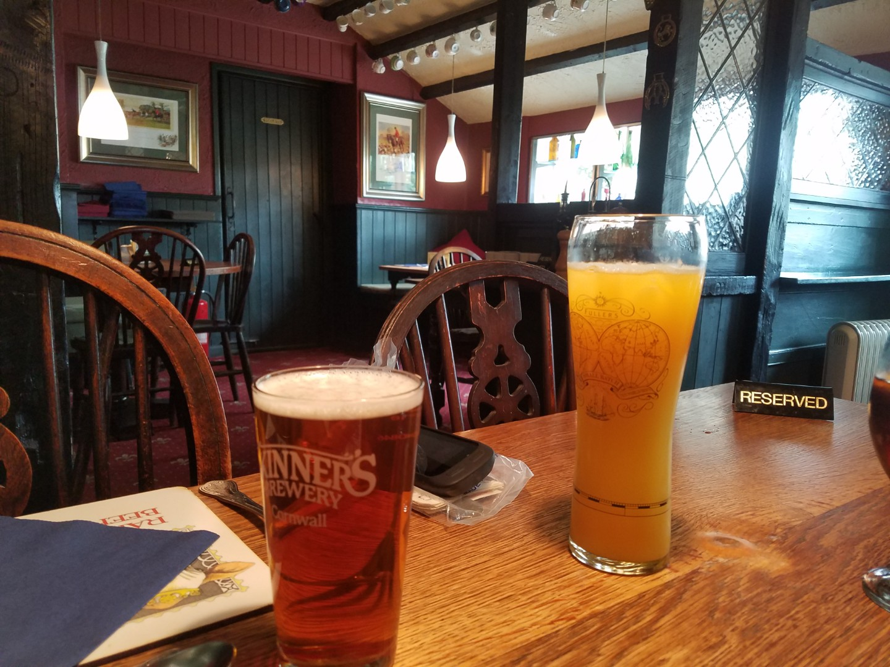
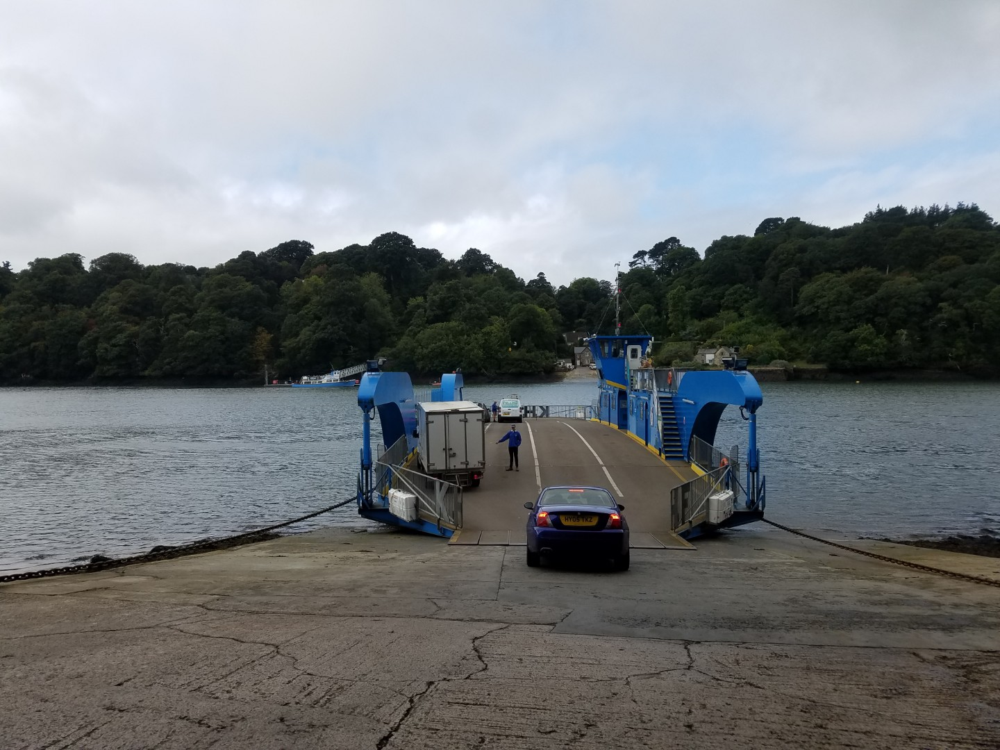
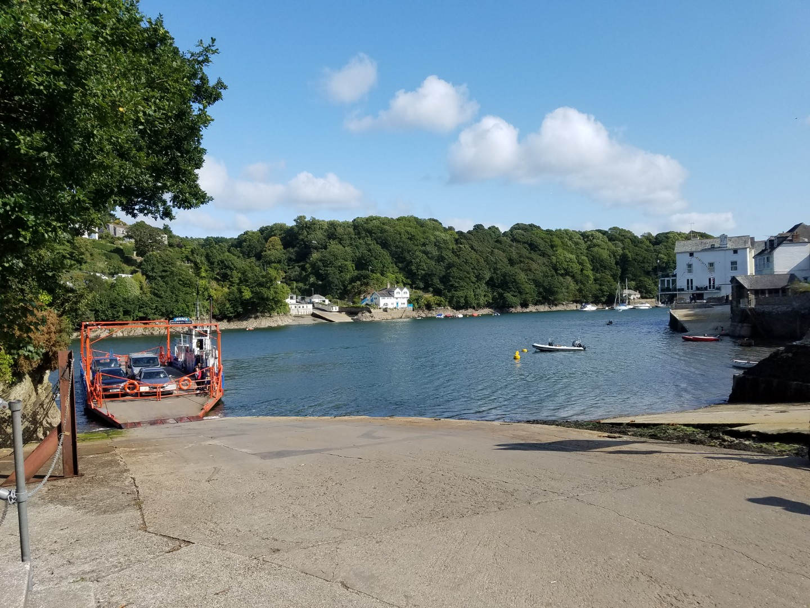
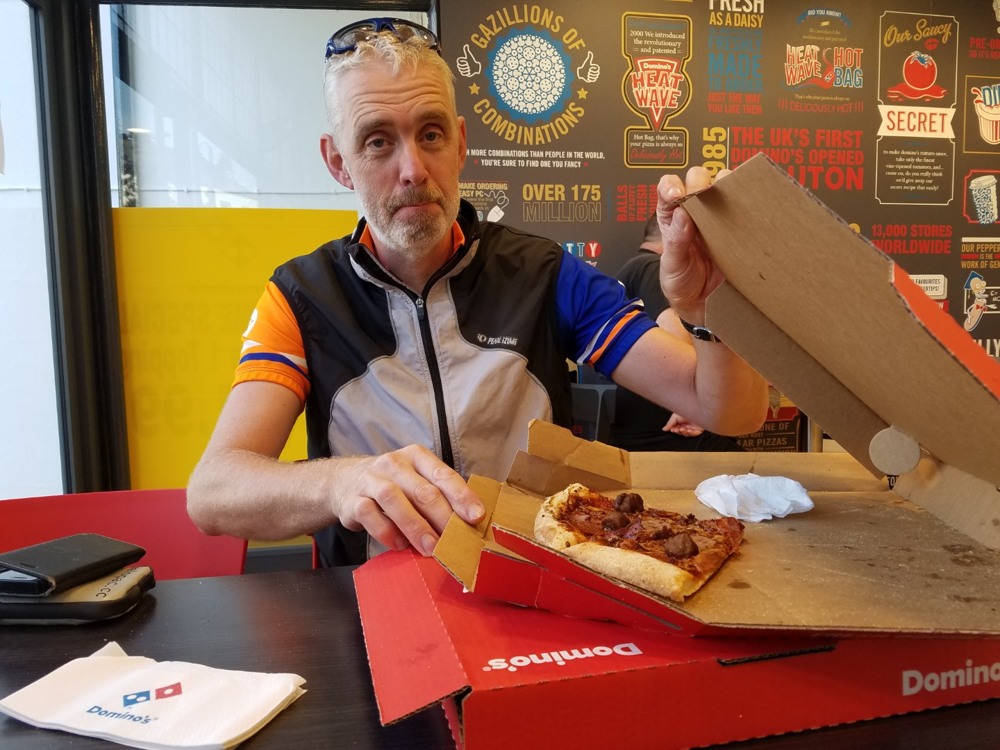
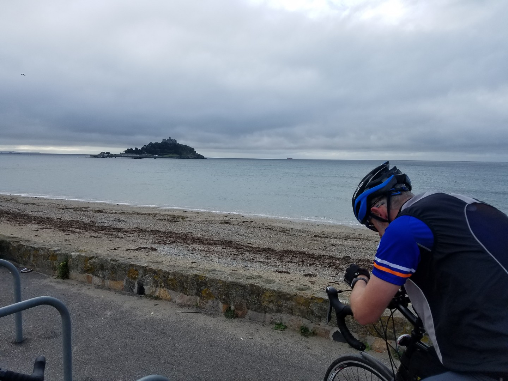

---
tags:
  - road-cycling
  - bikepacking
  - England
title: LEJOG day 2 Penzance to Wheal Tor, Liskeard.
description: Land's End to John O'Groats day 2 Penzance to Wheal Tor, Liskeard.
draft: false
date: 2018-08-29
author: Tompkins Jonathan
---
# LEJOG day 2 Penzance to Wheal Tor, Liskeard.

**29th August 2018**
**7.12hrs, 120km, 16.7av, 2.3vkm**

The one essential travel item, the ear plug, worked well last night although they were overwhelmed by one tremendously loud fart that erupted from one of my roomies. I hate to think what damage would have been done to my hearing if I hadn't been wearing them.

So, not too far to ride today, 119km, but it's fairly hilly with 2.4vkm.  We decided to set off early and get breakfast after about an hour. Instead we set off late and had a banana and two biscuits. At the half way mark at about lunch time we had a pub meal. Quite frankly I'm flabbergasted I rode 60km on so little food. The burger was great and I even risked half a pint of a local ale! Hardcore.

<figure style="text-align: center;">  <figcaption><i>A proper pub, lots of wood, hidden corners and red carpets. Pity I can't remember where it is.</i></figcaption> </figure>

We had generally good weather. It was windy and occasionally damp this morning but we were mostly sheltered in the sunken Cornish lanes. The sun came out in the afternoon along with a headwind, just as the hills got steeper and the lanes less sheltered.

Highlights of the day were definitely the two ferry crossings, one at King Harry's Crossing (best place name along with London Apprentice) over the river Fal and the other at Bodinnick. At King Harry's we were getting hungry so I asked the lad who worked on the boat if there were any cafes along the road. He replied that he'd never been over the other side! His whole life must revolve around the ferry and his village. I managed to persuade him to step off the ferry onto this new world and he agreed. He looked pleased. Honest.

<figure style="text-align: center;">
  
  <figcaption><i>King Harry's Crossing</i></figcaption>
</figure>

<figure style="text-align: center;">
  
  <figcaption><i>Ferry crossing at Bodinnick. Down river is Fowey which looked a great place to retire to.</i></figcaption>
</figure>

We were late getting to Wheal Tor so we stopped in Liskeard at a Dominoes Pizza for a two for one deal, how do they make any money?

We're staying in a glamping pod tonight which will be definitely cooler than the hostel last night. Unfortunately I fear my eardrums will be assaulted again tonight as Jim's eaten a burger and a pizza today. I'm a bit scared.

<figure style="text-align: center;">
  
  <figcaption><i>A man on a mission</i></figcaption>
</figure>

Jim wanted me to mention that on the drive down I took a wrong turn coming out of a service station which delayed our arrival in Penzance. I said that I'd feel compelled to mention how he missed the hostel in Penzance and made us ride further than required. Plus he couldn't even operate the sat nav correctly this morning. We agreed that he'd come out of it looking worse so we agreed not to mention it.

<figure style="text-align: center;">
  
  <figcaption><i>In the background is St Michaels Mount. In the foreground is a man slowly realising that the reason the sat nav won't navigate us out of Penzance is because he's loaded tomorrow's route and not today's.</i></figcaption>
</figure>

Another long hilly day tomorrow so we definitely need to start early. JIM, WE NEED TO START EARLY. Facebook actually came in useful today. Olly Reese got in touch, who I've not seen in years, he lives down this way and he's going to pop out for a ride and meet us in Princetown.  I'm not sure he knows he's going to tow us a bit.