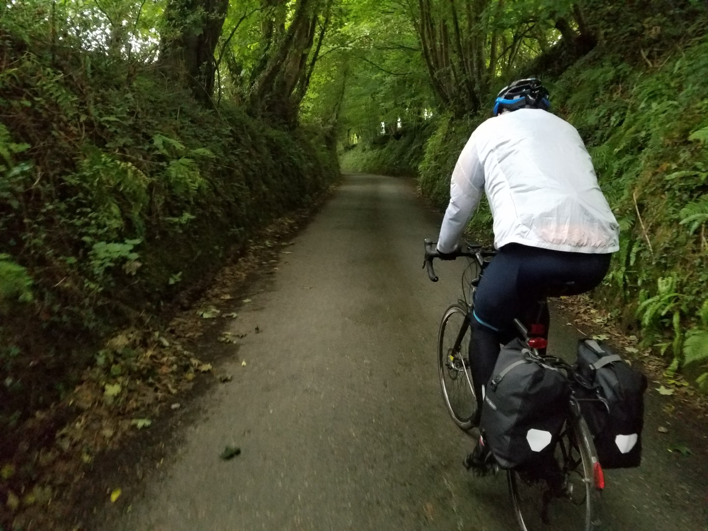
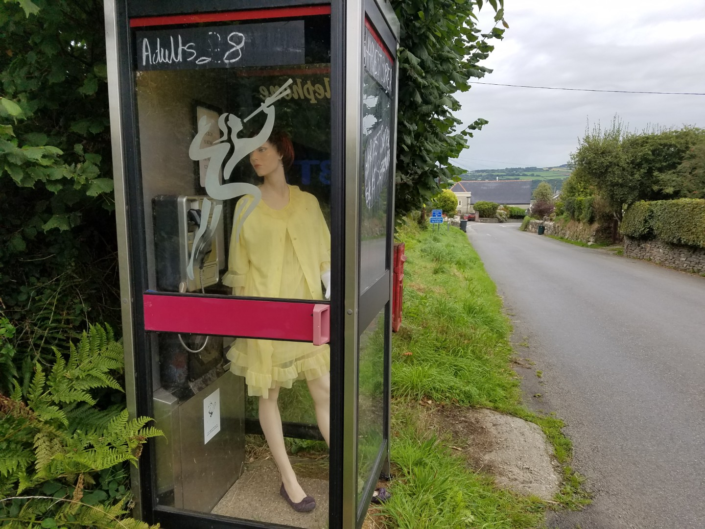
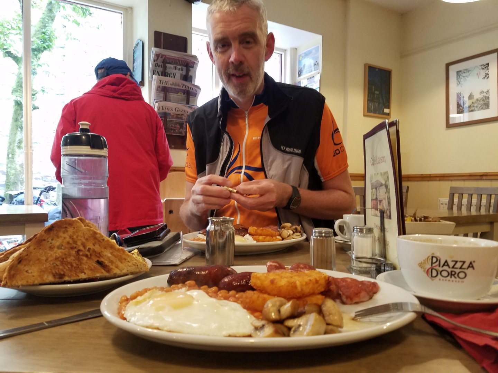
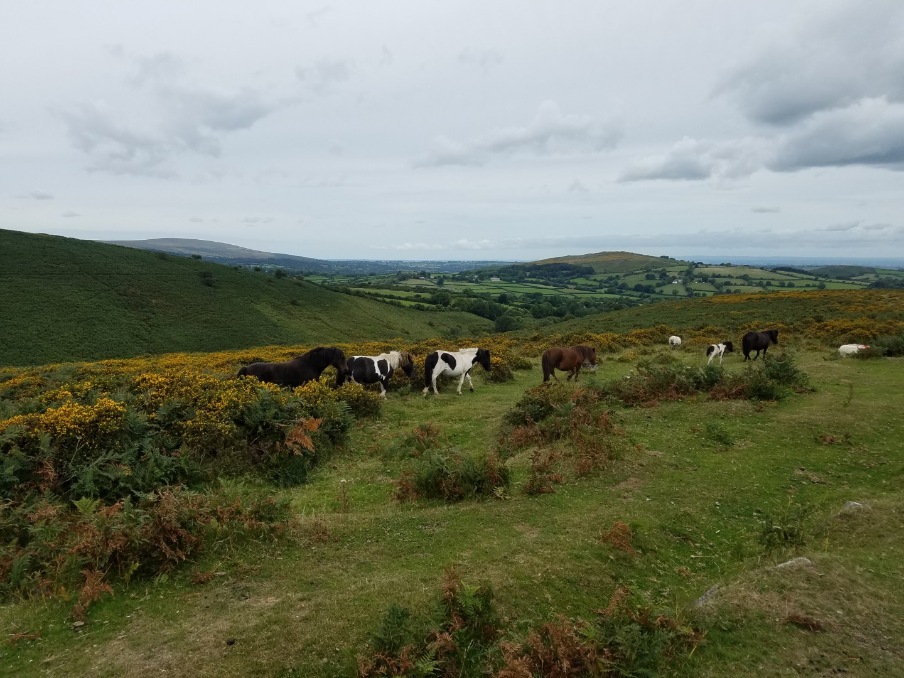

---
tags:
  - road-cycling
  - bikepacking
  - England
title: LEJOG day 3 Wheal Tor to Taunton, over Dartmoor
description: Land's End to John O'Groats, day 3 Wheal Tor to Taunton, over Dartmoor
draft: false
date: 2018-08-30
author: Tompkins Jonathan
---
# LEJOG day 2 Penzance to Wheal Tor, Liskeard.

**30th August 2018**
**7.05hrs, 136km, 2.3vkm, 19.1av**

The Hobbit House glamping pod was great, cool and quiet. Jim was asleep and snoring before I even got in bed. We've got a good forecast for today, dry with light tailwinds over Dartmoor.

<figure style="text-align: center;">
  
  <figcaption><i>A typical dark, sunken track in Devon. Not easy downhill with dark sunglass on.</i></figcaption>
</figure>

<figure style="text-align: center;">
  
  <figcaption><i>Why is there a mannequin in a phone box?</i></figcaption>
</figure>

We actually left early at 7.50 and then did 26km before breakfast at the Café Liaison in Tavistock (a stannery town, you look it up). Already found the two best places names, Chipshop and Bere.

<figure style="text-align: center;">
  
  <figcaption><i>No one else will be interested in these foodphotos but WE ARE!</i></figcaption>
</figure>

<figure style="text-align: center;">
  
  <figcaption><i>Just to prove we went there, a picture of Dartmoor ponies.</i></figcaption>
</figure>

The climb up to Princetown on Dartmoor was a pleasant change from yesterday, it was one long climb that allows you get a rhythm going. Met Olly Reese, who I probably hadn't seen in 5 years, in the cafe for a cake and catch-up then he rode with us for 20 minutes or so until he had to turn off for home.

Long ascents and descents followed, one descent in particular was sublime. Smooth tarmac, easy bends, not too steep and no traffic.

Exeter onwards was fast but dull, we basically followed the M5 on incredible increasingly busy roads.

Stayed in a great Airbnb in Taunton, clean, bright, really friendly and helpful owner.