---
tags:
  - road-cycling
  - bikepacking
  - England
title: LEJOG day 4 Taunton to Ross-on-Wye YHA
description: Land's End to John O'Groats day 4, Taunton to Ross-on-Wye YHA
draft: false
date: 2018-09-01
author: Tompkins Jonathan
---
# LEJOG day 4 Taunton to Ross-on-Wye YHA

**1st September 2018**
**149km, 7.43hrs, 1.2vkm, 19.2av**

<figure style="text-align: center;">
  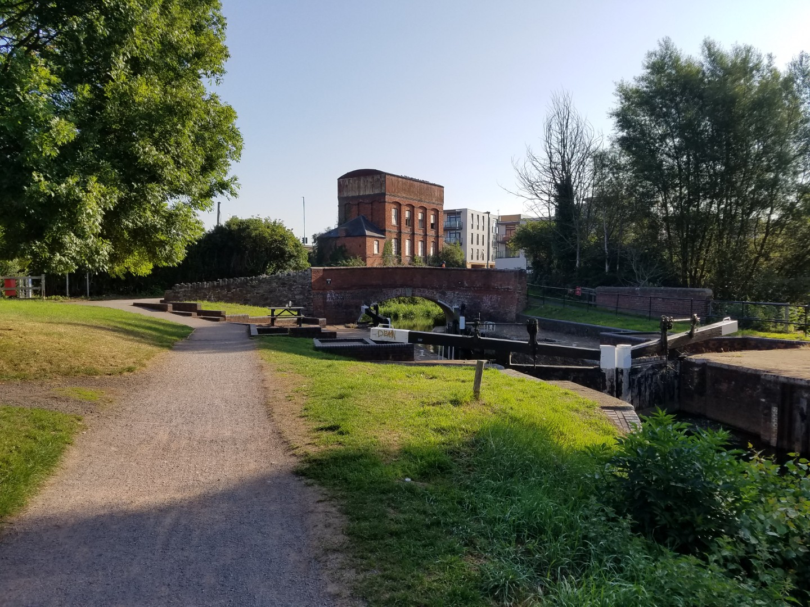
  <figcaption><i>The Bridgewater Taunton Canal</i></figcaption>
</figure>

The Glenside AirBnB in Taunton was great; clean, roomy, quiet, cool and with all the facilities you'd need. After a massive sausage breakfast and too much coffee we set off following the Bridgewater and Taunton Canal. A bit rough at times but a beautiful quiet  route out of Taunton. It's quite overgrown so there's more wildlife than a normal canal.

<figure style="text-align: center;">
  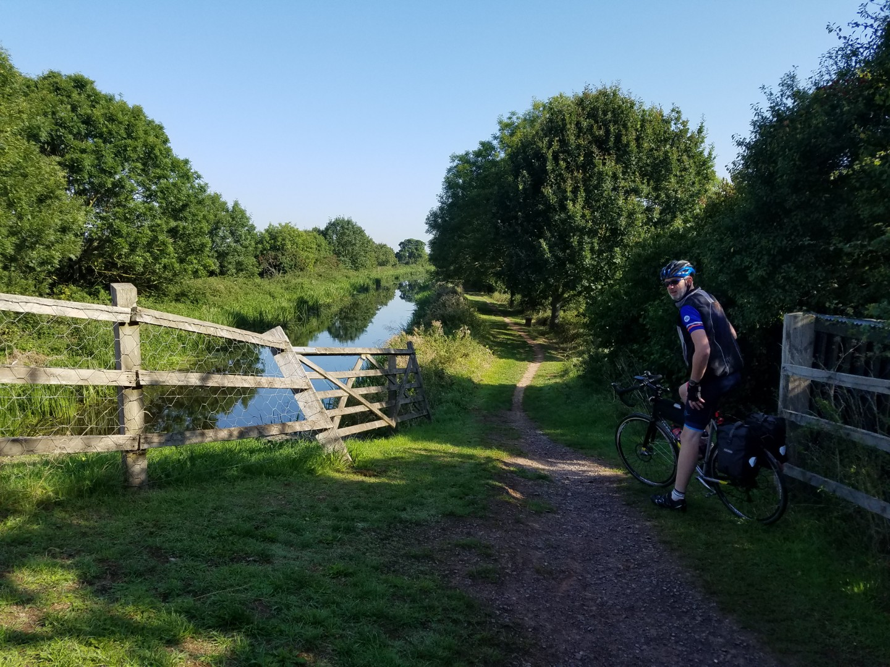
  <figcaption><i>Jim wondering if it's all worth it</i></figcaption>
</figure>

<figure style="text-align: center;">
  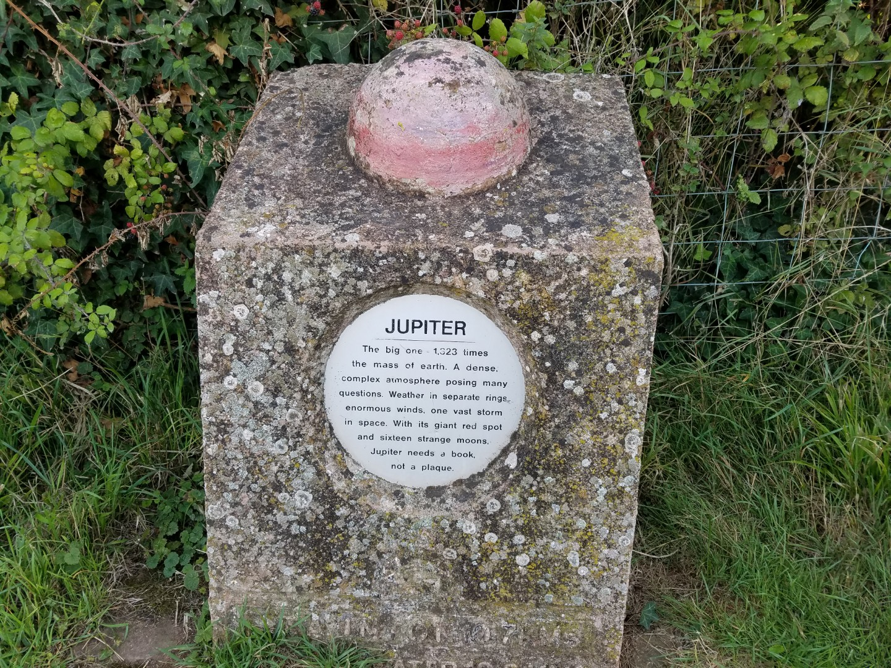
  <figcaption><i>Not the real Jupiter. All the planets are placed to scale along this canal. Blame  Arthur C Clarke who was born around here.</i></figcaption>
</figure>

<figure style="text-align: center;">
  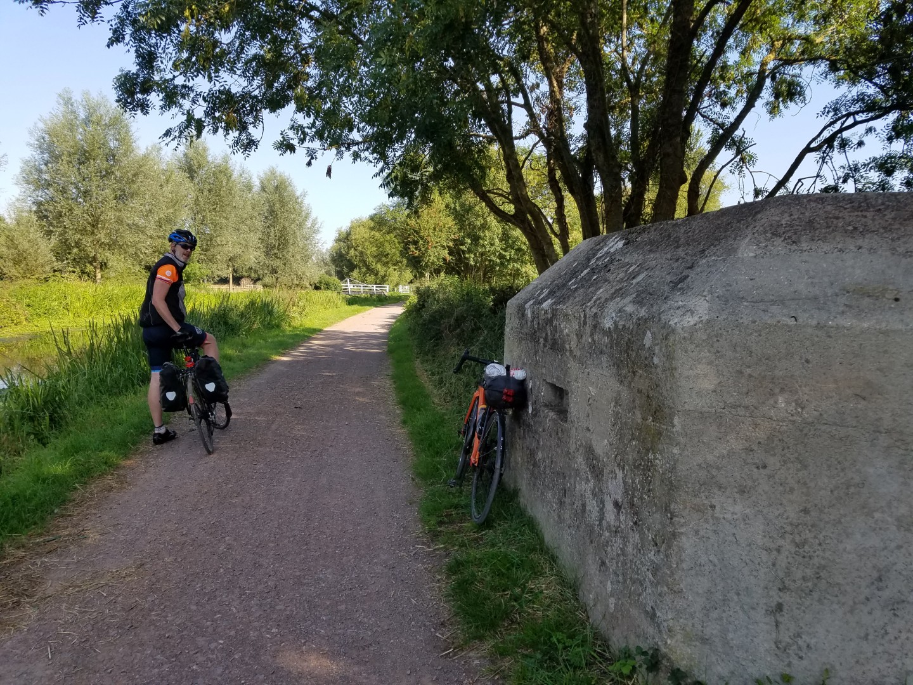
  <figcaption><i>There's lots of pill boxes along this canal. Were the Germans really going to march down here? Maybe to get the cider?</i></figcaption>
</figure>

The Somerset Levels are, well, level, and even with Jim's mudguard rubbing the whole way we absolutely flew along smooth roads.

<figure style="text-align: center;">
  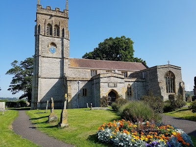
  <figcaption><i>Impressively high twee factor. St Mary the Virgin Church at Chedzoy</i></figcaption>
</figure>

Up ahead were the Mendips, a mere blip in real terms but a colossal mountain range compared to what we'd just done. It looked like we'd have to cross on a busy A road but partway up we turned off on to a Sustrans route along an abandoned railway, through a tunnel. More traffic free riding on route 26 on the Strawberry Line brought us to Yatton Station for cake, diet coke and ice cream, plus a chat with two lady cyclists about chafing and underwear.

<figure style="text-align: center;">
  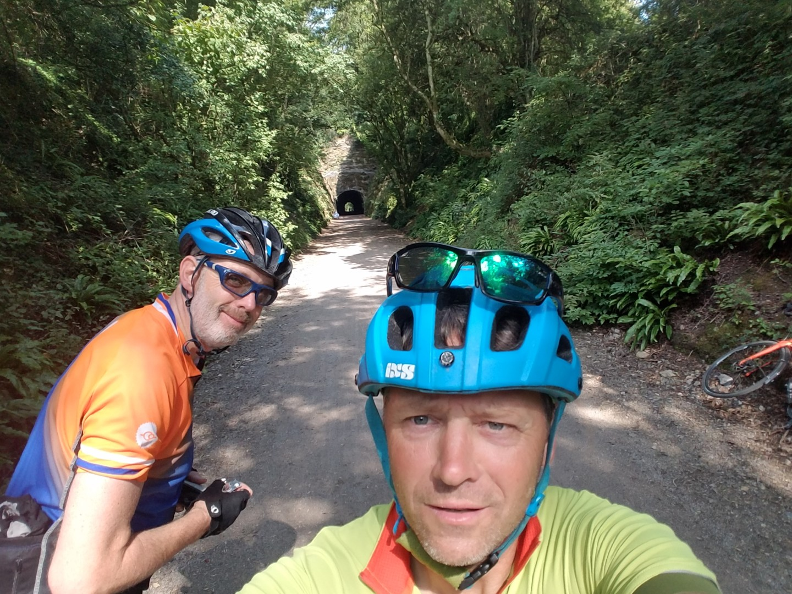
  <figcaption><i></i></figcaption>
</figure>

<figure style="text-align: center;">
  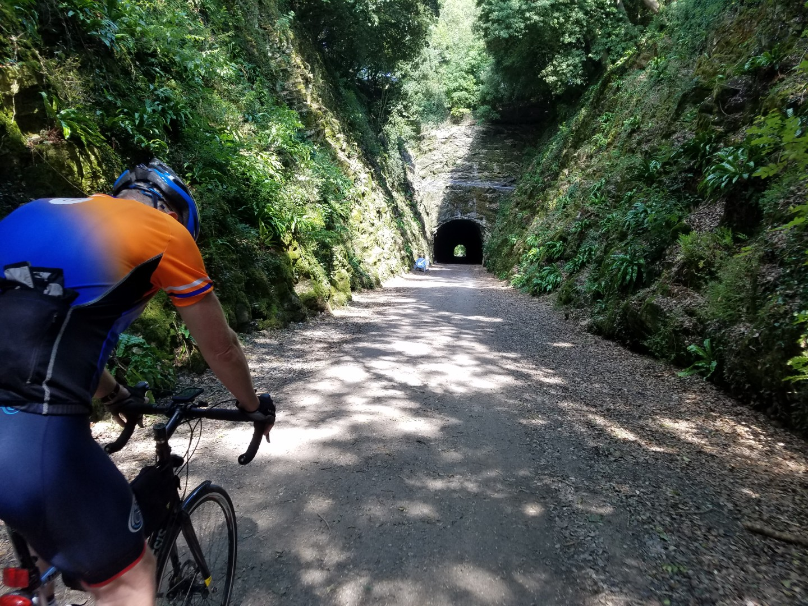
  <figcaption><i> A tunnel and Jim channeling Chris Froome.</i></figcaption>
</figure>

<figure style="text-align: center;">
  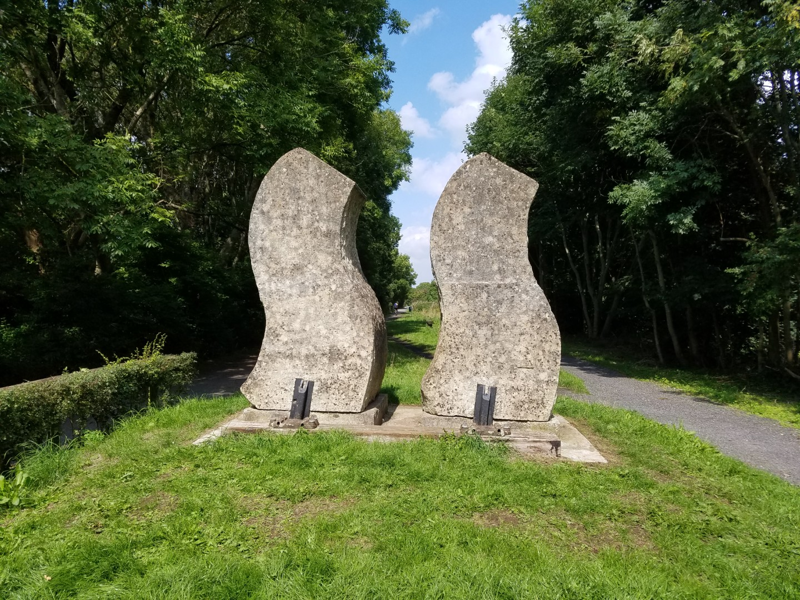
  <figcaption><i>Is it A: a Churchillian V for victory sign? B: two leaping salmon? C: a giant vagina?</i></figcaption>
</figure>

It turned a bit crap after that. We ended up on a busy road, it was fast but we held up traffic and there was a bit of sphincter clenching at some of the over taking manouvers. Eventually it improved again and we followed the Sustrans 410 Avon cycleway.

Crossing the River Avon on a cycleway on the M5 bridge was a highlight, as was crossing the Bristol Channel on the M4 bridge. Great views and an odd place to be on a bike.

<figure style="text-align: center;">
  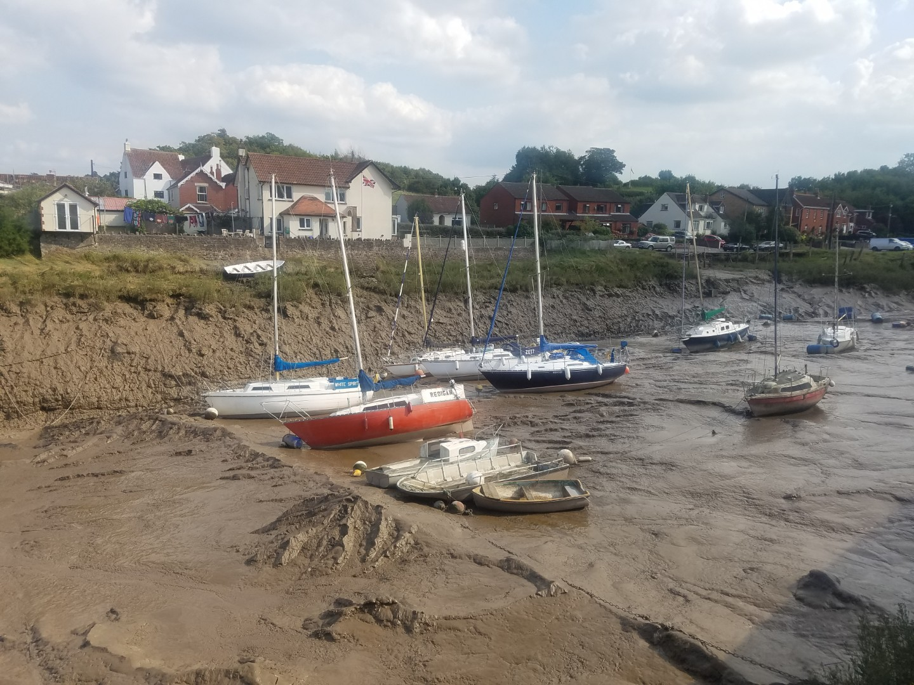
  <figcaption><i>A quick dip anyone?</i></figcaption>
</figure>

<figure style="text-align: center;">
  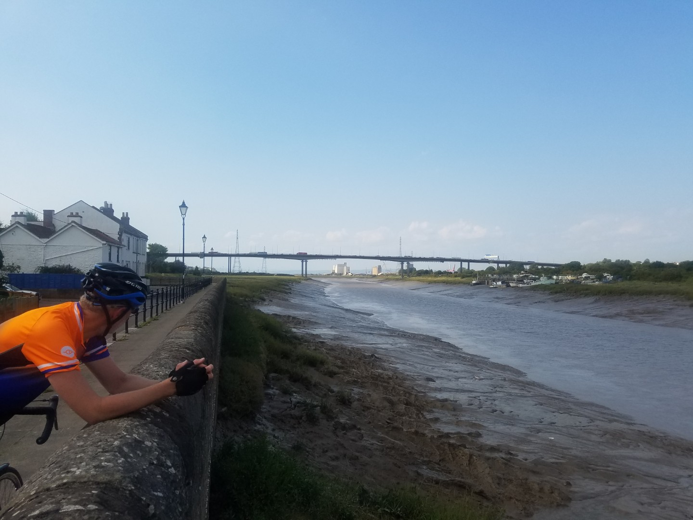
  <figcaption><i>The M5 bridge over the Avon.</i></figcaption>
</figure>

<figure style="text-align: center;">
  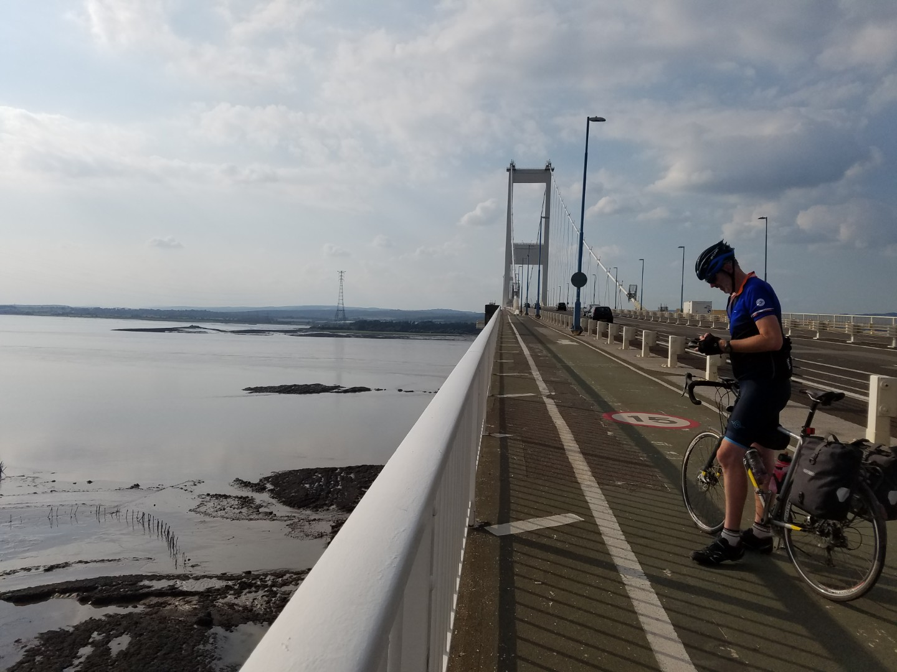
  <figcaption><i>M4 over the Bristol Channel</i></figcaption>
</figure>

Chepstow looked nice but we didn't have time to loiter so we took the long climb out, with some great views over the Severn Estuary,  and over to Wye YHA. A nice YHA but unfortunately it's up a steep hill and then down a "road" that's rougher than a badger's arse, not that I've inspected a badger's arse. It could be smooth.

<figure style="text-align: center;">
  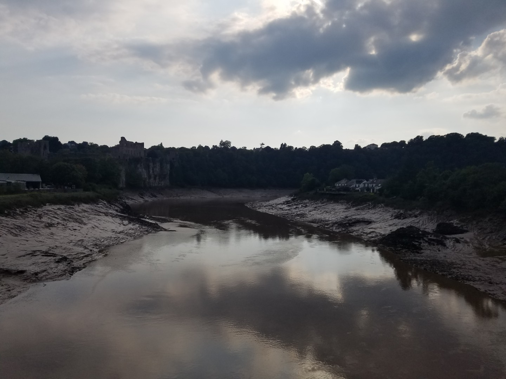
  <figcaption><i>Chepstow</i></figcaption>
</figure>

We're taking it relatively easy, consequently we feel good. My legs don't ache on the bike, they only ache a little at the end of the day. Jim occasionally has to stretch his back, other than that it seems quite straightforward, just long days really.