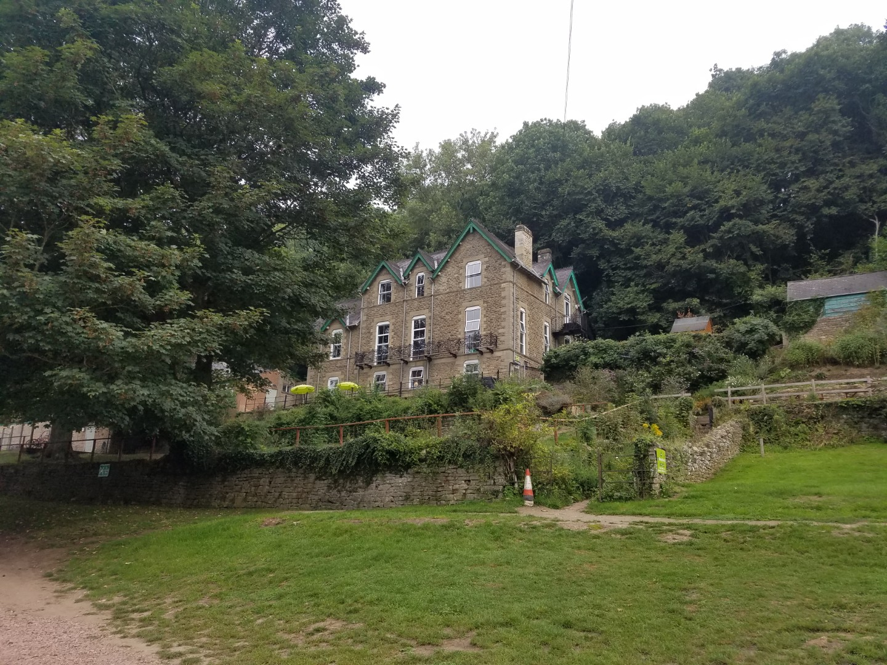
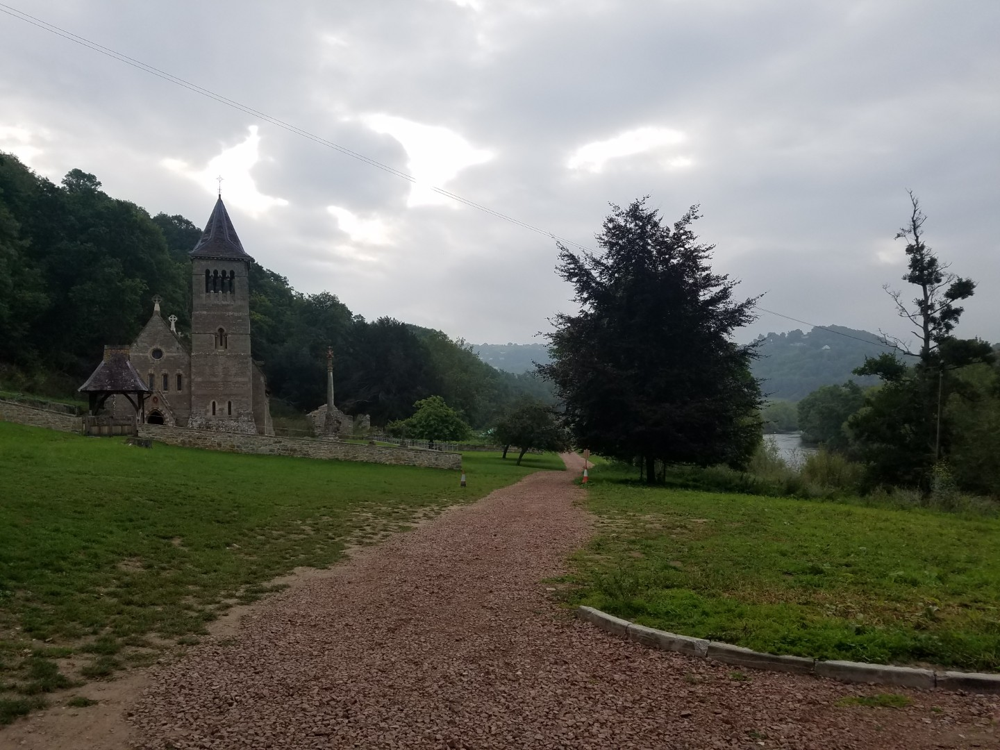
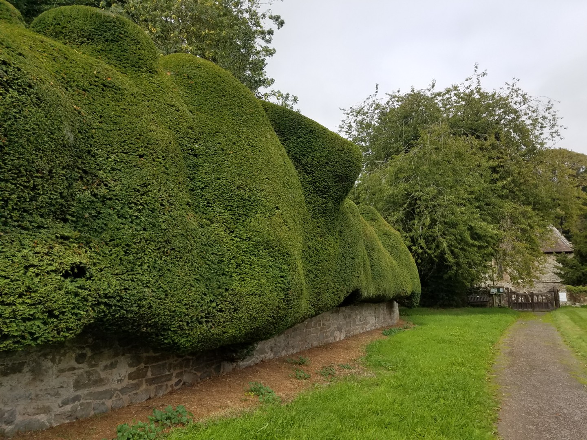
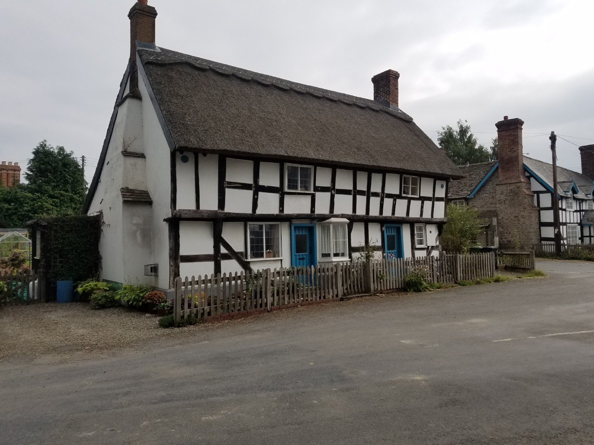
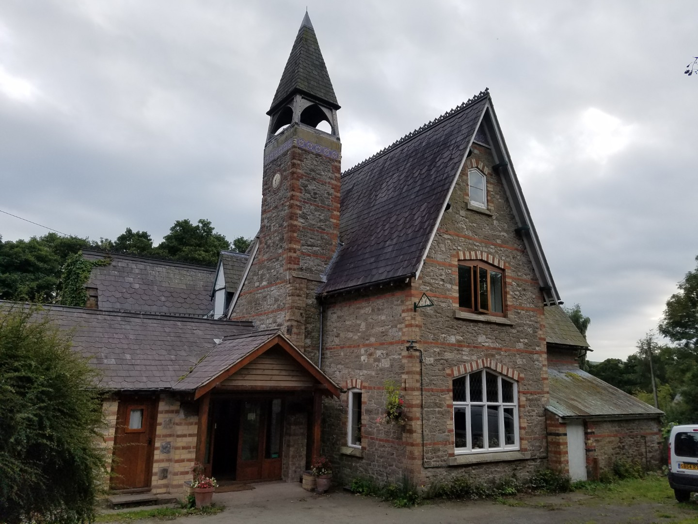

---
tags:
  - road-cycling
  - bikepacking
  - where/England
title: LEJOG day 5 Wye YHA to Bridges, Shropshire
description: Land's End to John O'Groats day 5, Wye YHA to Bridges, Shropshire
draft: false
date: 2018-09-01
author: Tompkins Jonathan
---
# LEJOG day 5 Wye YHA to Bridges, Shropshire

**1st September 2018**
**5.31hrs 112.6km 20.3av 1.3vkm**

<figure style="text-align: center;">
  
  <figcaption><i>Wye YHA</i></figcaption>
</figure>

<figure style="text-align: center;">
  
  <figcaption><i>It even has it's own church</i></figcaption>
</figure>

Good news! I've found a footpath and a bridge over the river Wye which avoids the awful climb out of the youth hostel. Which is good because my legs seem to ache a bit this morning when walking down the stairs.

Is it acceptable for me to be pleased that Jim's legs ache because mine ache as well?

Bad news. The bridge is closed, we've got to ride over the hill. Luckily we found out before we set off.

I decided on a more liberal application of bum butter today although it did feel like I'd sloppily soiled myself at first. It did work though, still no chafing. I'm showing an impressive level of undercarriage resilience.

Today's route: up down up down, around the bend, up down, along, along, along, up, up.

The area north of Chepstow around the Wye valley is stunning. Further north, around Weobley and Kington, it's merely nice, largely spoilt by excessively high hedges. Once in Shropshire it's stunning again, great views due to sensible hedges.

<figure style="text-align: center;">
  
  <figcaption><i>The best hedge, IN THE WORLD!</i></figcaption>
</figure>

Somebody, I won't say who but let's call him J, made a navigation error (with a sat nav!) and sent us on a "detour" around Weobley, rather than through it, adding a few kilometres. Luckily the other person, let's call him j, realised and found an alternative route to get back on track, luckily going past a nice little pub / shop for lunch. j (little j) has agreed not to name J (capital J), out of decency.

<figure style="text-align: center;">
  
  <figcaption><i>There's lots of timbered houses round here, Weobley is famous for them.</i></figcaption>
</figure>

Speaking of lunch, I had one scotch egg too much. On top of a sausage roll, donut, Cadburys Twirl and a litre of milk it made me feel light headed when we set off again.

My legs ache today although it doesn't massively impede progress. Tomorrow is a long day so I'm hoping to recover tonight. Otherwise I'm drafting Jim all day.

<figure style="text-align: center;">
  
  <figcaption><i>Bridges YHA</i></figcaption>
</figure>

