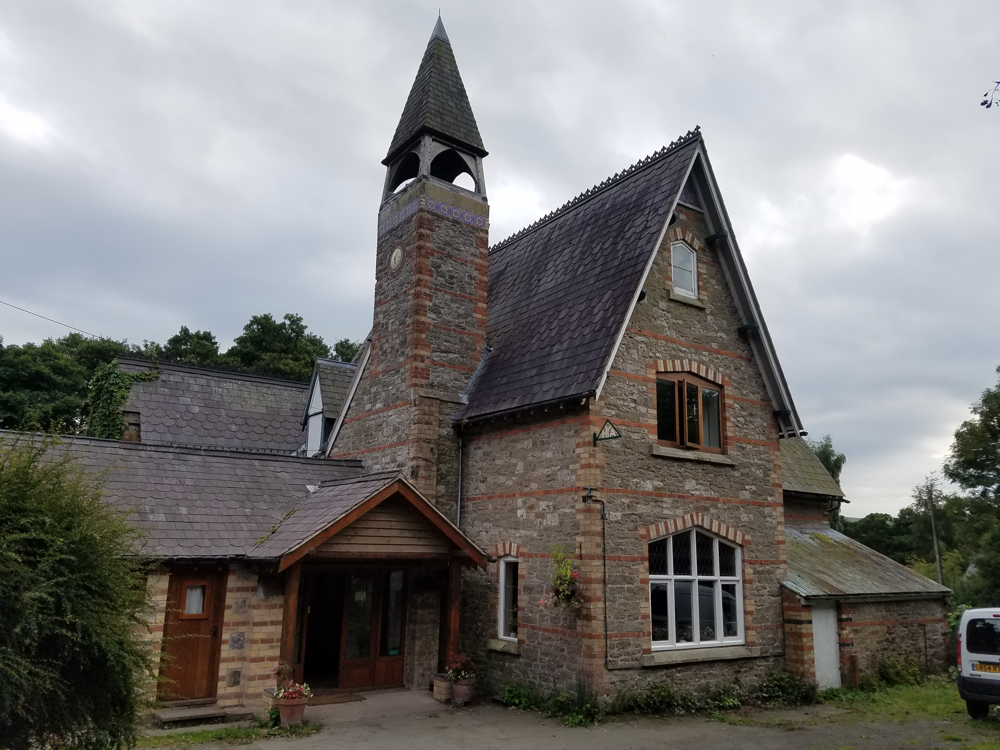
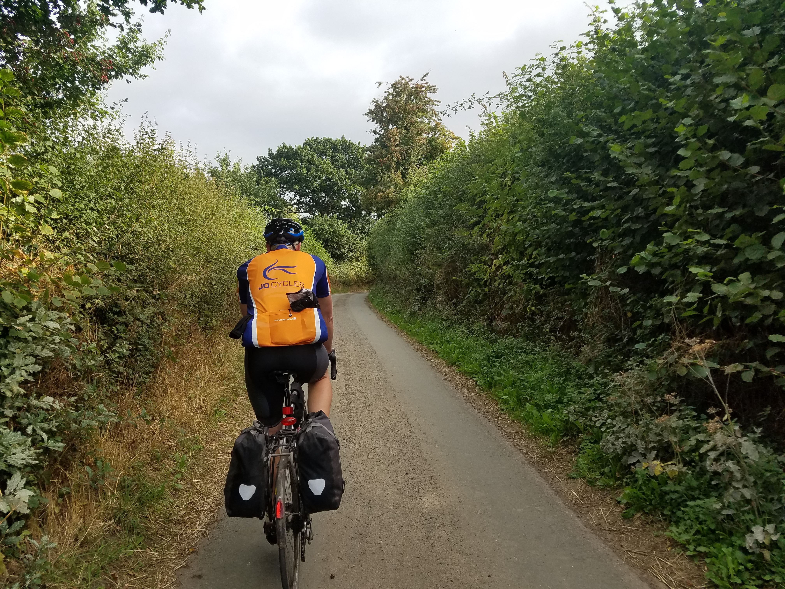
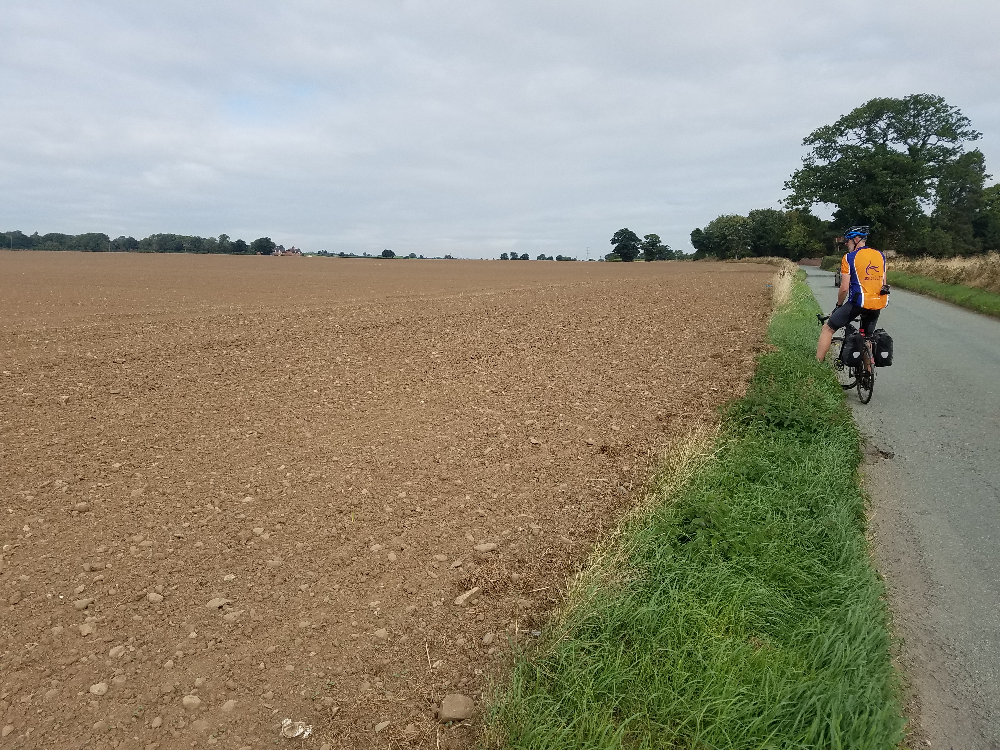
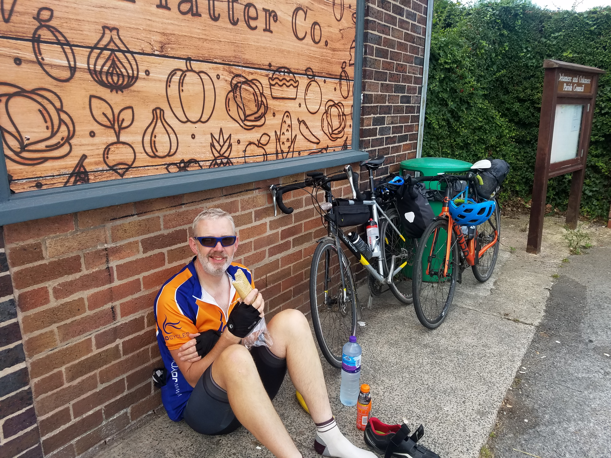
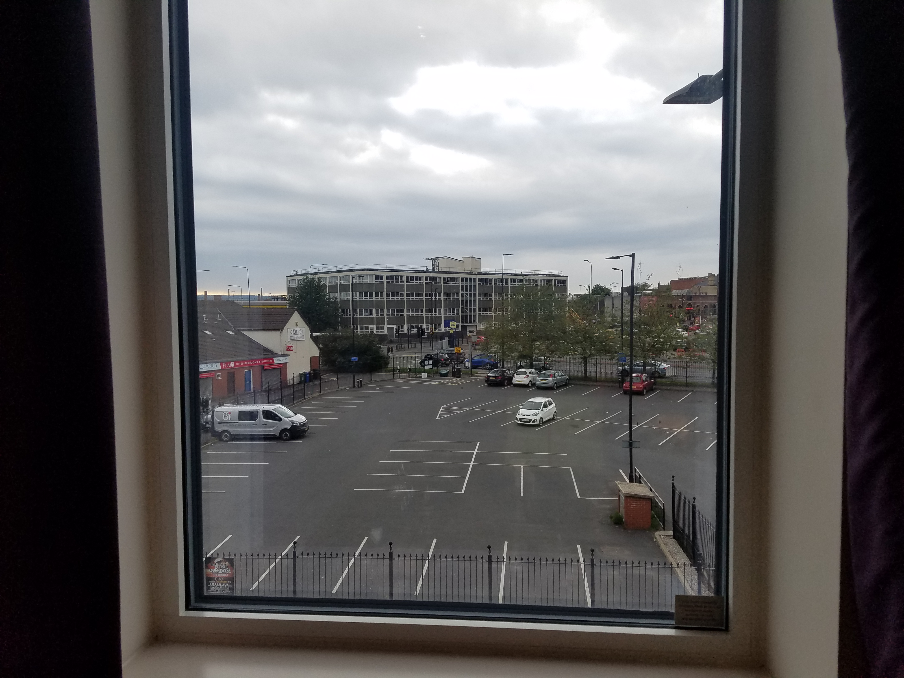

---
tags:
  - road-cycling
  - bikepacking
  - England
title: LEJOG day 6 Bridges, Shropshire to Wigan
description: Land's End to John O'Groats day 6, Bridges, Shropshire to Wigan
draft: false
date: 2018-09-02
author: Tompkins Jonathan
---
# LEJOG day 6 Bridges, Shropshire to Wigan

**2nd September 2018**

Cockyard. 

The best place name from yesterday and probably a clear winner for the whole trip.

<figure style="text-align: center;">
  
  <figcaption><i>Bridges YHA</i></figcaption>
</figure>

The Bridges hostel was busy. There were three extras from Last of the Summer Wine in our room who were discussing how difficult it is to find ladies and when they did find one how they couldn't match their sexual needs. This morning they displayed their artistic side by coordinating their breathing and snoring in some sort of Britain's Got Talent audition.

There's also a female mountain biking group who perversely didn't mix with the male nasal choral group, as well as a gang of Duke of Edinburgh refugees and their guards.

To top it off there's the warden, who is really nice and helpful and very, very impressive at talking, a lot. She's quite hardcore having done the Pennine Bridleway on a touring road bike.

Jim keeps up a fairly audible gaseous running commentary on the state of his bowels which makes me 1: worried about the contents of his bowels and 2: worried that the contents of his bowels might be in his chamois.

He's also started regaling me with information about his trips to the loo and how it was affected by last night's food. Today he bought a Toffee Crisp and told me that my next tod (thanks Bob Mortimer) should look like it. Helen, please, have a word with him.

I took the opportunity to wash all my cycling kit last night and dry it out in the drying room. Jim decided it wouldn't work so he's risking an itchy undercarriage with yesterday's chamois. I'm in clean chamois although it is slightly damp, something I only found out when I stood up from the wooden bench at breakfast and noticed a shiny bum shaped area. I stealthy cleaned it off by sliding off the bench instead of just standing up.

<figure style="text-align: center;">
  
  <figcaption><i>bloody hedges!</i></figcaption>
</figure>

Another good forecast today with a slight tailwind, only spoilt by the fact that we're going to Wigan. And Warrington. It was nice riding through Shropshire and into Cheshire, and I think Wales was there somewhere along the way. A bit rough in places but very pleasant. Legs feel ok, better on the bike than off. Undercarriage is suffering slightly just from time in the saddle but there's still no chafing.

<figure style="text-align: center;">
  
  <figcaption><i>Tilled field porn shot, just for Sue.</i></figcaption>
</figure>

<figure style="text-align: center;">
  
  <figcaption><i>Living the dream, what a beautiful cafe we found.</i></figcaption>
</figure>

Riding in Warrington and Wigan was relatively safe, even on the A road, probably due to it being Sunday evening. It was fast at well. They serve breakfast at 6.30 in the Premier Inn so we've got half a plan to leave soon after to avoid as much traffic as possible.

<figure style="text-align: center;">
  
  <figcaption><i>A view of Wigan from my cell.</i></figcaption>
</figure>