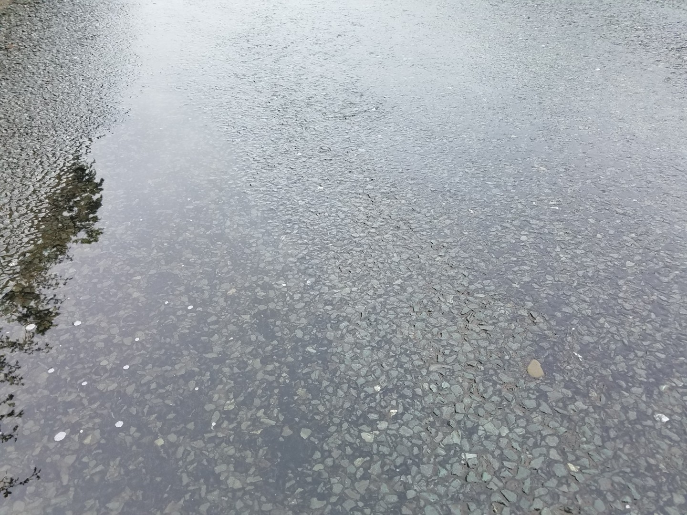
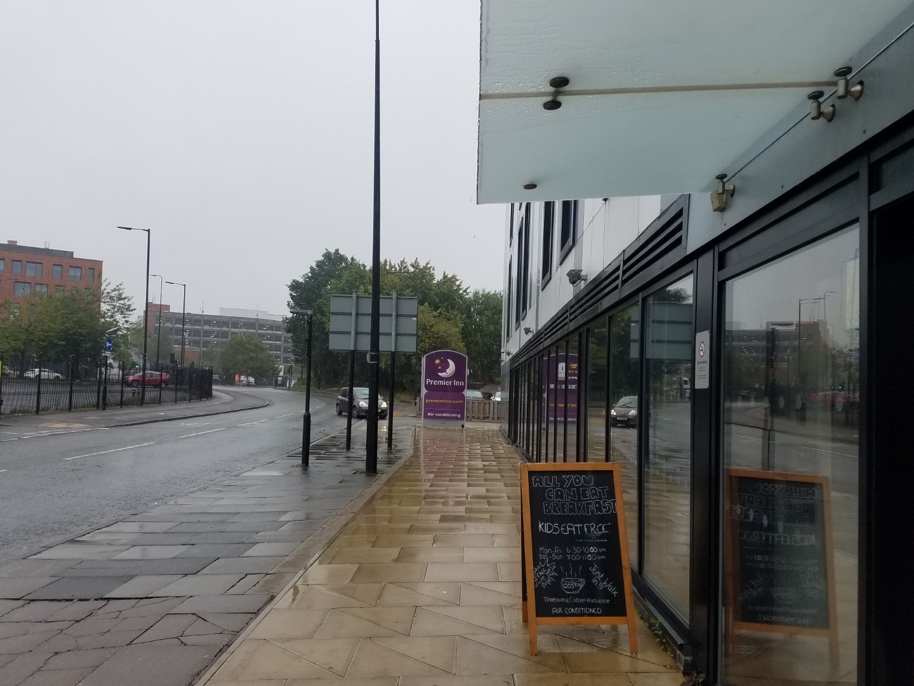
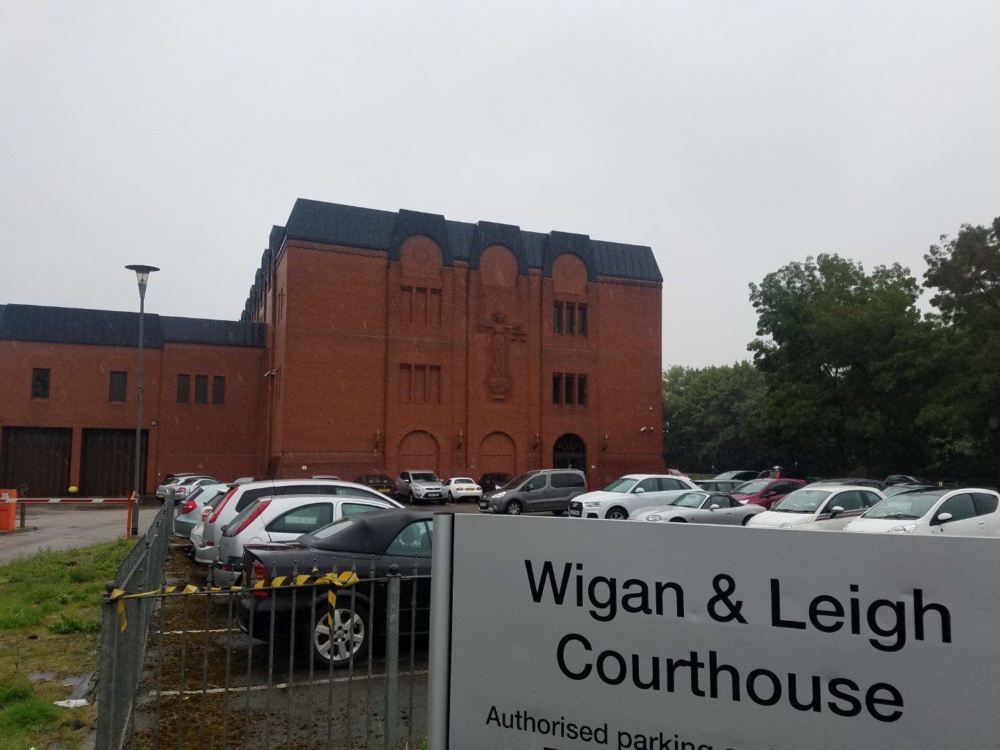
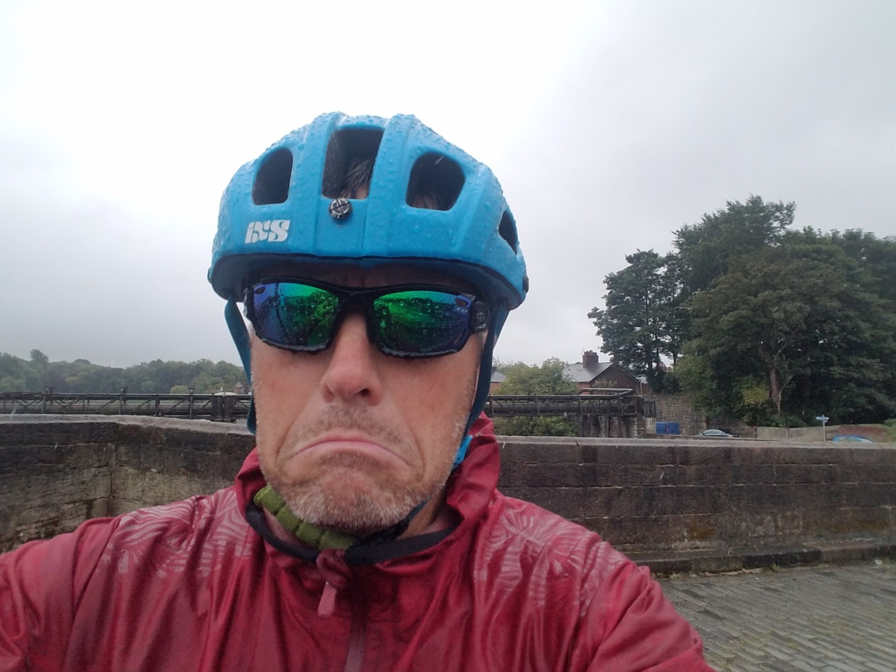
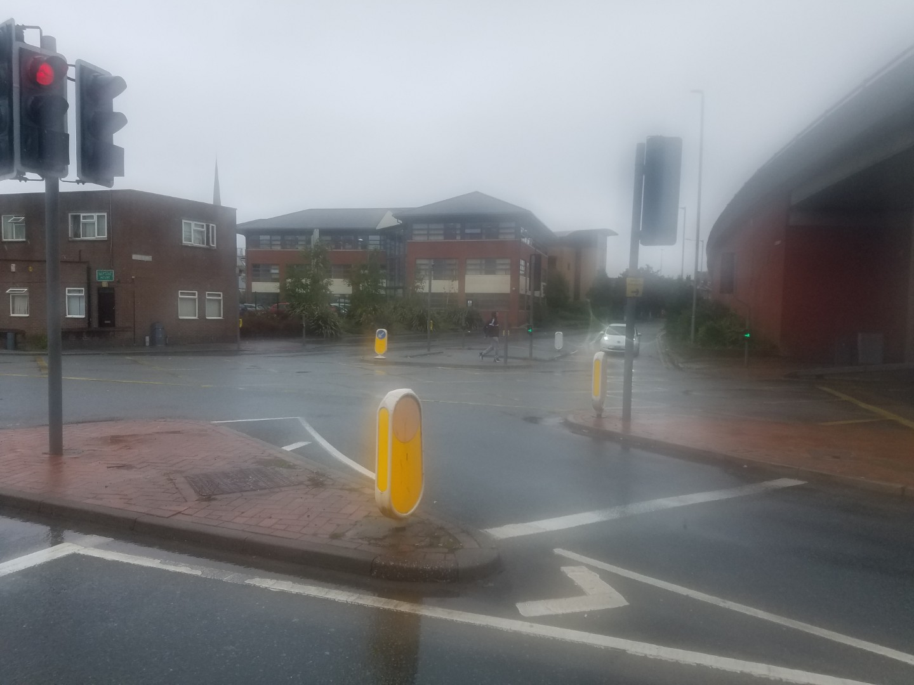
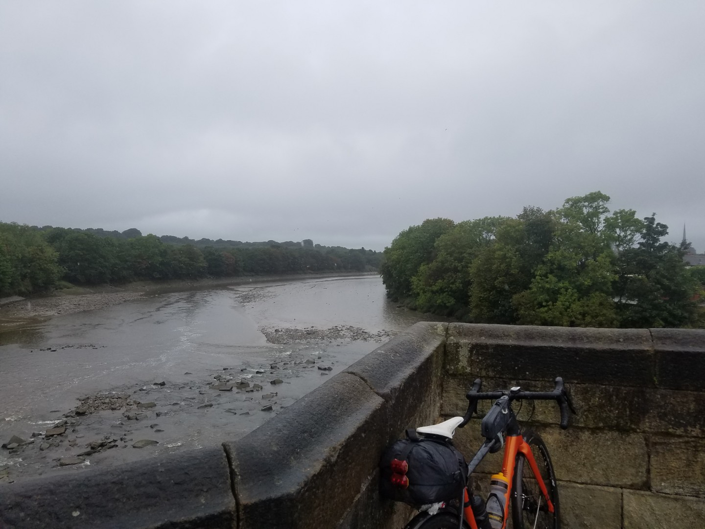
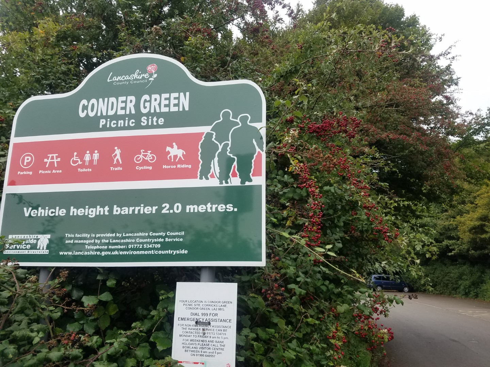
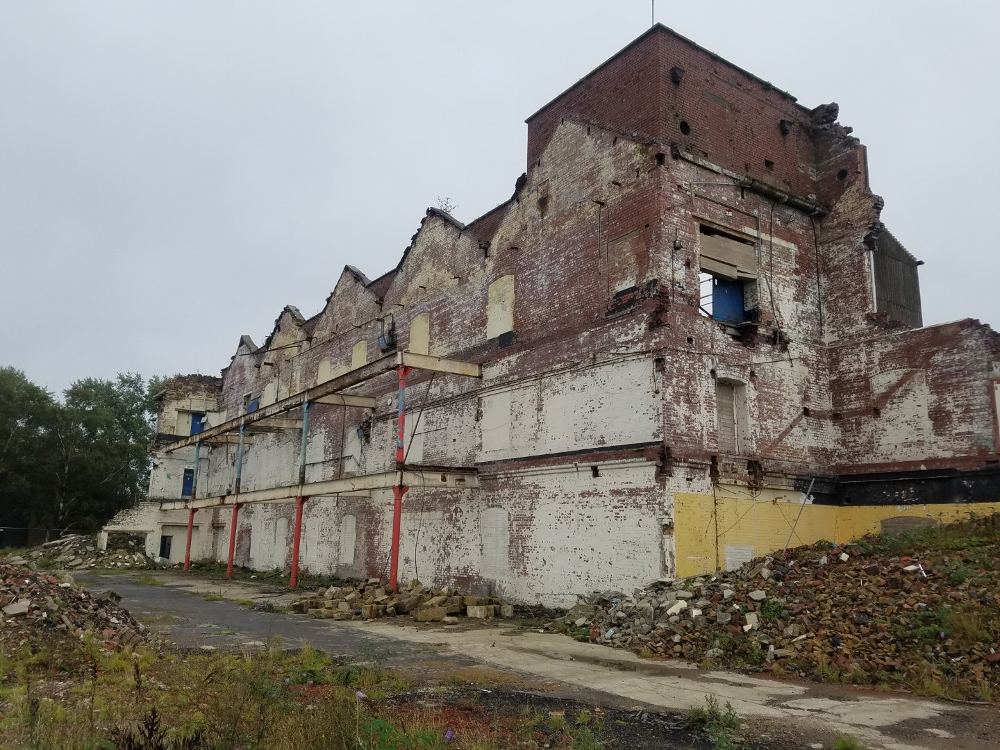
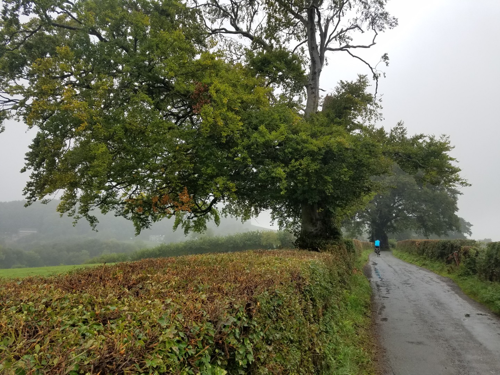

---
tags:
  - road-cycling
  - bikepacking
  - England
title: LEJOG day 7 Wigan to Windermere
description: Land's End to John O'Groats day 7, Wigan to Windermere
draft: false
date: 2018-09-03
author: Tompkins Jonathan
---
# LEJOG day 7 Wigan to Windermere

**3rd September 2018**
**6.08hrs 126km 20.5av 1.1vkm**

Both Jim and I absolutely loved this day.

<figure style="text-align: center;">
  
  <figcaption><i>Ground conditions this morning</i></figcaption>
</figure>

<figure style="text-align: center;">
  
  <figcaption><i>People enjoying Wigan</i></figcaption>
</figure>

<figure style="text-align: center;">
  
  <figcaption><i>The best building in Wigan</i></figcaption>
</figure>

<figure style="text-align: center;">
  
  <figcaption><i>Moist</i></figcaption>
</figure>

<figure style="text-align: center;">
  
  <figcaption><i>Preston seemed to go on forever and it was all wet like this.</i></figcaption>
</figure>

<figure style="text-align: center;">
  
  <figcaption><i>The river Ribble near Preston, wet, but not as wet as me.</i></figcaption>
</figure>

<figure style="text-align: center;">
  
  <figcaption><i>Do Lancastrians really look like that?</i></figcaption>
</figure>

<figure style="text-align: center;">
  
  <figcaption><i>Lancashire is not all post apocalyptic urban wastelands, there's beauties like this.</i></figcaption>
</figure>

<figure style="text-align: center;">
  
  <figcaption><i>Sensible sized hedges, take note south of England</i></figcaption>
</figure>

<figure style="text-align: center;">
  
  <figcaption><i>Road conditions at the end</i></figcaption>
</figure>
