---
tags:
  - road-cycling
  - bikepacking
  - England
  - Scotland
title: LEJOG day 8 Windermere to Marthrown of Mabie, Dumfries
description: LEJOG day 8 Windermere to Marthrown of Mabie, Dumfries
draft: false
date: 2018-09-04
author: Tompkins Jonathan
---
# LEJOG day 8 Windermere to Marthrown of Mabie, Dumfries

**4th September 2018**

Helen and Sue would be at Windermere and on the ride in we decided we'd have a game of spouse bingo and what they would tell us at the cottage. 

Helen would:

1. Tell Jim he should do something different on the ride.

2. Tell Jim he was washing his clothes incorrectly.

3. Talk about poo.

Sue would:

1. Tell me to take the dogs for a walk.

2. Want a lie in later than we needed to leave.

3. Not come and see us off from the top of Kirkstone Pass.

Admittedly Helen had a head start as she was there earlier but it was soon two all. As always Helen mentioned pooing and we had a winner.

It felt quite busy in the cottage with three dogs, two couples and Vicky, completely different from the other places we'd stayed. Good job Vicky was there because she injected a dose of sanity into Helen and Sue's orders!

The forecast was good for today although there was supposed to be a 10mph headwind most of the way. Luckily this only occurred up Kirkstone Pass, which was also cold, and there was hardly any wind the rest of the day.

I'd got used to flat riding and tiny hills by this stage and was concerned about Kirkstone Pass. In the end, despite the headwind, it was fine. Jim also found it ok, mostly due to mechanical doping - Helen carried his bags and one water bottle to the top of the pass.

<figure style="text-align: center;">
  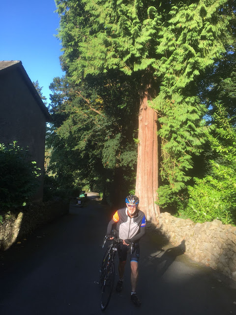
  <figcaption><i>Jim pushing his empty bike up a hill </i></figcaption>
</figure>

<figure style="text-align: center;">
  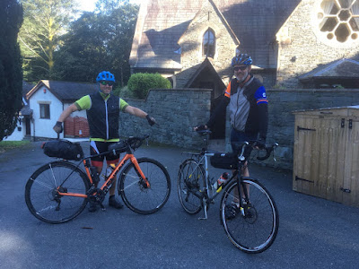
  <figcaption><i>Something's missing from Jim's bike</i></figcaption>
</figure>

<figure style="text-align: center;">
  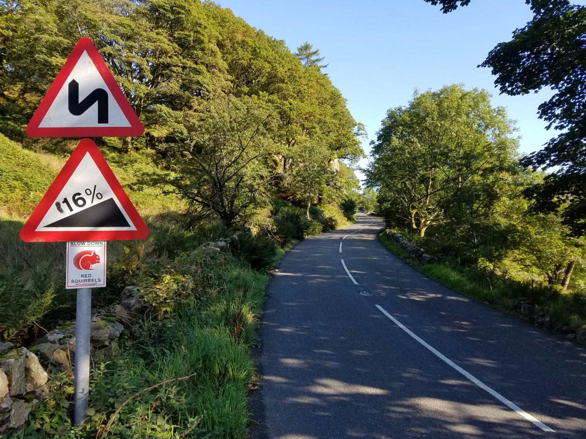
  <figcaption><i></i></figcaption>
</figure>
<figure style="text-align: center;">
  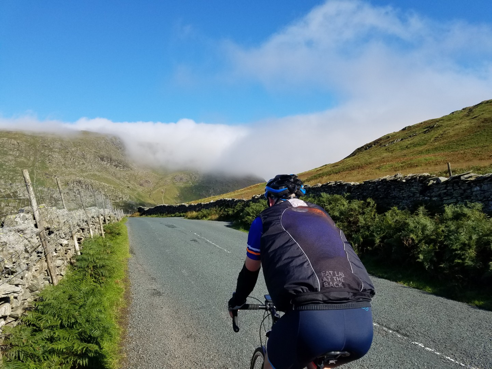
  <figcaption><i>A mechanical doping cloud over Jim's head</i></figcaption>
</figure>

At the pass, after last minute survival instructions from Helen, we put on all our clothes and descended to Patterdale and then up over past Dockray. It was still cold by the time we got to Carlisle and it didn't look very welcoming but we found a great little cafe, The Old Engine Shed, near the railway with awesomely comfortable seats.

<figure style="text-align: center;">
  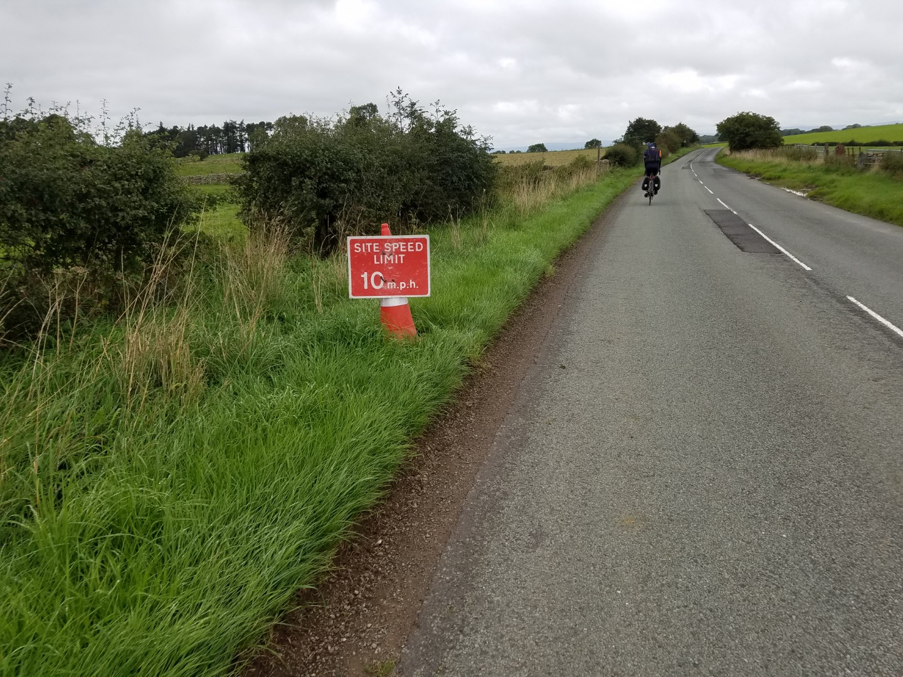
  <figcaption><i>How did they know Jim's top speed?</i></figcaption>
</figure>

<figure style="text-align: center;">
  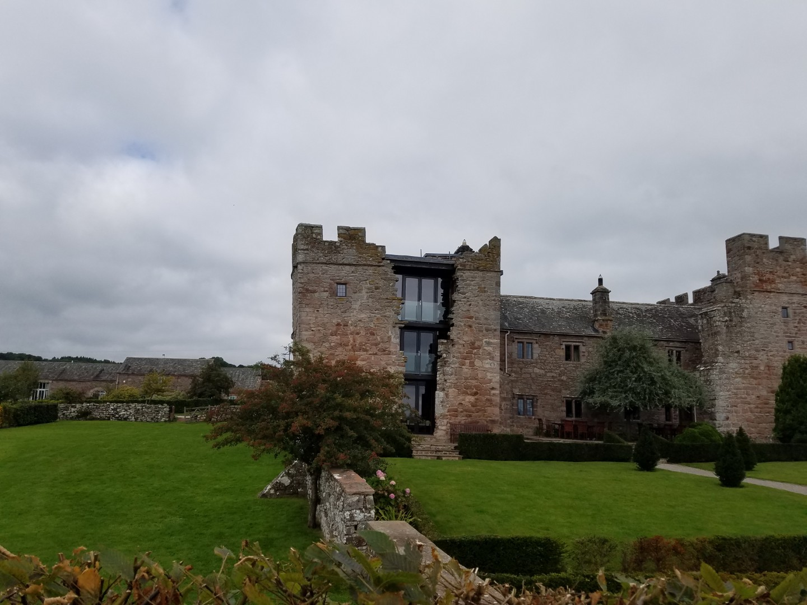
  <figcaption><i>Have you ever seen renovation like that?</i></figcaption>
</figure>

<figure style="text-align: center;">
  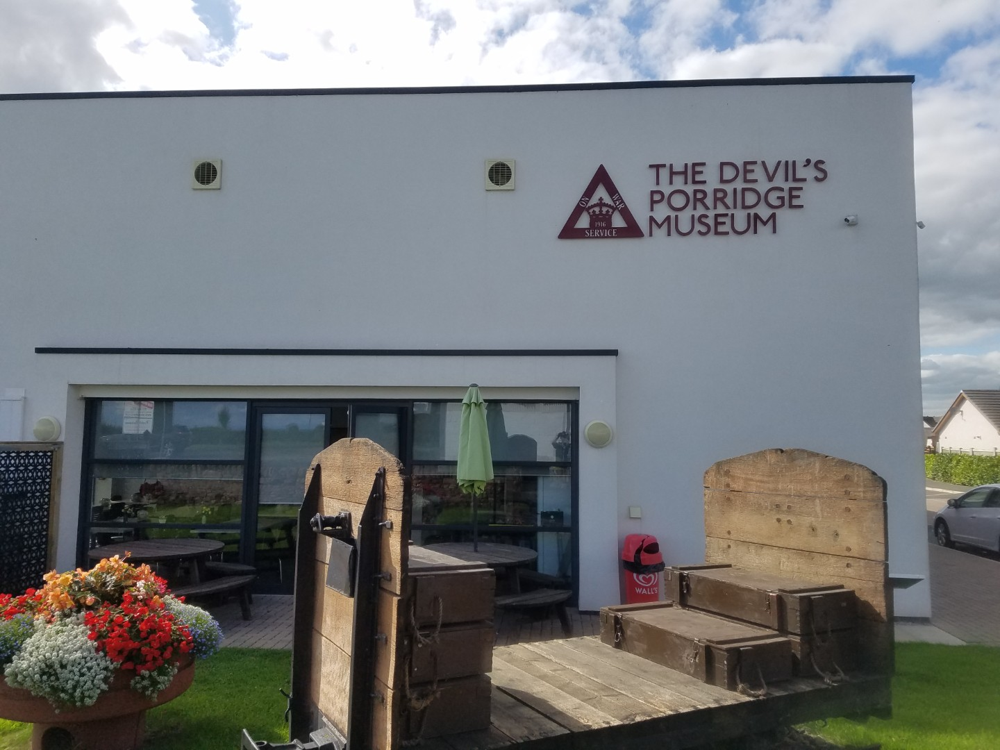
  <figcaption><i>Welcome to Scotland</i></figcaption>
</figure>

It was easy, fast riding after that, through Gretna Green and onto Dumfries as the sun came out. Our accommodation was at Marthrown of Mabie, an off grid bunkhouse, campsite, tee-pee and stone round house. It did involve a bit of off road to get there but a couple of mountain bikers on the red route pointed is in the right direction. It's a great spot, well worth visiting.

<figure style="text-align: center;">
  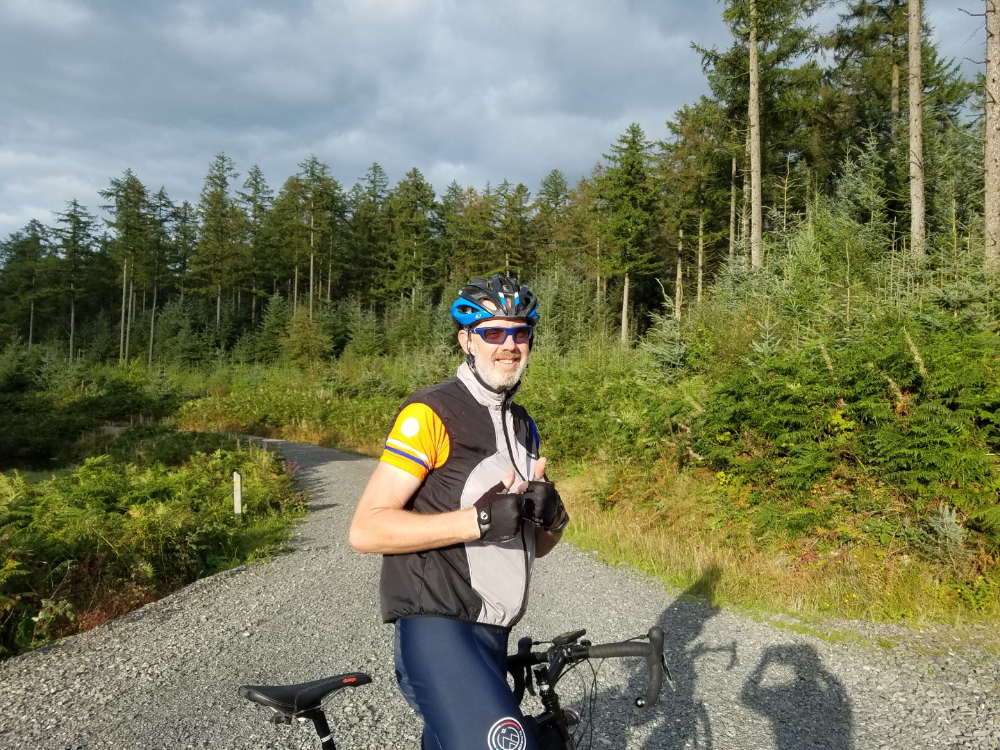
  <figcaption><i>Jim enjoying mountain biking on his road bike</i></figcaption>
</figure>

<figure style="text-align: center;">
  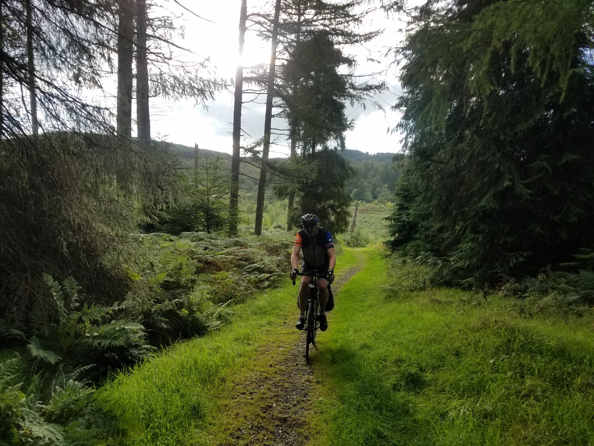
  <figcaption><i>Possibly not the recommended way to Marthrown of Mabie</i></figcaption>
</figure>

<figure style="text-align: center;">
  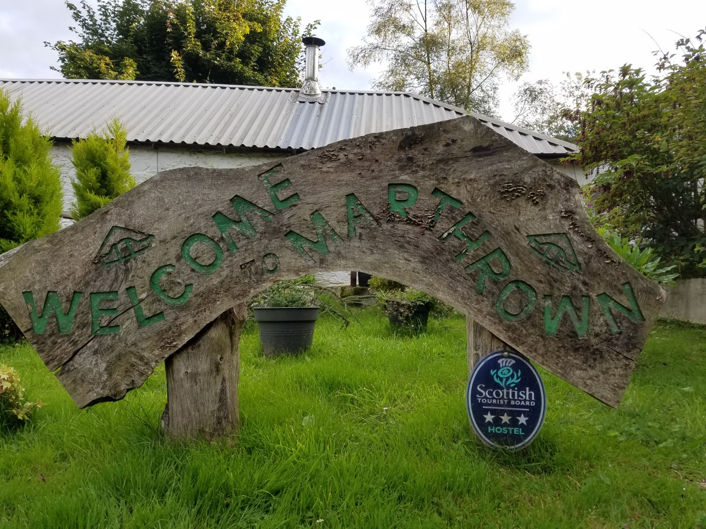
  <figcaption><i></i></figcaption>
</figure>

<figure style="text-align: center;">
  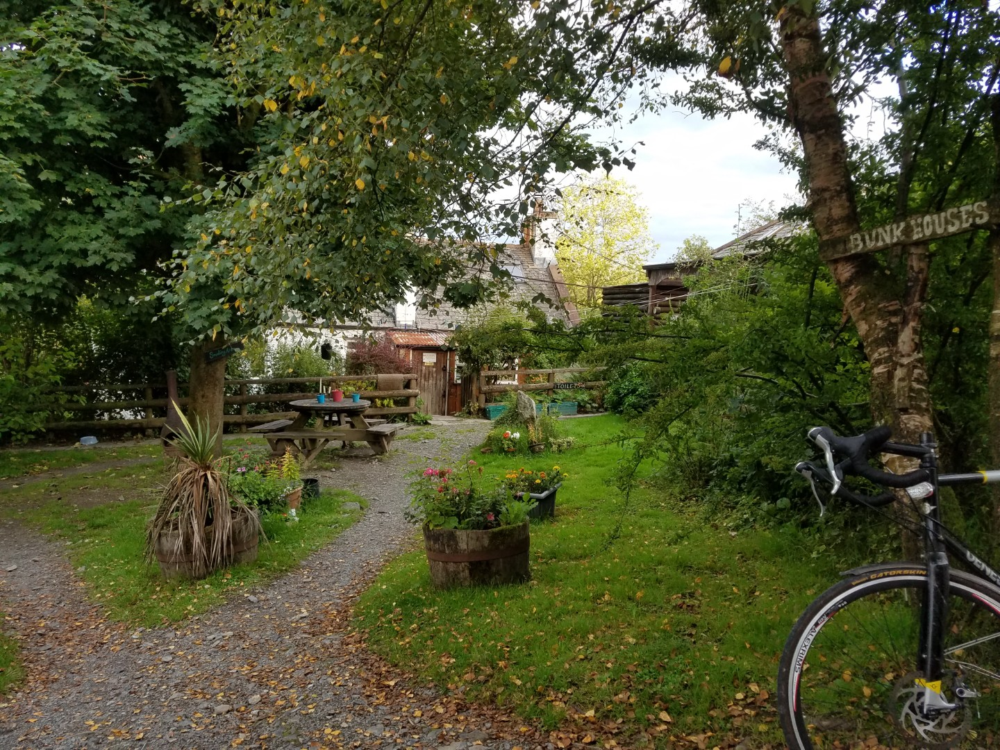
  <figcaption><i>Marthrown bunkhouse</i></figcaption>
</figure>
<figure style="text-align: center;">
  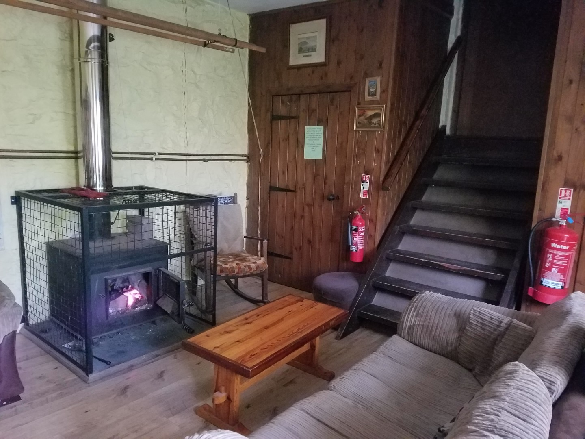
  <figcaption><i>Marthrown bunkhouse</i></figcaption>
</figure>

<figure style="text-align: center;">
  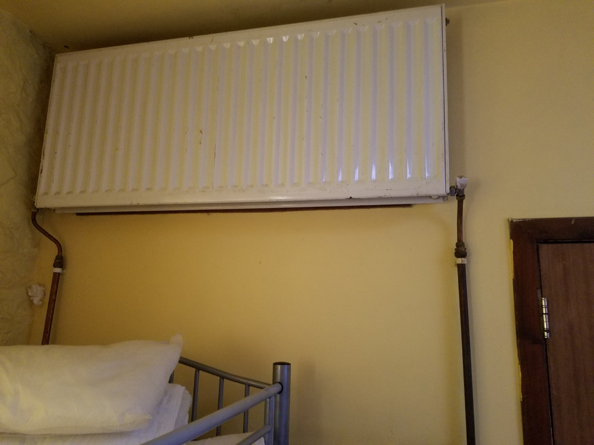
  <figcaption><i>The obvious place to put a radiator</i></figcaption>
</figure>

<figure style="text-align: center;">
  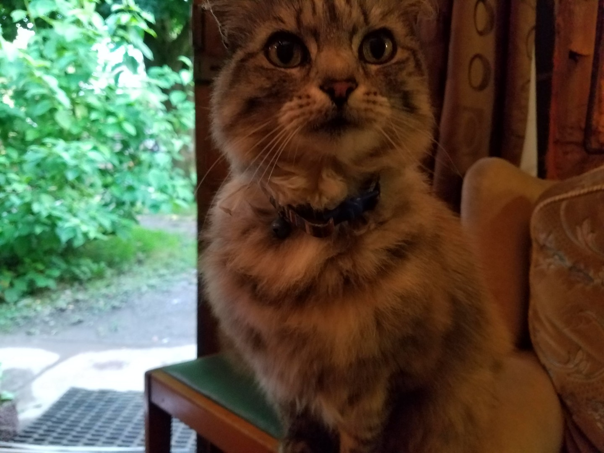
  <figcaption><i>Local pest control</i></figcaption>
</figure>

My legs felt better off the bike today but it's coincided with my arse not liking my saddle. If it took my legs 8 days to get used to the riding, at this rate I'll be comfortable in the saddle by day 16. Unfortunately we finish on day 14.