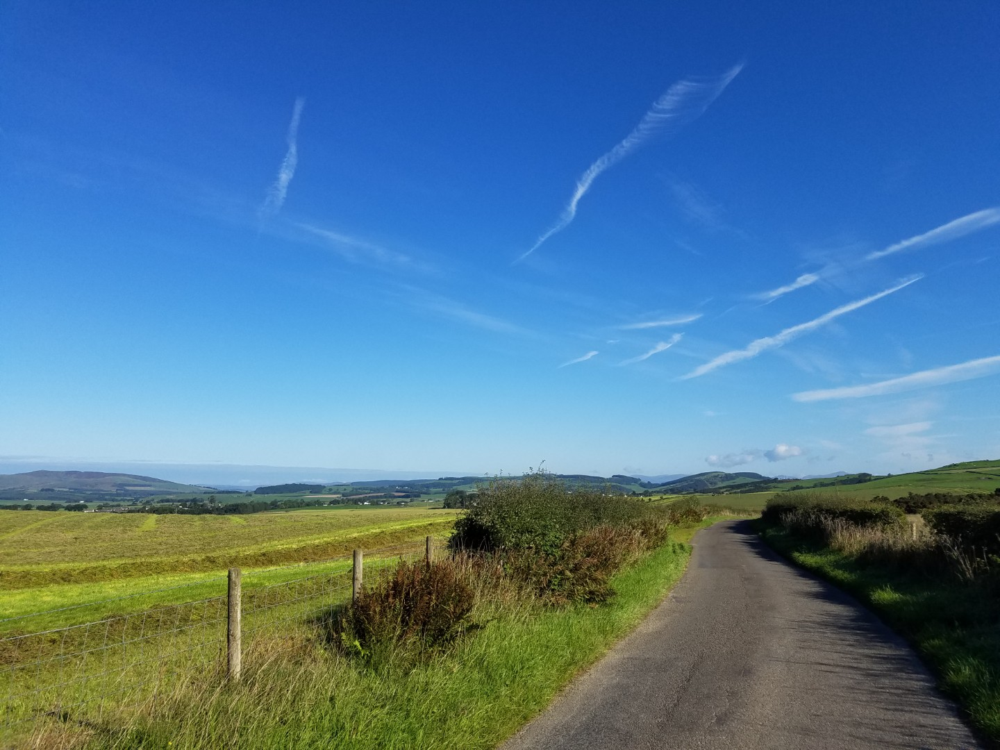
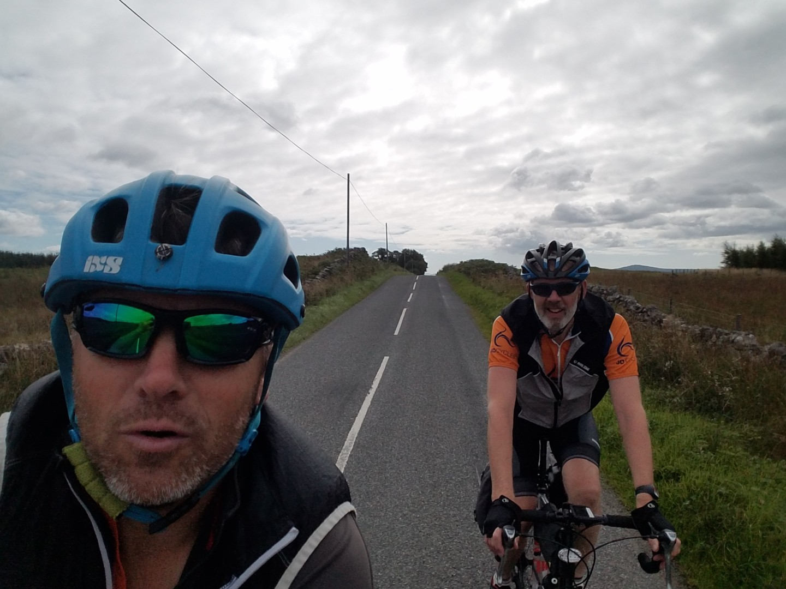
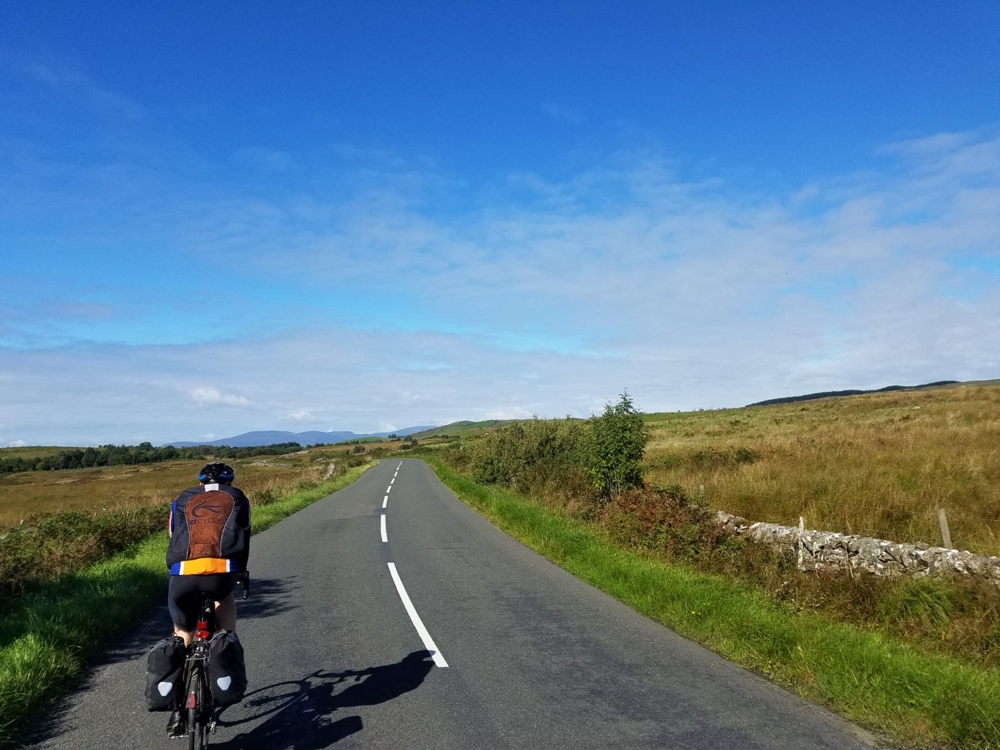
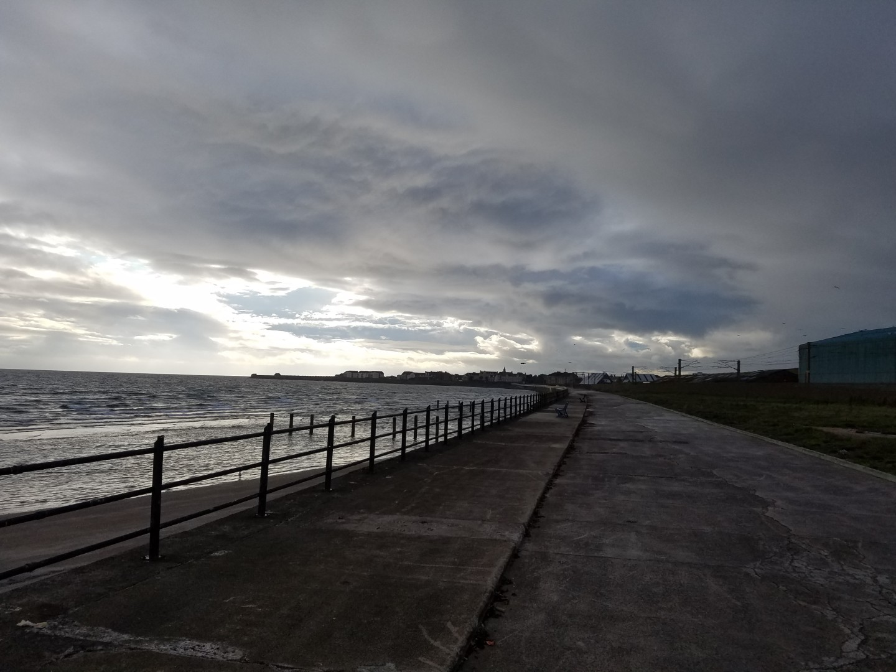
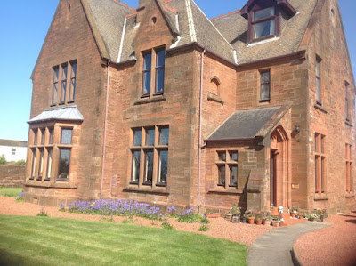
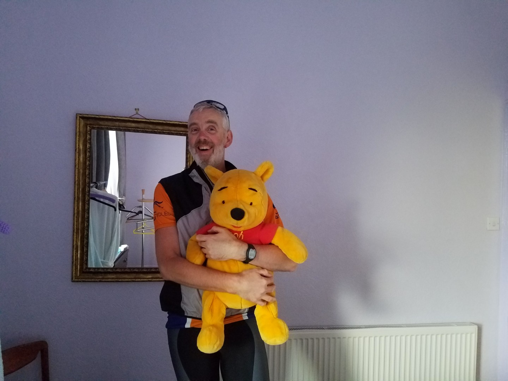

---
tags:
  - road-cycling
  - bikepacking
  - Scotland
title: LEJOG day 9 Mabie to Ardrossan
description: Land's End to John O'Groats day 9, Mabie to Ardrossan
draft: false
date: 2018-09-05
author: Tompkins Jonathan
---
# LEJOG day 9 Mabie to Ardrossan

**5th September 2018** 
**146km 7hrs 1.225vkm 20av**

Didn't get kidnapped and sold overnight, good start. There might have been some fleas though. We (me) did manage to add an extra 5km to the start by coming out of the hostel in a different direction and then having to climb the last hill that we climbed yesterday. For some reason Jim mentioned this numerous times.

It was a chilly but sunny start and the views over Galloway were beautiful but it went on and on and on and on. Got a bit bored of riding today. It didn't help that we didn't have a proper breakfast or find a single open cafe. Also, my sit bones seem to have taken a distinct aversion to my saddle today.

<figure style="text-align: center;">
  
  <figcaption><i>Near Mabie</i></figcaption>
</figure>

<figure style="text-align: center;">
  
  <figcaption><i>Somewhere between a place with no cafe and a place with a closed cafe.</i></figcaption>
</figure>

<figure style="text-align: center;">
  
  <figcaption><i>Jim, on a bike, outside.</i></figcaption>
</figure>

The AirBnB in Ardrossan is fantastic. It's a massive red sandstone Victorian house overlooking the sea. We've got our own pool room with TV and the staircase and hall alone is probably bigger than my house.

<figure style="text-align: center;">
  
  <figcaption><i>Atmospheric Ardrossan</i></figcaption>
</figure>

<figure style="text-align: center;">
  
  <figcaption><i>Our accommodation</i></figcaption>
</figure>

<figure style="text-align: center;">
  
  <figcaption><i>Don't ask</i></figcaption>
</figure>
