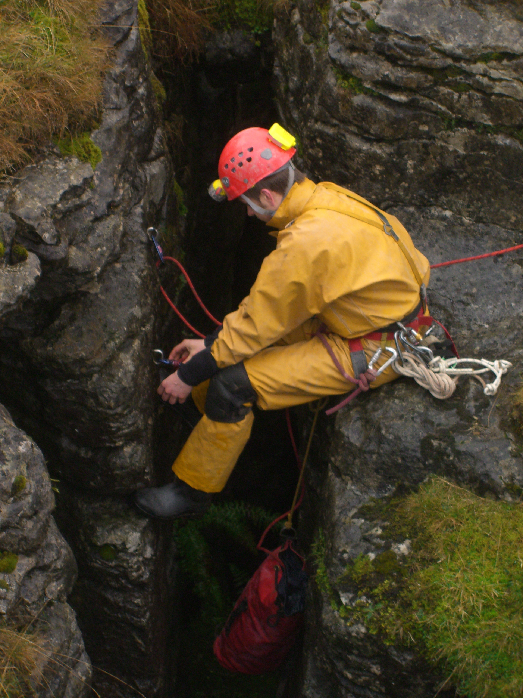
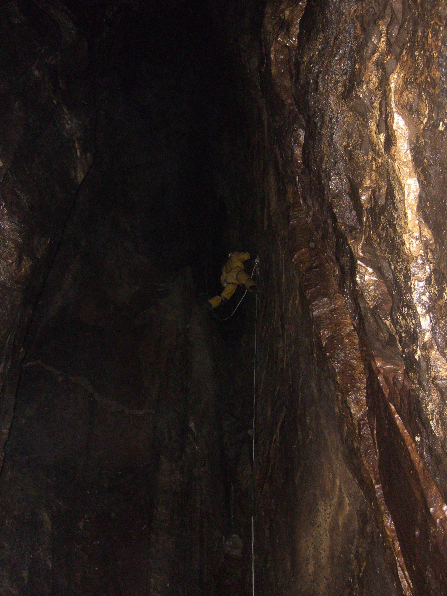
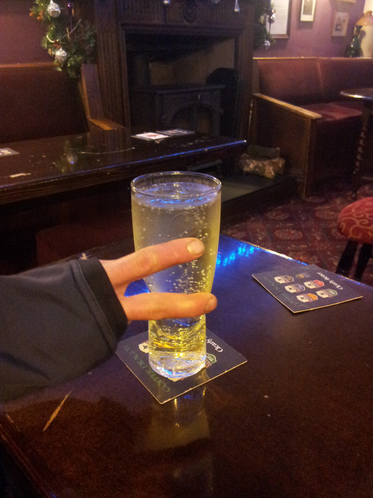

---
tags:
  - caving
  - Yorkshire-Dales
  - England
title: Long Kin West
description: A caving trip down Long Kin West in the Yorkshire Dales
draft: false
date: 2011-12-22
author: Tompkins Jonathan
---
# Long Kin West
**Friday 22nd December 2011**

**Grade IV    Depth 168m**
Jonathan Tompkins, Henry Exxon, Olly Rees
4 hours

[Surveys](http://cavemaps.org/cavePages/Newby%20Moss__Long%20Kin%20West.htm)

Henry and Olly had been caving in South wales for a few days and so we hadn't decided which cave to visit. We met in Inglesport cafe at 9 with a selection of descriptions. Some turned out to be too long, some required lots of short rope which we didn't have and some didn't have enough rope work for Henry and Olly. In the end we chose to do two of either Long Kin West, Pillar, Grey Wife Hole or Newby Moss Pot. After a quick chat with Jonny who very gently ribbed me about a post on my blog and with Dave still threatening to take me digging we left and drove to the parking spot.

We'd planned on doing a lot of caving today but we'd already made the crucial mistake of meeting in the cafe. Our second mistake was to pack all the bags and then change our minds. We ditched Pillar as a plan after Olly said it was pants. The good thing about repacking was that we were now down to two bags and it was mine that was left behind. Being the thoughtful soul that I am I didn't want to make the lads feel inferior by offering to carry their bags, so I didn't. We walked up the hill and found the cave without too much fuss. By now it was about 11am, doing two caves was not looking likely. 

<figure style="text-align: center;">
  
  <figcaption><i>Olly rigging the entrance pitch.</i></figcaption>
</figure>

Olly, being super keen, grabbed the rope and started rigging whilst I was still putting my harness on. There was quite a bit of moaning about pitch heads and 15 minutes later he was back on the surface, complaining about rope rub. He moved over to another set of bolts, moaned about the pitch head again and then disappeared. During all this Henry and I had tried to comfort him by gentle encouragement but unfortunately we failed and reverted to merciless banter. The first pitch requires a 100 metre rope, has a few re-belays and is very impressive. It starts down a narrow rift but soon opens out. By the bottom, even though I'd abseiled quite slowly, my descender was steaming as drops of water hit it. On the way down I'd learnt that my Petzl Stop doesn't automatically lock off on 9mm rope. Time to replace the bobbins I think.

<figure style="text-align: center;">
  
  <figcaption><i>Last Pitch</i></figcaption>
</figure>

Henry rigged the short second pitch and they kindly allowed me the last pitch. This involved crawling over shoring and loose boulders in a narrow rift and then to crawl around the edge of the top of the 3rd pitch in a shale bed. Olly got his revenge by correcting all my rigging. Rigging the pitch head was slightly awkward but only because I didn't want to stand up and lean out over the top of the pitch with a bolt below me. A drop of 15 metres was followed by a re-belay through a window and a final 55 metre drop to the bottom of the cave. There was a single bolt in the wall a long way down which I assumed was a re-belay but if used actually added a lot of rope rub. I abseiled carefully to avoid any rope rub but when Henry came down he re-belayed here to make the ascent easier. 

The bottom is a massive boulder choke with a dig at the far end, abandoned I think. We ate lunch and then set off out, with me derigging. We were getting close to our call out time so at the bottom of the first pitch Henry set off for the surface to cancel the call out. We had a plan that we could haul the bags up the first pitch from the surface and it would have worked perfectly if I'd taken out the knots when derigging the re-belays! I didn't because I'd stupidly hung one of the bags which was full on the end of the rope to make jugging easier. Not only did this make using the Pantin difficult during jugging it also meant that to untie the knots involved me hauling the bags up a bit and faffing around whilst I sorted the knots out. Naturally I couldn't be bothered with this and so we all ended up faffing around at the top instead as we got different sets of knots past the pulley. Not the easiest method!

It was 3.30 by the time we all got out, still light but misty. Olly entertained us on the way down with some deep philosophical questions, his best being "Which would be heavier; a bag of 8mm or 10mm rope?" Somehow I once again managed not to carry any bags which was handy as my legs were tired after all that jugging.

Our visit to the New Inn in Clapham produced our only disappointment of the day; Olly's choice of drink, as can be seen below.

<figure style="text-align: center;">
  
  <figcaption><i>Olly's disappointing choice of drink.</i></figcaption>
</figure>

Postscript - 18th December 2020
Having already done Long Kin West but wanting a bit of rigging practice in a new cave with John Martin, we decided to do Pillar Holes. It's quite close to Long Kin West and the description is on the same CNCC pdf. John put the grid reference into his phone and off we went.

 We looked at the various entrances but strangely the entrances didn't really match up with the description but we chose some starting bolts and set off, we could always turn back if we had to. At the end of our ropes we'd at least reached a floor but there was another pitch below. None of it  made sense.

Back home I looked at the Long Kin West rigging topo and realised that's what we'd done. John must have accidentally copied the wrong grid reference from the description. I texted him to tell him what we'd done and he replied with a link to a blog that he'd found, the first result in his search, showing a picture of the entrance which we both recognised. It was my blog, that post above.

Oh well, anyone can accidentally copy the wrong grid reference, especially a really experienced qualified Mountain Leader, Summer and Winter.