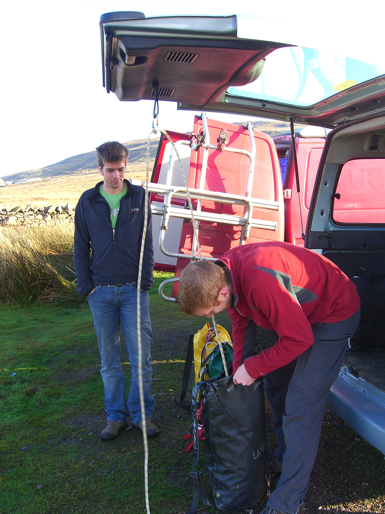
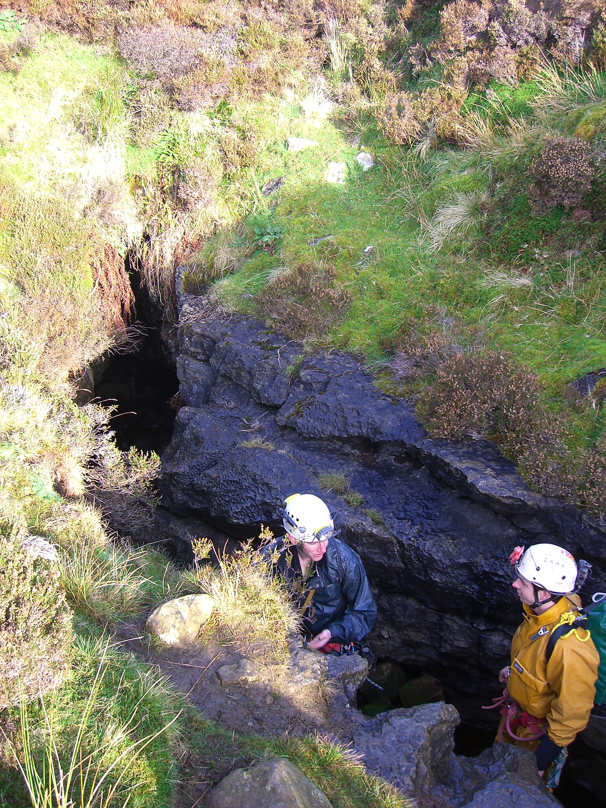
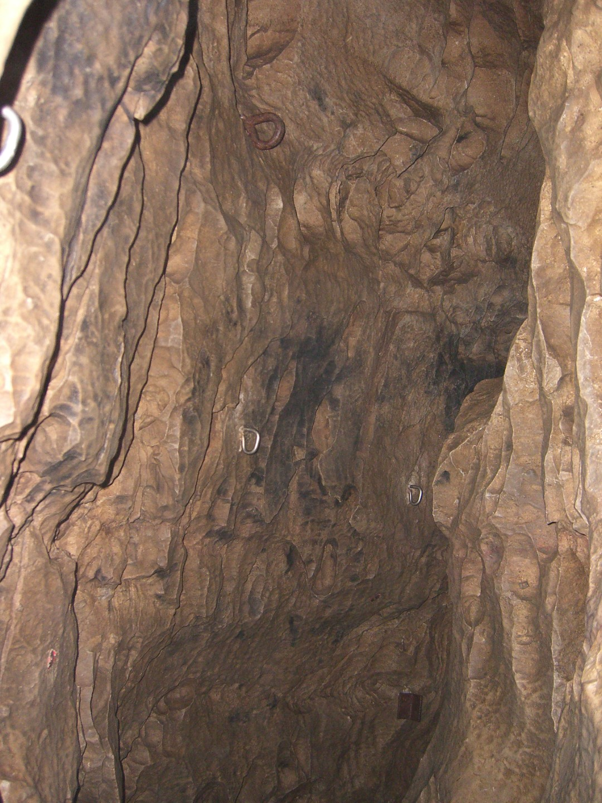
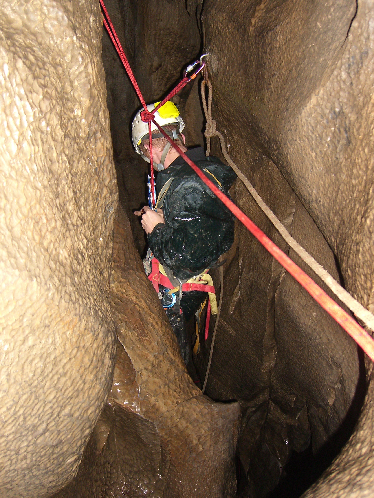
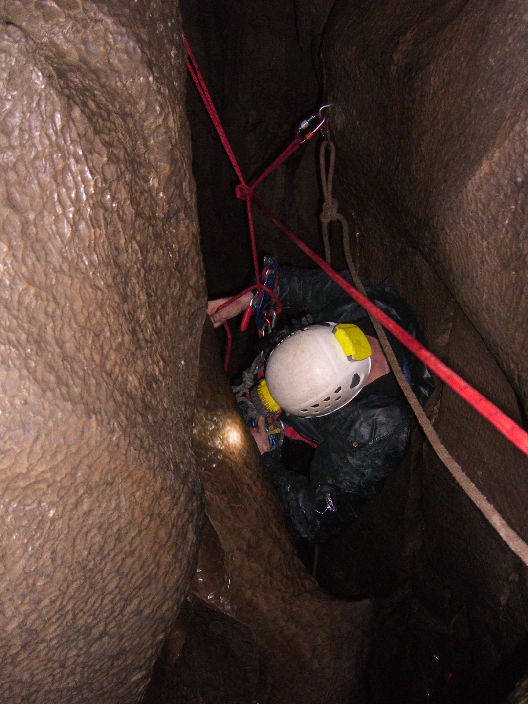
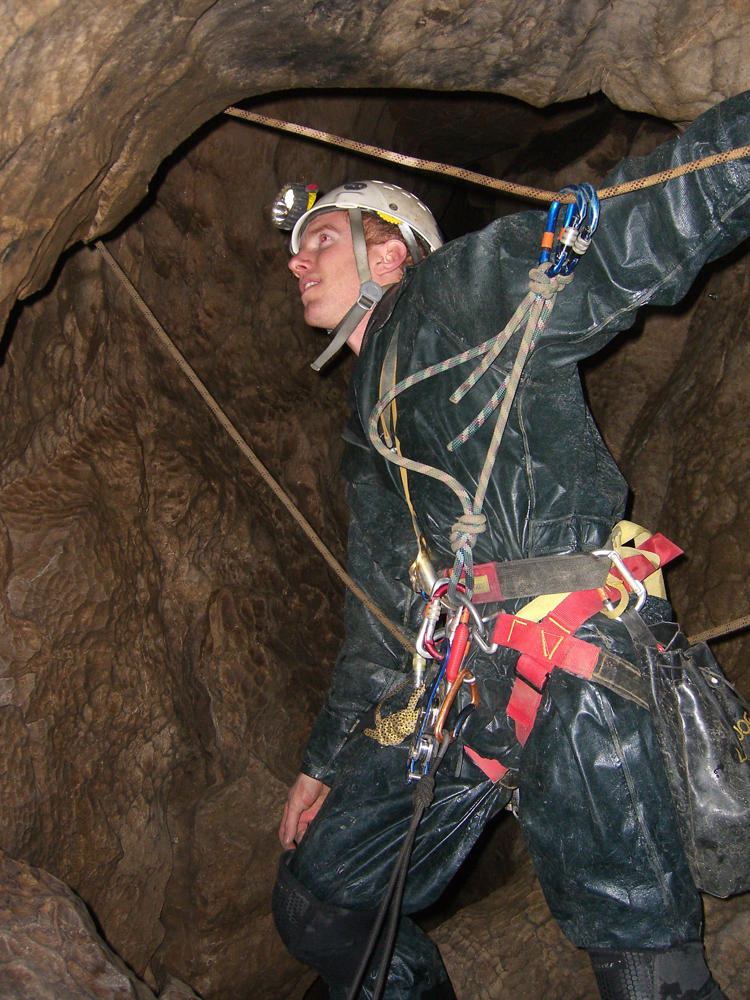
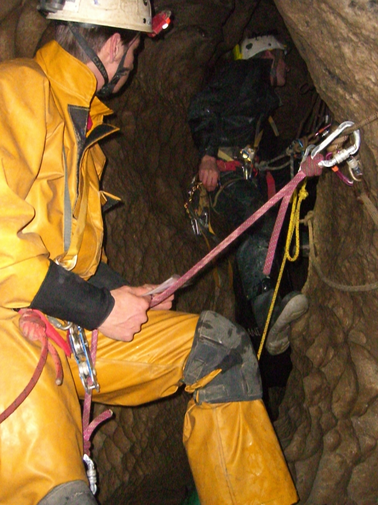
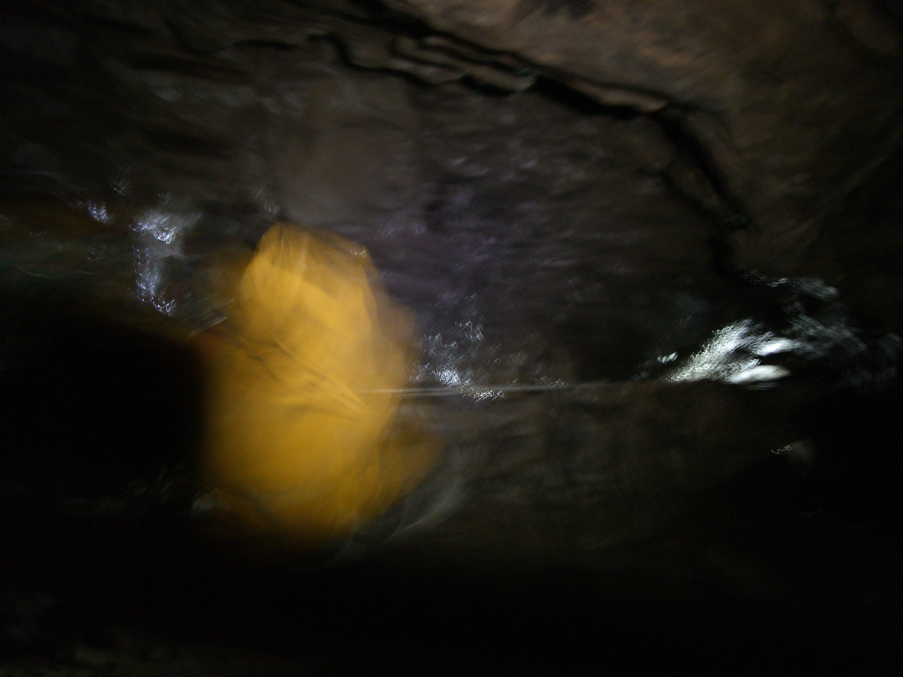

---
# Lost John's Cave

## or "Blimey, that felt hard"

### or "Don't go vertical caving when you're a bit ill"

**Lost John's cave  - Thursday 17 November 2011**

Grade 3/4    Length 4800m     Depth 140m

Jonathan Tompkins, Henry "the Stick" Exon, Olly "Baby Faced Cynic" Reese

[Surveys](http://cavemaps.org/cavePages/Leck%20Fell__Lost%20Johns%20Cave.htm)

We met at 10am near the cave. The plan was to do what Henry Exon told us to do. He'd been down Lost John's on his CIC training so we were going to do a different route to the one he'd done. Plus he could impart some of his new found knowledge on us mere mortals. There's lots of different ways to the bottom of this cave and we aimed for the driest way. It was a good forecast and had been dry for a while so we didn't envisage any wet epics.

<figure style="text-align: center;">
  
  <figcaption><i>Henry packing, Olly looking busy</i></figcaption>
</figure>

We pulled all our ropes out of our cars, chose the ones that were nearest to the lengths we needed and packed them. In total we needed 220 metres of rope, we probably carried 250. The first bag was my big yellow bag, Marks' favourite but unfortunately he wasn't here to carry it. He had some terrible excuse about having to work during the week. Luckily Henry had the day off and Olly Rees was a student and could do what he wanted. 

<figure style="text-align: center;">
  
  <figcaption><i>Henry & Olly  in the cave entrance</i></figcaption>
</figure>

<figure style="text-align: center;">
  
  <figcaption><i>Would you use that rusty crap?
</i></figcaption>
</figure>

After the massive walk in of 3 minutes we headed for Dome pitch which meant we had to go along The New Roof Traverse; easy going over a fine canyon. I was rigging first and the first two pitches are short and probably free climbable. 

I soon found myself at the start of Dome pitch where there is a very interesting assortment of rusty ironmongery, non of which I decided to use. It starts with a few bolts and a short abseil. I landed on a platform and hadn't really looked around properly on the way down and thought it was the bottom. Just as I started to get off the Stop I turned round and saw I was stood on the edge of a large drop. A short curse soon saw me regain my composure. There was supposedly a rebelay 11 metres down this pitch and then a swing into an alcove but I couldn't see one from here. I set of abseiling again but soon stopped; there seemed to be a lot of ominous creaking coming from my  kit. A quick look saw me cursing again and quickly screwing up the carabiner that attached my Stop to my harness, a fairly crucial item! Henry and Olly were beginning to enjoy this. I carried on, still not able to see the deviation. Lower down and to the right I saw a platform with some red tape on it, maybe that was where I had to swing to. I then saw a thread I could use as a deviation and after multiple attempts to claw my way across the rock, and a bit of cursing, I threaded it and clipped in and then carried on abseiling. Lower down I saw the real deviation, a bolt. Bugger. By this stage I was no where near the rock wall and couldn't swing over to the bolt. Poo. So I started to jug up so that I could push off the rock but somehow my abseil carabiner got jammed in my chest jammer. Bloody hell! It was like being a beginner again. Then I saw the real alcove I had to swing to and it was easy. 

<figure style="text-align: center;">
  
  <figcaption><i>Typical of some of the rift traverses</i></figcaption>
</figure>

<figure style="text-align: center;">
  
  <figcaption><i>Candle & Shistol</i></figcaption>
</figure>

Olly took over the rigging now and we headed off to Dome Junction, Candle and Shistol pitches without incident. Most of the route so far had been quiet but at the Battle-Axe traverse you encounter a noisy stream. The traverse starts with the streamway not far below you; an easy traverse in a narrow rift passage with a few awkward bits. By the end you've stopped looking at the size of the drop and when you do you suddenly realize it's quite big. The final drop is an impressive abseil in to a large chamber. There is then a short climb up to the final drop where we found evidence of flood debris, very sobering. 

Even more sobering was Groundsheet Junction where every inch of the walls was plastered in mud up to the roof. Not a place to be when it floods. 

By now it was about 2.30pm and we were in the Leck Fell Master cave. We wandering off upstream, constantly looking at all the mud on the walls. I think we got to Lyle Caverns. We had a look up a side passage and found some fantastic pristine formations, the best of which were flowstone that had formed on top of mud which had subsequently washed away leaving wafer thin layers of rock hanging in mid air. 

Down stream consisted of 1.2 km of meandering passage eventually ending at the Long Pool. Technically it didn't end there but as we weren't keen on wading in neck deep water just to look at a sump we turned round. 

<figure style="text-align: center;">
  
  <figcaption><i>Start of Battle Axe traverse</i></figcaption>
</figure>

<figure style="text-align: center;">
  
  <figcaption><i>Final pitch traverse</i></figcaption>
</figure>

The return up the pitches went mostly without incident, except for me feeling a bit iffy. I'd caught a bit of a cough and a runny nose after working with a group last week. I was really keen on going down Lost John's so I did no exercise all week in the hope that my mild cold wouldn't turn into full on man flu. On the way down I felt fine but after a 100 metres of jugging back up I wasn't exactly full of beans. 

One minor incident occurred as I was about to step in to the void from the alcove on Dome pitch. Rather than jug up with bags attached to us I had the brainwave of attaching all the bags to the rope and launching them into space. We could haul them all using a pulley when we were at the top and the weight of the bags on the rope would help pull the rope through our jammers as we ascended. So I'm stood at the edge of a drop, with bags attached to a rope below me hanging in space. I attach my hand jammer and then my chest jammer. Just as I'm about to step off the ledge the rope is pulled out of my chest jammer. Luckily I retain control of my sphincter. After a few more unsuccessful attempts I move the bags back to the ledge, step off and then pull the bags bag into the void. 

The rest of the route out saw no more sphincter contractions or cursing, except at one of the little climbs took me at least 4 attempts of flailing around. Most of the big pitches saw me admiring the view a lot instead of moving upwards. Luckily Olly was so keen, or felt such pity for my old man antics, that he took my bag through all the difficult bits. Always said he was a nice lad. 

We exited about 5.30pm. Henry was first, then Olly and me. Somehow we got to the cars without Henry and we hadn't actually seen him exit because he was ahead of us. We shouted a few times but there was no answer. I took off my harness and started to walk back to the cave and saw his lights. Somehow he'd exited, waited for us near the cave and then missed us. That's what he said; me and Olly weren't quite so sure that there was something he wasn't telling us.

<figure style="text-align: center;">
  
  <figcaption><i>How not to take photos in a cave</i></figcaption>
</figure>

**Jugging technique**

I'm a stocky build so a bit top heavy. When jugging up long pitches my arms often give up first and this is because my SRT setup doesn't pull my body close enough into the rope. I use a standard frog setup with a [Petzl Torse](http://www.petzl.com/en/outdoor/caving-harnesses/torse) as a chest harness. Even when this is pulled tight I still struggle to be efficient. Occasionally I use a [Petzl Pantin](http://www.petzl.com/en/pro/verticality/rope-clamps/rope-clamps-progression/pantin) foot jammer which helps.

For this trip I decided to try a [Beast Chest Harness](http://beastproducts.co.uk/shop.html). There are 4 buckles to adjust, 3 of which are adjusted once and then left alone, the fourth is the one to use in the cave. The horizontal chest strap goes straight through the chest jammer hole and if you adjust the chest harness so that it's high up on your chest, it allows you to really keep the jammer close in when jugging. When tightened up my chest stayed close to the rope with hardly any slack and jugging was almost a delight. It's definitely far better than previous methods I'd used.

There are some disadvantages. It's a little bit fiddly to tighten the fourth buckle; it's not a one handed operation.  If you're hot it's a bit harder to keep the front of your suit open because of the horizontal strap and your "friends" make constant references to your bra. I'll be sticking with it for now

Another alternative is the [MTDE Garma chest harness](http://www.starlessriver.com/shop/harnesses_belts/mtde_garma_chest_harness). Similar to the Beast but with gear loops. Not cheap.

Update 18/11/11 - I ache.