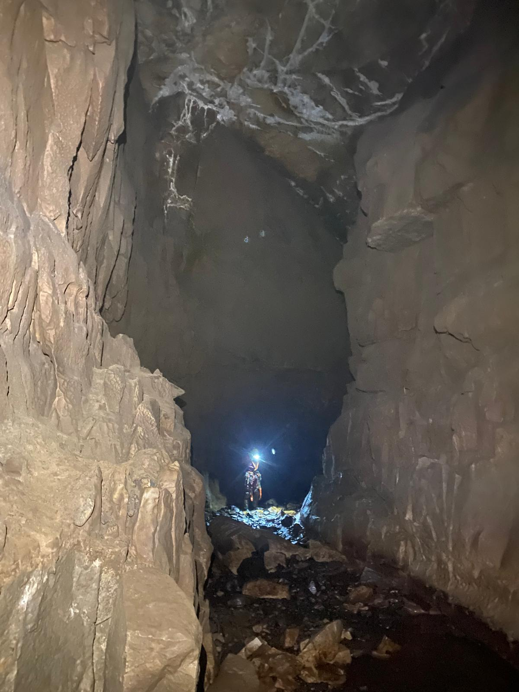
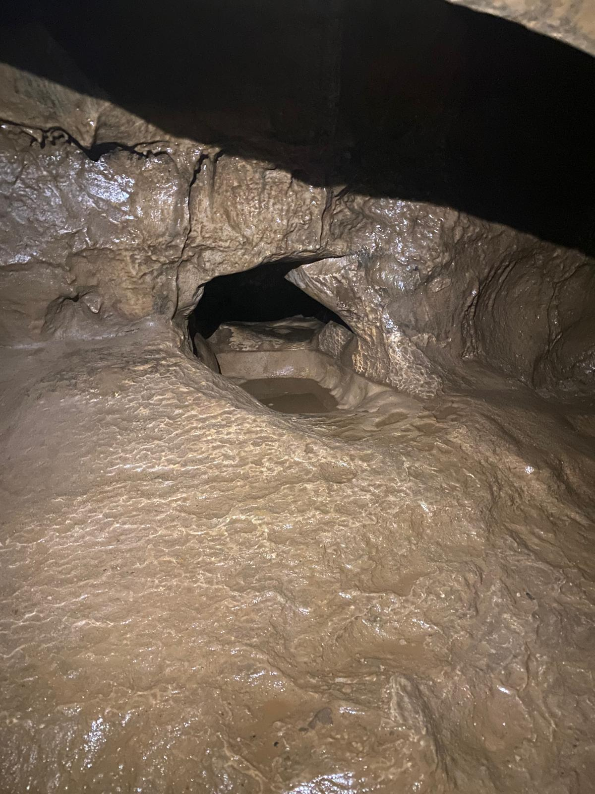
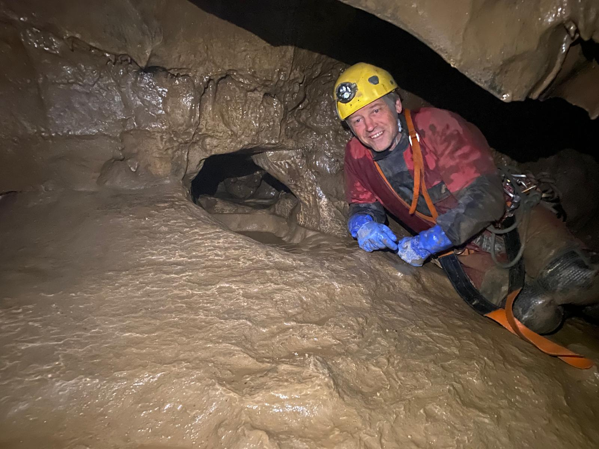
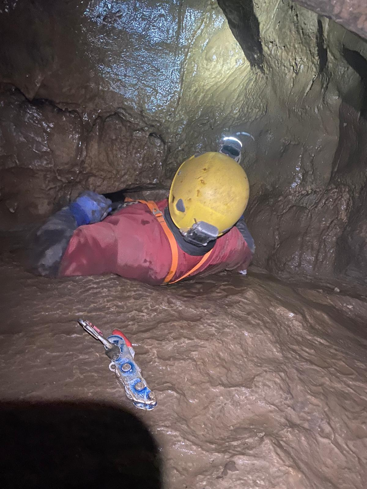
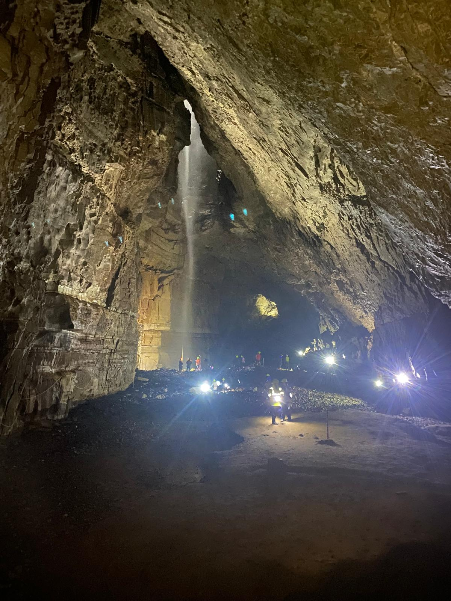

# Marilyn Pot
**16/08/2026**

Another long dry summer and [[John Martin|John Martin]] and I still had done the Easegill through trip. We each had the same day free during the August Gaping Gill winch meet, organised by the Craven Pothole Club - https://www.cravenpotholeclub.org . We didn't really plan anything in advance and ended up going down Marilyn (I'd forgot how snug it was in places), romping around Henslers (I'd also forgot how big this was) and then went to look at the Far Country. 

<figure style="text-align: center;">
  
  <figcaption><i>Henslers</i></figcaption>
</figure>

We soon arrived at the Blowhole.

<figure style="text-align: center;">
  
  <figcaption><i>The Blowhole in the Far Country</i></figcaption>
</figure>
Of course John slipped through, with his SRT kit on, like it was easy. He said as much and I told him I didn't believe him. I tried a few times, with and without SRT kit, feet first, head first, on my back and on my stomach. I possibly could have made if I'd really really tried but a combination of size, lack of flexibility and being a bit scared of it put me off. I was happy when when John struggled to get back through.

<figure style="text-align: center;">
  
  <figcaption><i>A human being to give it some scale</i></figcaption>
</figure>

<figure style="text-align: center;">
  
  <figcaption><i>A human being not going through the hole</i></figcaption>
</figure>

We returned back to Henslers and had a mooch down some of the crawls. Later, after consulting a few CPC members we found out that we might have been long Long or Mud Henslers. I was long, wet and muddy and seemed to terminate in a sump although I was assured that you could get round the bend to, well, somewhere. At the end of it I was up to my elbows in freezing, muddy water with John safely holding back to graciously let me investigate the passage. I felt he was missing out so when I turned round and went as fast as possible hoping that the bow wave would swamp him. The bugger stayed dry.

The connection towards Bar Pot was as slightly awkward as always. We were soon at the turn off to Gaping Gill main chamber when we spied a red rope over a pool. This turned out to be Pool Traverse, something I'd only learned about when Ian Patrick wrote that he'd rigged it for the CPC winch meet. I'm glad I didn't have to rig it, it was smooth without an abundance of footholds and there weren't many bolts. There were some drilled holes but not big enough for 9 or 10mm rope, only what looked like 6mm cord. It wasn't very confidence inspiring.

<figure style="text-align: center;">
  
  <figcaption><i>Main Chamber</i></figcaption>
</figure>

After a chat with Ian Patrick in the main chamber he mentioned that if no customers turned up for the chair I could get a trip up the winch, I just had to pay my tenner later. I obviously jumped at the chance whereas John went up Bar pot.

A good day out and with a newer survey it would be worth exploring Henslers again.