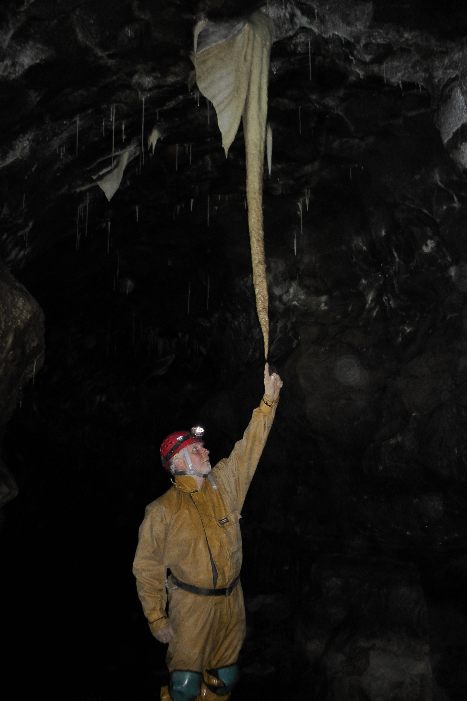

---
tags:
  - caving
  - Yorkshire-Dales
  - England
title: Notts II
description: A caving trip down the beautiful Notts II
draft: false
date: 2012-03-28
author: Tompkins Jonathan
---
# Notts II

**Wednesday 28th March 2012**

Jonathan Tompkins, Dan Clarke, Mike Hirst

Dan had visited Notts II before and wanted to return to take photos. We tagged along to look at the formations, rather than a full exploration of the system. I was a bit reluctant because it was a glorious sunny, warm day and I'd just got my new bike!

The entrance shaft, also known as Committee Pot and Iron Kiln Hole, is a superb engineering feat. It consists of scaffolding, concrete, wooden shoring, breeze blocks and fixed ladders, winding their way down 50 metres to Mincemeat Aven and Inlet 13. It looks a bit intimidating at first but is easy climbing, almost worth the trip for this alone!

Once at the master cave (lots of evidence of flooding) we headed upstream and helped Dan take some photo's. There are some stunning formations and they seem to be undamaged. Depressingly this is not always the case and it's hard to understand why a caver would break off or throw mud at pristine formations.

I think we went to Curry junction and explored the two ways on. It was quite a pleasant amble and we turned round when the formations finished. The exit was physically harder than expected, a nice little workout!

<figure style="text-align: center;">
  
  <figcaption><i></i></figcaption>
</figure>
