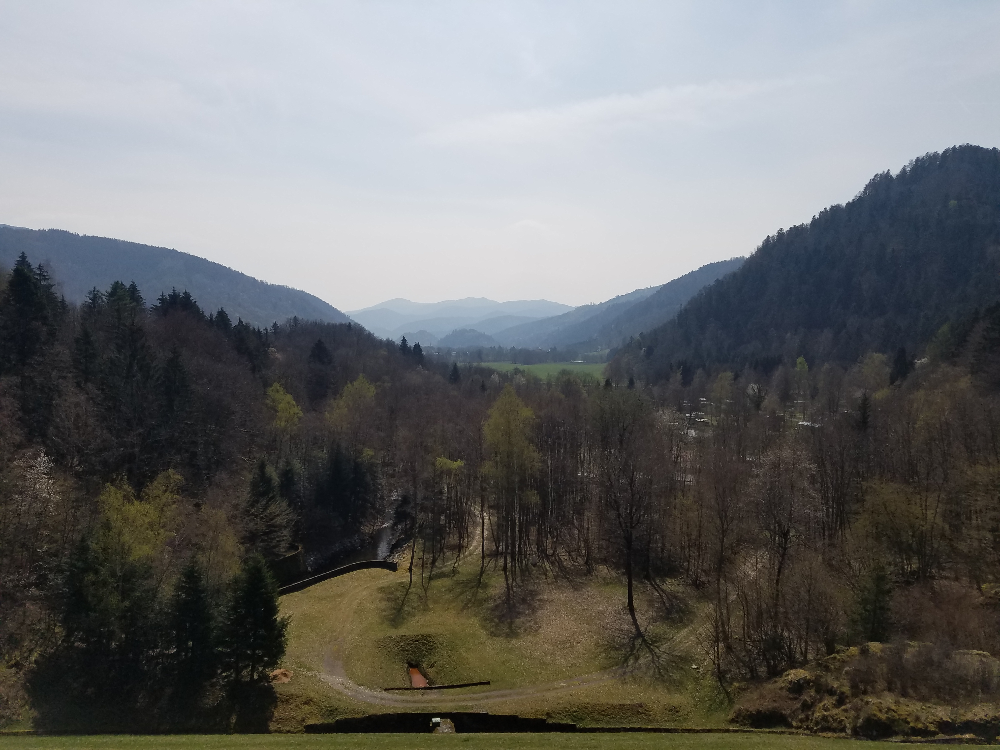
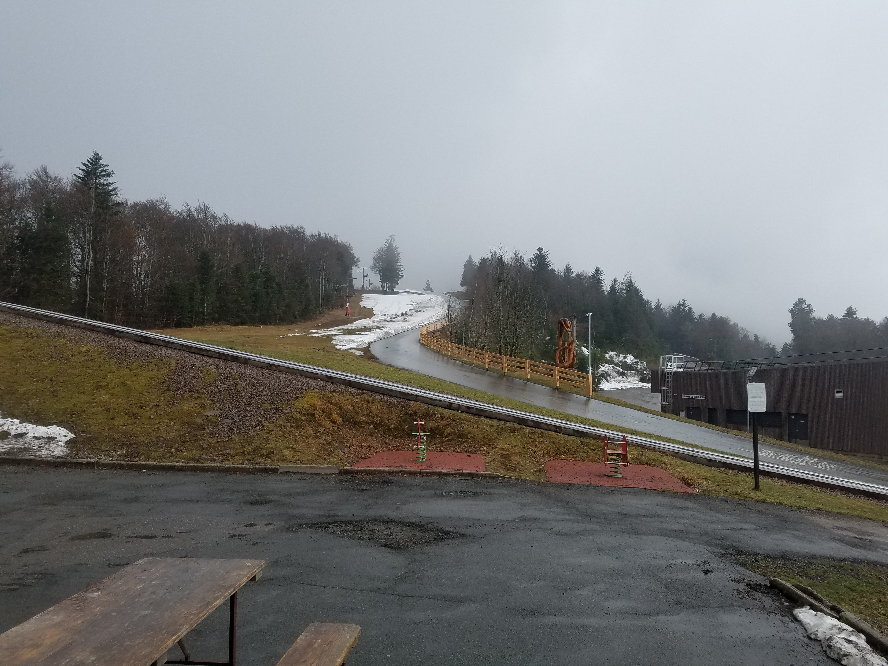
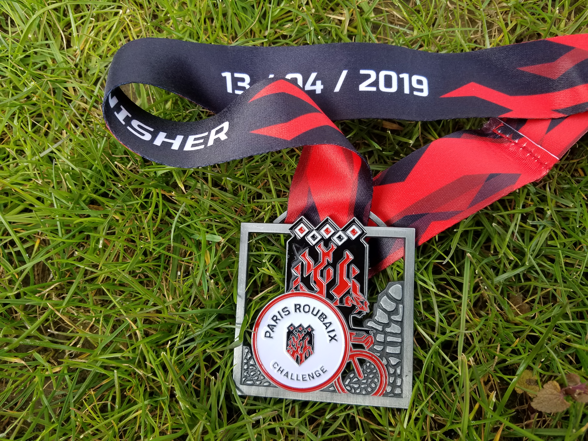
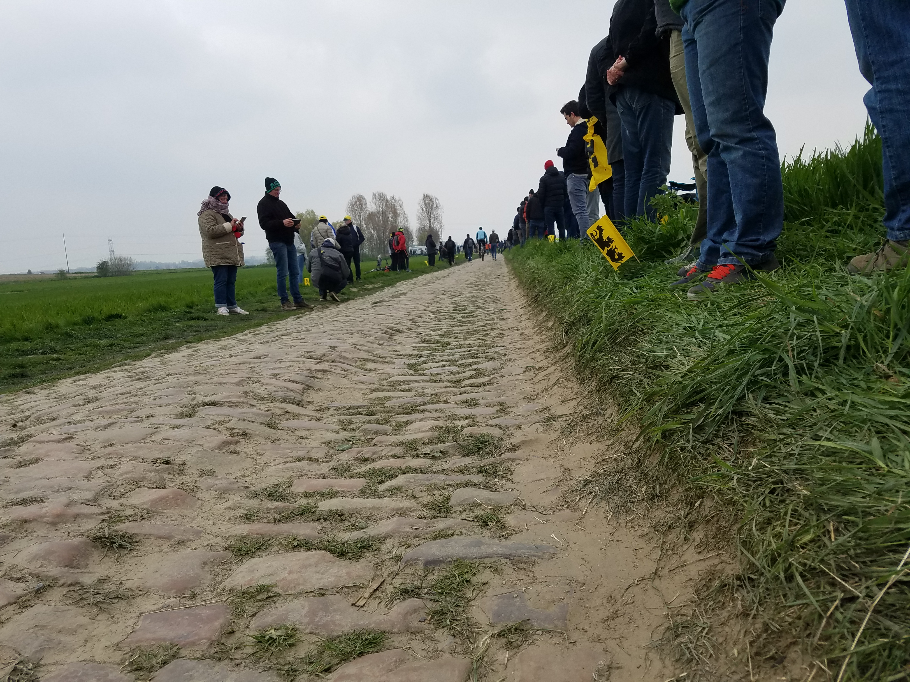
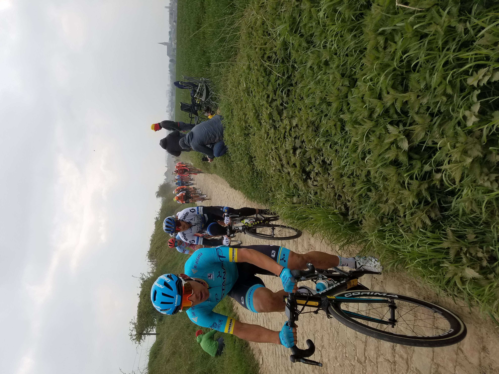
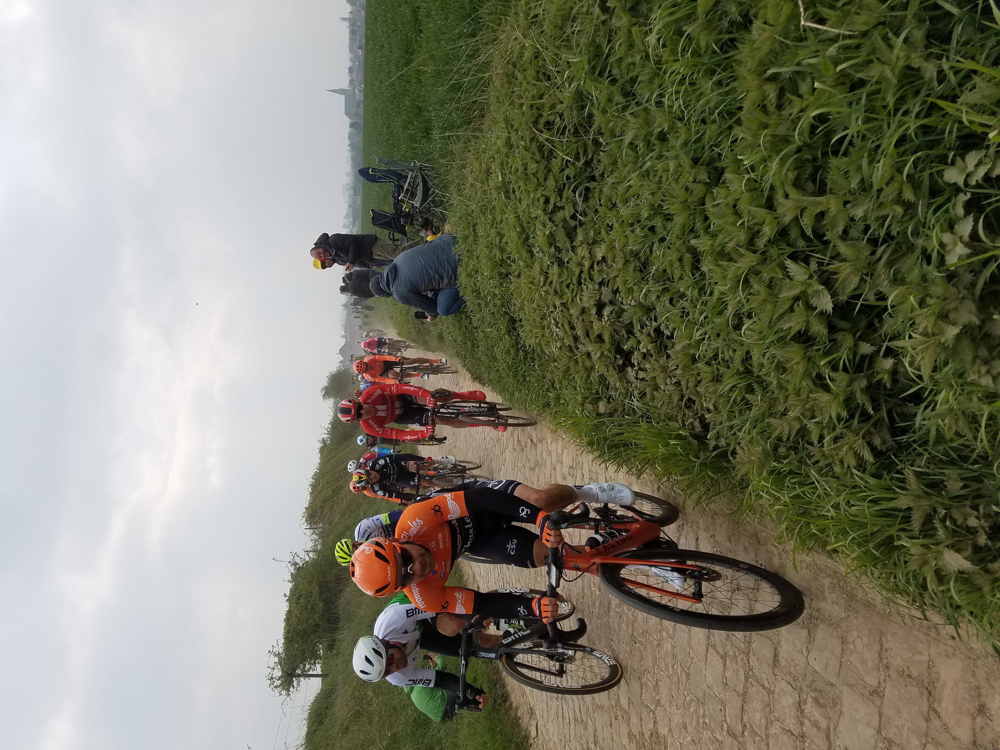
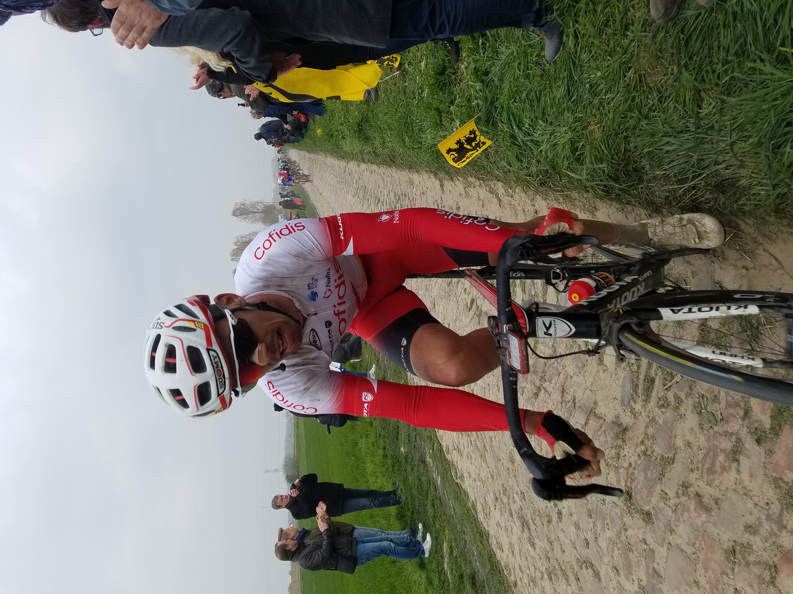
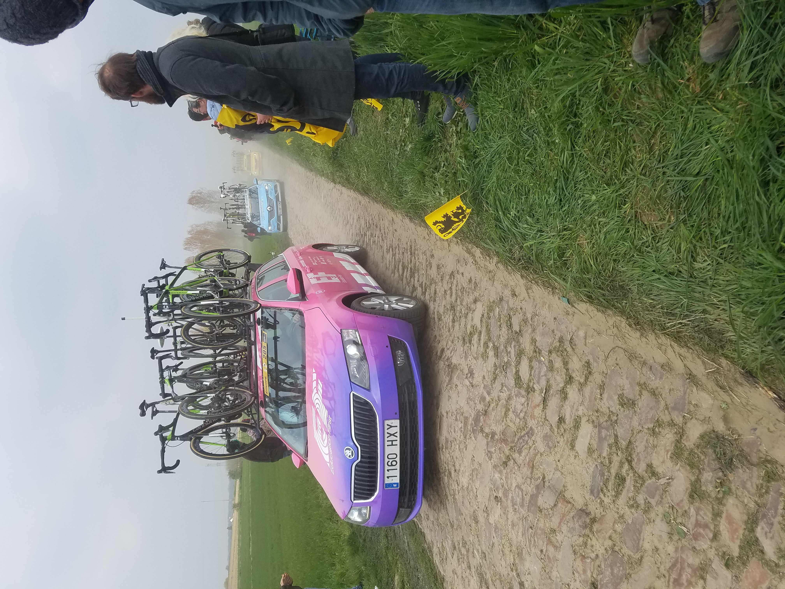

# Riding the Paris Roubaix Sportive and watching the race
**14th April 2019**

I'm writing this after the event, nearly seven years after the event when I've realised that I neglected to post about a lot of my trips. Considering that my memory is dreadful and I set this blog up to counteract that problem it's all a bit ironic.

Dan Clark invited me along, I think there were four of us in total, one of whom was David Hormigo. They'd all been before so I didn't have to think about a thing. We went for a week, had some easy riding beforehand and then went to the Planche De Belle Filles which had been made famous by the Tour de France.

<figure style="text-align: center;">
  
  <figcaption><i>Humongously long climb not pictured</i></figcaption>
</figure>

<figure style="text-align: center;">
  
  <figcaption><i>The top</i></figcaption>
</figure>

The sportive itself was a bit of a shock to me. I'd never ridden in a bunch before and got a bit overwhelmed by it, loosing contact with the rest of the group before re-joining them at the first feed zone. At one point I remember hardly having to pedal as I sat behind two gigantic Belgian units; that was until we got to a hill (a hump backed bridge) and they ground to a halt. In the end I rode the fastest average speed I'd ever ridden, purely down to drafting. 

The cobbles were great. On the Arenberg cobbles I remember bikes in front of me discharge, pumps, bottles, bottle cages and bottles still attached in cages. Being a mountain biker at heart I made an effort to find the best line whilst others deliberately rode down the middle over every cobble in an effort to get the genuine experience. I had 32mm tyres and no extra bar tape and didn't have any trouble with my hands at the end.

<figure style="text-align: center;">
  
  <figcaption><i>Finishers medal. You also get a sticker for your bike with cobble section on it and where they are on the course. My is still stuck to my bike.</i></figcaption>
</figure>

On race day we were lucky to have David, he seemed to know every detail about where to watch the race and we got to see it at loads of places. Two things stand out - it's very fast and it would be better without the cars, they create too much dust.

<figure style="text-align: center;">
  
  <figcaption><i></i></figcaption>
</figure>

<figure style="text-align: center;">
  
  <figcaption><i></i></figcaption>
</figure>

<figure style="text-align: center;">
  
  <figcaption><i></i></figcaption>
</figure>

<figure style="text-align: center;">
  
  <figcaption><i></i></figcaption>
</figure>

<figure style="text-align: center;">
  
  <figcaption><i></i></figcaption>
</figure>

  
  
<i>CAPTION</i>

