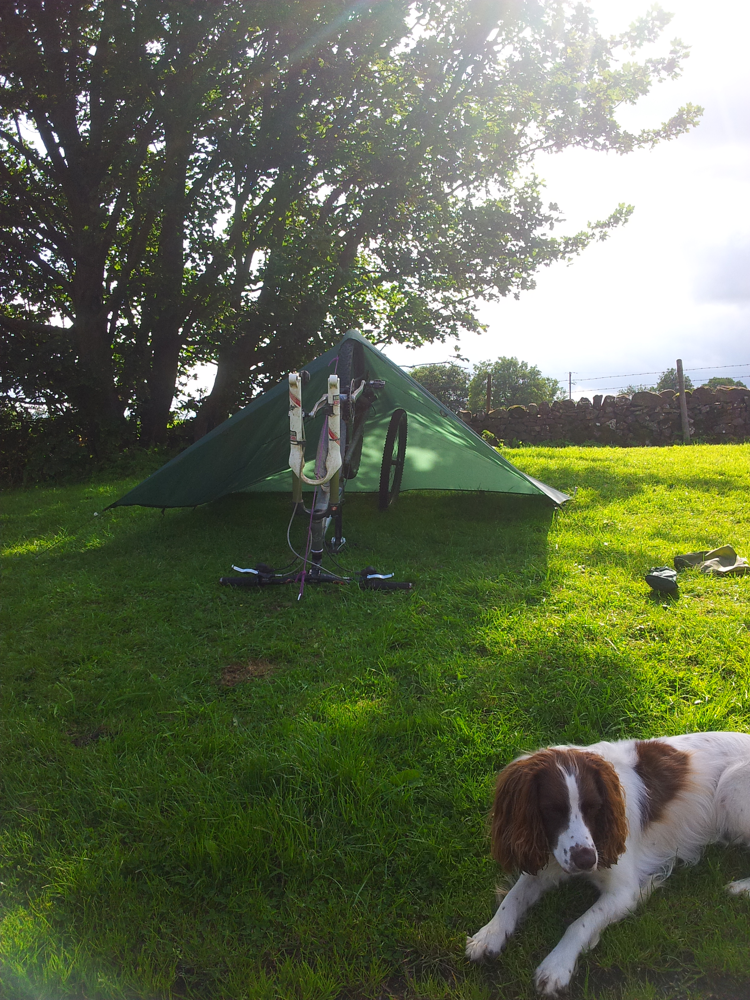
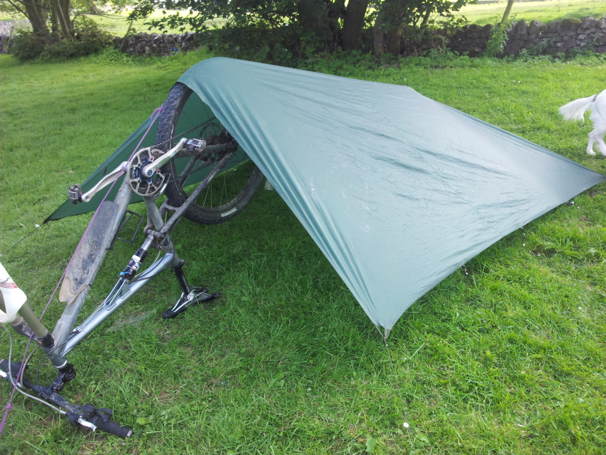
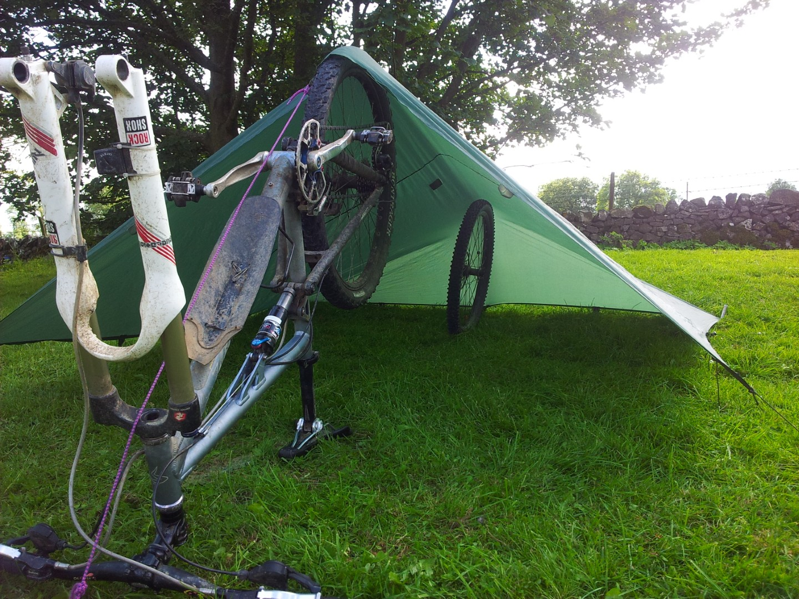
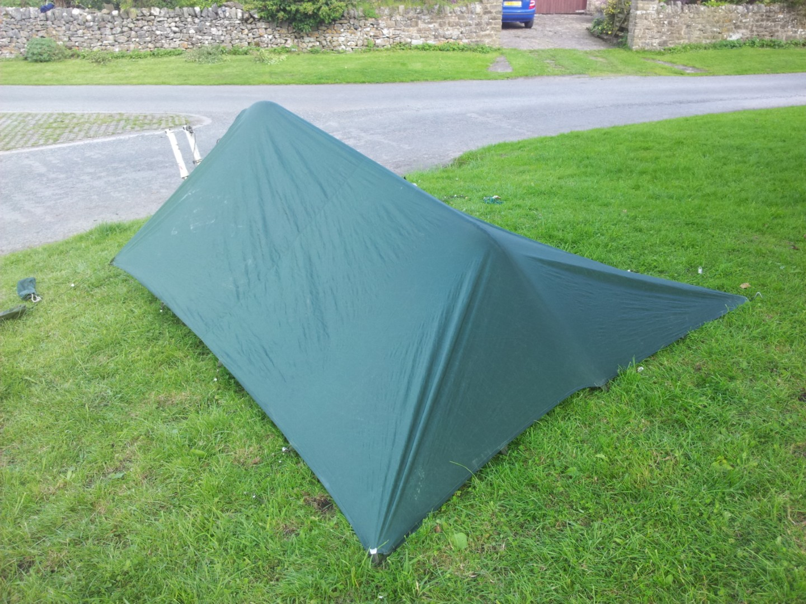


---
# Project bikepacking: the shelter

During my [bikepacking trip around Wharfedale and Bishopdale](04_blog/blog/content/posts/bikepacking_wharfedale_bishopdale/index) I used my tarp against a wall. I wanted to be able to set it up freestanding, using the bike and some guys lines. Despite looking a bit of a knob playing on the village green, the results were a success. I think.

<figure style="text-align: center;">
  
  <figcaption><i>Molly isn't impressed</i></figcaption>
</figure>

<figure style="text-align: center;">
  
  <figcaption><i></i></figcaption>
</figure>

<figure style="text-align: center;">
  
  <figcaption><i>The finished article. It's surprisingly roomy inside, very comfortable for two.</i></figcaption>
</figure>

<figure style="text-align: center;">
  
  <figcaption><i>Can be made very weather proof.</i></figcaption>
</figure>
