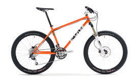

---
# Project new bike

 I need a new mountain bike. Mine is five years old and works perfectly, except for the annoyingly frequent pivot bearing changes. Someone will point out that I don't need a new bike, I want just want one and they are two different things. The truth is, I do need a new bike but not for my sake, it's for the benefit of Sue's happiness.

Everybody wants their partner to be happy and making their partner happy makes themselves happy. When I get a new bike I will enjoy my mountain biking more and therefore be happier and by default, Sue will be happier. So I'm spending the money and getting a new bike for Sue's benefit, not mine. In fact Sue should pay for it but I may struggle to persuade her.

So, what to get? I already have a xc full suspension so I want something different. "Ah ha, a singlespeed" I hear deviants shout. No, don't be silly. Plate tectonics or God didn't make hills hard just for me to make them harder. I want the simplicity and lack of maintenance of singlespeed but with as many gears as possible. Please take a bow, [Rohloff hub gears](http://www.rohloff.de/en/products/index.html).

I like long day rides over whatever terrain is there and I don't like fixing my bike. I need a hardtail with suspension forks. Specifically I need a 29er because they roll faster, grip better and are the future. [Stuart](http://yorkshirebiking.com/) is now convinced about 29ers and because I believe everything he says, I'm getting one.

Now then, what should the frame be made of? Not aluminium for sure, I like my teeth where they are. Carbon fibre? Still not sure about it plus I'd need to sell Sue and Molly to pay for it. Titanium? Mmmm, yes please but now's not a good time to sell my house to finance it. So that leaves steel which is probably better than all the rest anyway.

Which make? Haven't got a clue. I'd like a British brand and there are plenty to choose from. I'm interested in the [Ragley](http://www.ragleybikes.com/our-frames/blue-pig-mk2/) [geometry](http://www.ragleybikes.com/geometry/); slack head angle for descending, steep seat tube angle for climbing and plenty of tyre clearance. They don't make a 29er though, well they do but it isn't designed for a suspension fork and only a madman would ride fully rigid. (Hello [Stuart](http://yorkshirebiking.com/)). Plus, now that the founder, Brant Richards, has left I feel they are a bit rudderless.

A [Cotic Soul](http://www.cotic.co.uk/product/soul) or [BeFe](http://www.cotic.co.uk/product/BFe) in a 29er would be nice, which I'm sure I've read somewhere that they are thinking of doing.

<figure style="text-align: center;">
  
  <figcaption><i>Cotic Soul</i></figcaption>
</figure>

Or one of these, an [One-One Inbred](http://www.on-one.co.uk/i/q/FROOIN29V3/on_one_inbred_29er_swap_out_frame) 29er:

Don't be confused by the fact that they are all orange coloured, it's obviously the new white. They are actually different bikes.

I always fancied a [Pace](http://www.pacecycles.com/?page_id=913#) when I was younger, and thinner, and fitter. They do a 29er but the geometry looks a bit racy.

More investigation is required.

The potential spanner in the works is [belt drive](http://www.carbondrivesystems.com/forbikemakers.php). This is basically a carbon fibre belt drive instead of a chain. Less noise, less maintenance, less weight (I think). Problem is because the belt can't be split it requires a split near the dropouts. This significantly reduces my choice, most of the choice consisting of expensive bikes.

A smaller spanner in the works that I learnt about very recently is [shaft drive](http://www.dynamicbicycles.com/chainless-technology/shaft_v_chain.php). Looks interesting but is heavy and too new to allow a sufficient choice in bikes.