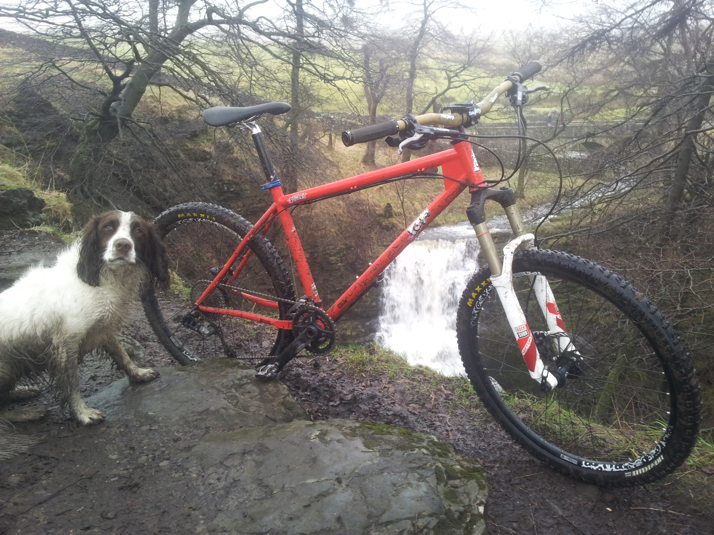
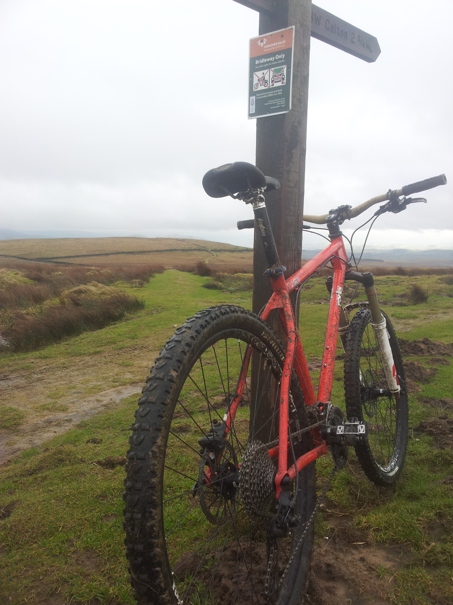
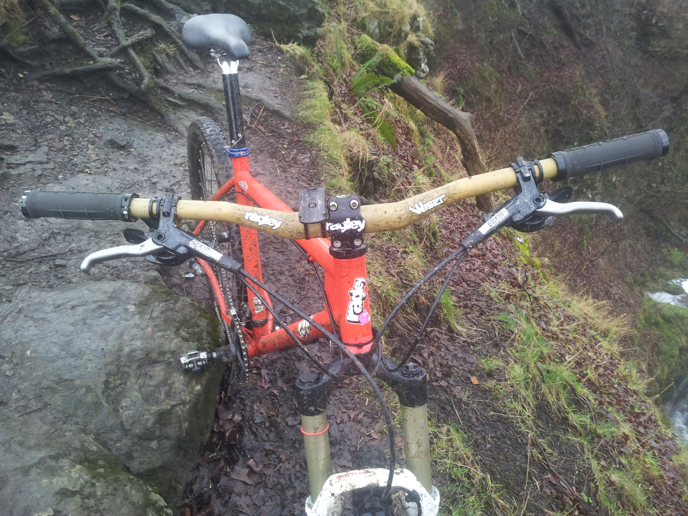
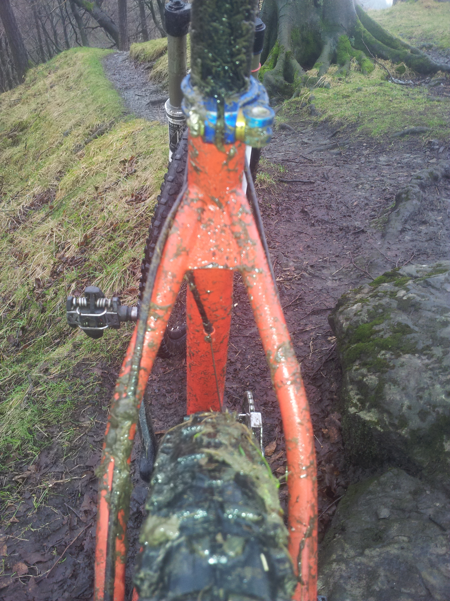
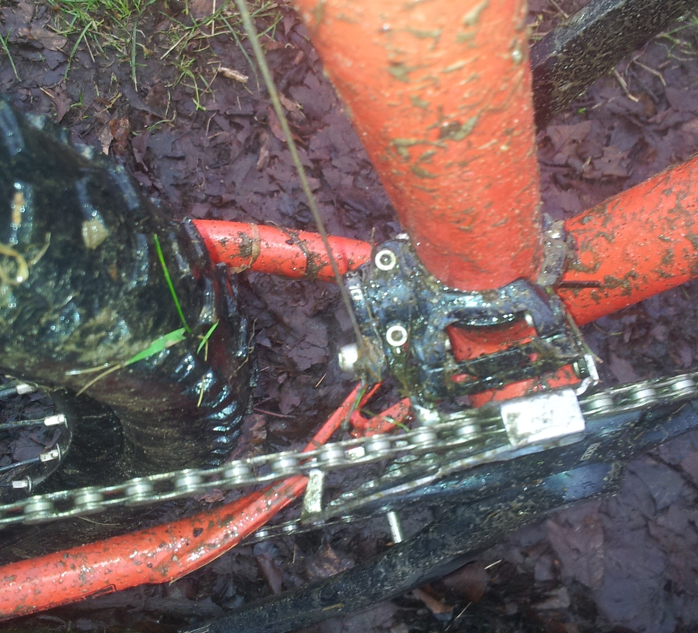
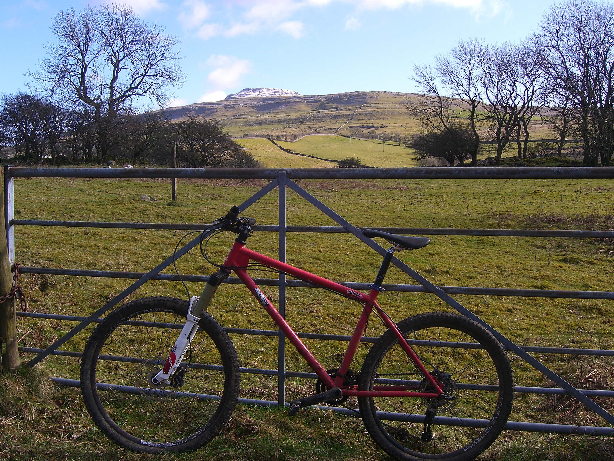

---
tags:
  - kit
  - mtb
title: Project new bike - the Ragley Piglet test.
description:
draft: false
date: 2012-02-23
author: Tompkins Jonathan
---
Having lusted after a [Ragley for a while](http://jonathantompkins.blogspot.com/2011/11/project-new-bike.html), I've finally got my hands on one for a long term test thanks to [Stuart](http://yorkshirebiking.com/). He's lent me his Piglet; I'm not sure for how long but he hasn't asked for it back yet and I'm not in a hurry to ask him.

<figure style="text-align: center;">
  
  <figcaption><i>Dog not included.</i></figcaption>
</figure>

<figure style="text-align: center;">
  
  <figcaption><i>Not my favourite tyres. Almost my least favourite</i></figcaption>
</figure>

It's come already built up and whilst it's only the frame I'm interested in there are a few note worthy components. The tyres are Maxxis High Rollers 2.1. I like Maxxis tyres, I ride a Crossmark in summer and an Ardent on the front all year round. The High Roller is a popular tyre but I can't work out why; it slides on the front, has no grip in mud on the back and isn't fast. What are they for? I fell off 3 times at slow speed due to this tyre on a recent wet ride in the Dales. Plus they are too narrow to be issued on a hardcore hardtail.

The brakes are [Avid Elixir 5](http://www.sram.com/avid/products/elixir-5-hydraulic-disc-brake#/path/term-id/68). They are more powerful than my Hope Mono Minis and one finger braking is easy. They have far less feel though and I think it might be due to the horrible plastic levers.

<figure style="text-align: center;">
  
  <figcaption><i>Look at the width!</i></figcaption>
</figure>

The bars are [Ragley Wiser bars](http://www.ragleybikes.com/our-components/wiser-bars/) 710mm and are superb. I initially thought they were too wide but now I'm converted. Coupled with the short stem they work really well on this bike.

I've ridden the Piglet a few times at Harden Moor which consists of technical riding in a landscaped quarry; at Ae which consisted of gloopy fire roads and not very technical singletrack, at Drumlanrig which is all technical rooty singletrack and superb; and on my local loop up Stockdale Lane (technical climbing up limestone), Mastiles Lane (mixture of hardpack and gloop) and then down from Weets Top (built singletrack).

I've got really used to my Santa Cruz Blur and wasn't really sure if I'd get on with a hardtail.

I thought full suspension was:

- More comfortable.

- Better on technical up hills.

- Faster on rough flat sections.

- Not a massive advantage downhill for a typical xc ride.

After riding the Piglet I've concluded that:

- It's not uncomfortable at all, just got to choose your line better. Full suspension's big advantage is the ability to sit down and still make progress at the end of a long hard ride.

- Probably just as good on technical up hills if you ride it correctly. Does require a bit more fitness.

- Does lose out on rough flat sections, unless you're fit enough to stand up and pedal.

- Probably just as fast on your typical xc downhill.

<figure style="text-align: center;">
  
  <figcaption><i>Not exactly lacking in tyre clearance.</i></figcaption>
</figure>

At Drumlanrig it did feel slightly barge like on some of the tighter sections. Initially I missed not riding the Blur on the rougher rooty sections but it was only because I was still riding the Piglet as if I was on a full sus - sat down. When I anticipated these sections and stood up then the Piglet was just as good. At Harden Moor, once I'd shifted the saddle forward to compensate for the fact that the bike is a bit too big for me, the Piglet geometry worked great for technical stuff and steep down hills. 

Climbing Stockdale Lane didn't result in me magically cleaning every section but again, that was mainly because I was still riding it like a full sus. Also the tyres were too narrow and hard and didn't help at all. Standing up and hovering got me far farther up the difficult sections. Although the occasional bump catches you out I didn't miss not having rear sus on this ride and I thought I would.

<figure style="text-align: center;">
  
  <figcaption><i></i></figcaption>
</figure>

Compared to my Blur it's got a very slightly longer top tube, a slacker head angle by 3 degrees, a slight steeper seat angle by 0.5 degree and slightly longer chainstays. I've really enjoyed riding it and not felt that I needed my Blur at all. One of the biggest pluses about getting back on a hardtail is how nice it is to standup when riding uphill. I don't really do it on my Blur because it then bobs about. All I can think off now is how much energy I must be wasting pedalling a heavy full sus up hill. 

We are off to Reeth this weekend so after I bit more riding to remind myself how to ride hardtails properly I think it'll be no slower than my Blur.

Pity it's not a 29er with dropouts that would take a hub gear though. Ragley are bringing out a 29er at some point but in the mean time there's [this](http://www.on-one.co.uk/i/q/FROOLUR29/on_one_lurcher_carbon_hardtail_29er_frame) to drool over, a carbon fibre 29er hardtail frame with swap outs for £500 from On One. Hmm.

<figure style="text-align: center;">
  
  <figcaption><i></i></figcaption>
</figure>