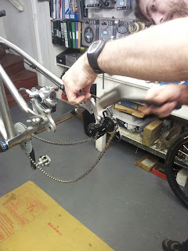

---

[Stuart Rider](https://instagram.com/paceline_cycles_mechanic)  is an optimistic bloke and he's full of little sayings.

**"I thought I felt good after the ride until I got home and found blisters where blisters shouldn't be :) my whole body is seizing up :(("**
Said after riding the Leeds Liverpool canal, twice. 258 miles in 25hrs and 38mins.

**"Grip is in the hands of the pilot"** 
This was said after he soundly beat me on an icy downhill.

**"A ride with Rider is like a blank canvas, allow the ride to paint the picture."**

<figure style="text-align: center;">
  
  <figcaption><i></i></figcaption>
</figure>

**"I like hammers"** 
Stuart gently persuading his Ragley Ti into compliance.

**"Don't wish your ride away"**
When asked how far to the top it was.

More to follow from Yoda as he reveals divine utterances.