---
tags:
  - caving
  - Yorkshire-Dales
title: Sell Gill Holes dry route.
description: A quick solo caving trip down Sell Gill Holes dry route in the Yorkshire Dales
draft: false
date: 2018-12-11
author: Tompkins Jonathan
---
# Sell Gill Holes dry route
**Sunday 9th December**

A quick solo trip, It's been a while since I've been down the dry route and because I want it on my LCL approved cave list it required a revisit.

<figure style="text-align: center;">
  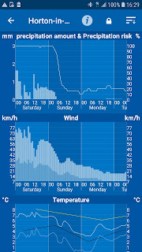
  <figcaption><i>The forecast</i></figcaption>
</figure>
<figure style="text-align: center;">
  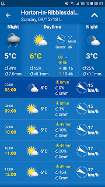
  <figcaption><i>The forecast for Sunday in Horton</i></figcaption>
</figure>

<figure style="text-align: center;">
  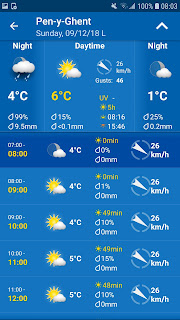
  <figcaption><i>The forecast for Pen-y-Ghent</i></figcaption>
</figure>

<figure style="text-align: center;">
  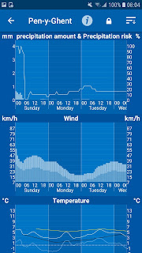
  <figcaption><i>Can't have too many forecasts!</i></figcaption>
</figure>

Prior to this the weather was very wet with rain on Saturday and overnight into early Sunday morning. The image below from [gaugemap.co.uk](http://gaugemap.co.uk/) was from 15.30 on the Sunday. The peak at the far right was from 05.15 on Sunday, so after 10 hours the water level had dropped significantly.

<figure style="text-align: center;">
  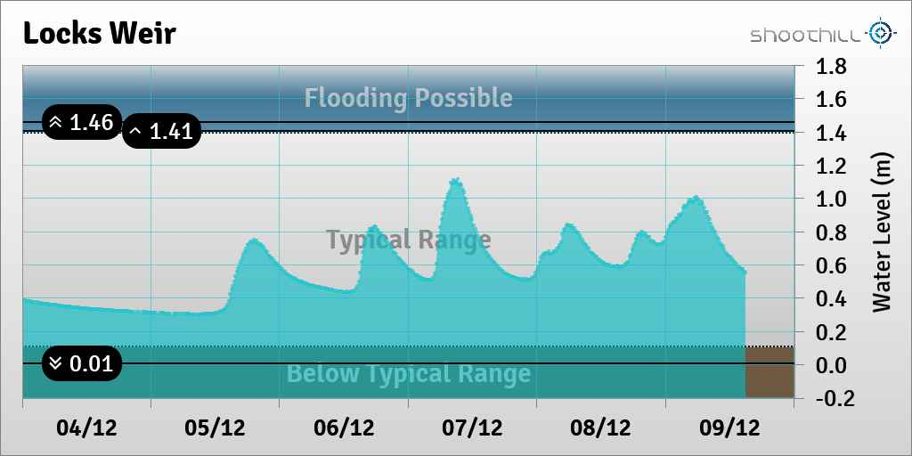
  <figcaption><i></i></figcaption>
</figure>

<figure style="text-align: center;">
  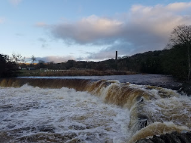
  <figcaption><i>At 9.30am Settle weir water levels looked bad.</i></figcaption>
</figure>

<figure style="text-align: center;">
  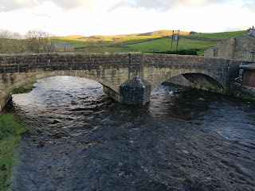
  <figcaption><i>At at 9.45am the Ribble in Horton looked much more benign.</i></figcaption>
</figure>

<figure style="text-align: center;">
  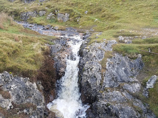
  <figcaption><i>The water flowing into the wet route was significant but not as bad as Settle weir would suggest.</i></figcaption>
</figure>

<figure style="text-align: center;">
  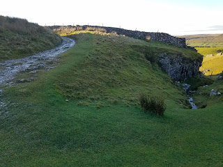
  <figcaption><i>A bit of runoff down the bridleway was trickling into the dry route.</i></figcaption>
</figure>

On the CNCC website the first pitch supposedly requires a 15m rope. This doesn't include the extra bolt before the first step down in the gulley that guided trips would use. If you include this bolt and the rope required for mid rope loops then 25m would be more appropriate.

The second pitch has two options; the left hand wall has a nice big ledge to stand on whereas the right side is mostly footless. The Y hang here is very wide. To save rope I used the rigging setup in the picture below.

<figure style="text-align: center;">
  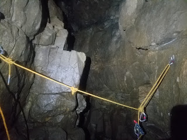
  <figcaption><i>Trying to save rope.</i></figcaption>
</figure>

<figure style="text-align: center;">
  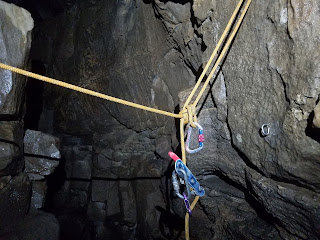
  <figcaption><i></i></figcaption>
</figure>

Traverse on the left, terminates at the first bolt of the Y hang. Single line down to a Fusion knot. One loop of the Fusion knot goes to the other Y hang bolt and the 2nd short loop acts as the central belay loop.

The third pitch was a bit damp and I can imagine this would be fairly damp in properly wet conditions. The bottom of the pitch is close to the bottom of the wet route and that looked horrible today.