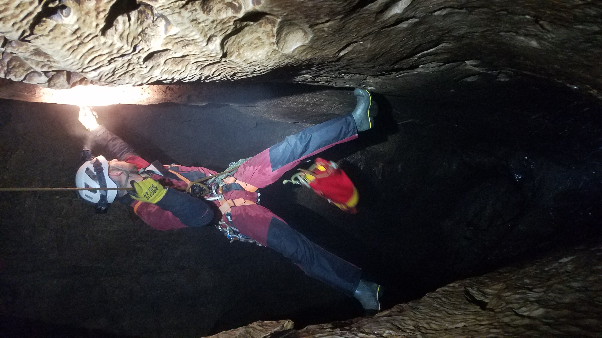
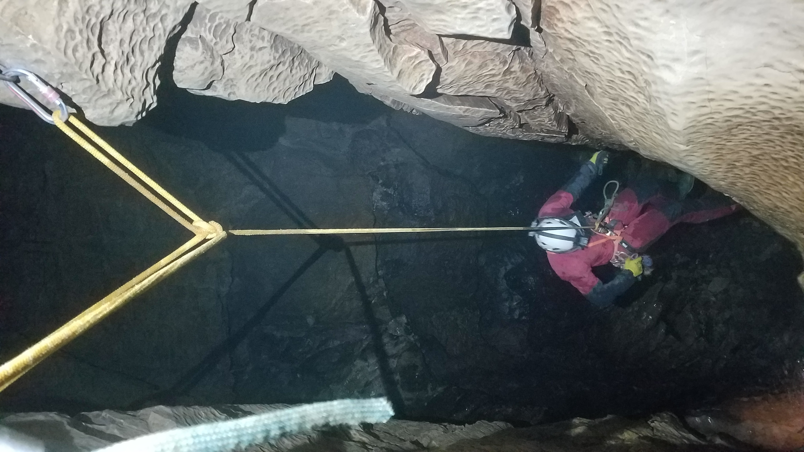
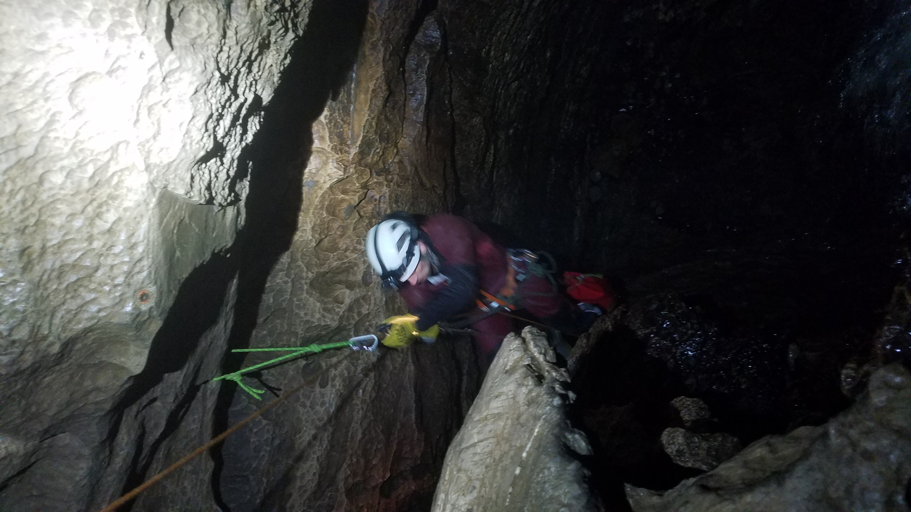
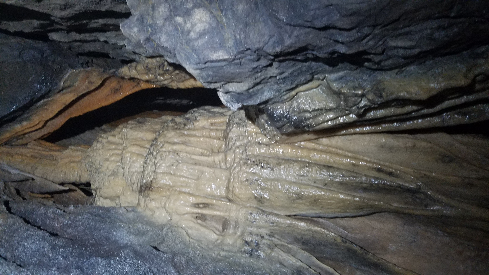

#what/blog #status/ready_to_publish #where/England/Yorkshire_Dales #topic/caving 

---
# Tatham Wife Hole
**5th March 2026**

I first visited Tatham Wife Hole with Stuart in 2003, I think it was my first Dales caving trip when I lived in Sheffield. I remembered nothing about it. The walk up is the hardest bit, it's basically straight up the flanks of Ingleborough to the bottom of the gritstone cap. It's not a place to be when it's been wet, is wet or will be wet as you follow the stream the whole way and whilst there are deviations to get out of the water I don't think you'd stay dry. Plus you'd probably get flooded in. There's no real problems; a slightly awkward rift and a duck that's short, but that's basically it. Some nice formations and impressive river passages.  Worth doing and I might go back in another 20 years.

<figure style="text-align: center;">
  
  <figcaption><i></i></figcaption>
</figure>

<figure style="text-align: center;">
  
  <figcaption><i></i></figcaption>
</figure>

<figure style="text-align: center;">
  
  <figcaption><i>Top of Rift Pitch</i></figcaption>
</figure>

<figure style="text-align: center;">
  
  <figcaption><i></i></figcaption>
</figure>

<figure style="text-align: center;">
  <video src="duck.mp4" style="max-width: 100%; height: auto;" controls>
    Your browser does not support the video tag.
  </video>
  <figcaption><i>The short duck</i></figcaption>
</figure>

