---
tags:
  - bikepacking
  - mtb
  - wildcamping
  - Yorkshire-Dales
  - Peak-District
title: The Pennine Bridleway.
description: Bikepacking the Pennine Bridleway from north to south.
draft: false
date: 2012-07-01
author: Tompkins Jonathan
---

# The Pennine Bridleway, north to south.
**1st July 2012**

For those of you who only end up reading the first paragraph of blogs, here's a summary. The Pennine Bridleway is about 290km of nearly all offroad riding which I did in three days. It's mostly great but gets a bit tedious through Lancashire and is utterly boring in the White Peak, except for Chee Dale. Washing your bum in a puddle is an odd experience and applying vaseline to your saddle sores really helps. Three days without washing makes you smell. A lot.

The plan was to miss the start at Middleton Top because it's on old railways lines and therefore boring and instead ride between Buxton and Kirby Stephen, bivvying along the way so that I wasn't tied into set distances each day.

Plan A -Pack Sunday, get a lift south with my parents to Hollingworth who were visiting for dinner and then beg them for a lift on Monday to Buxton.

Actual - Get up late on Sunday, clean house, do a bit of work, don't pack.

Plan B -Pack Sunday evening, get up early and get the 9:30am train to Kirby Stephen.

Actual -Watch England vs Italy in the Euros, don't pack, read my book till late, get up at 8.

Plan C -Throw stuff in bag, rush for 9.30 train, pack properly on train.

Actual -Miss train due to wanting to pack properly.

Plan D -Get 11.37 train which allows leisurely ride to station.

Actual -Get 11.37 train but rush like mad man, having answered important email & then got stuck behind a caravan which was stuck behind escaped sheep.

## Day one, Monday 25th June, 2012.

<figure style="text-align: center;">
  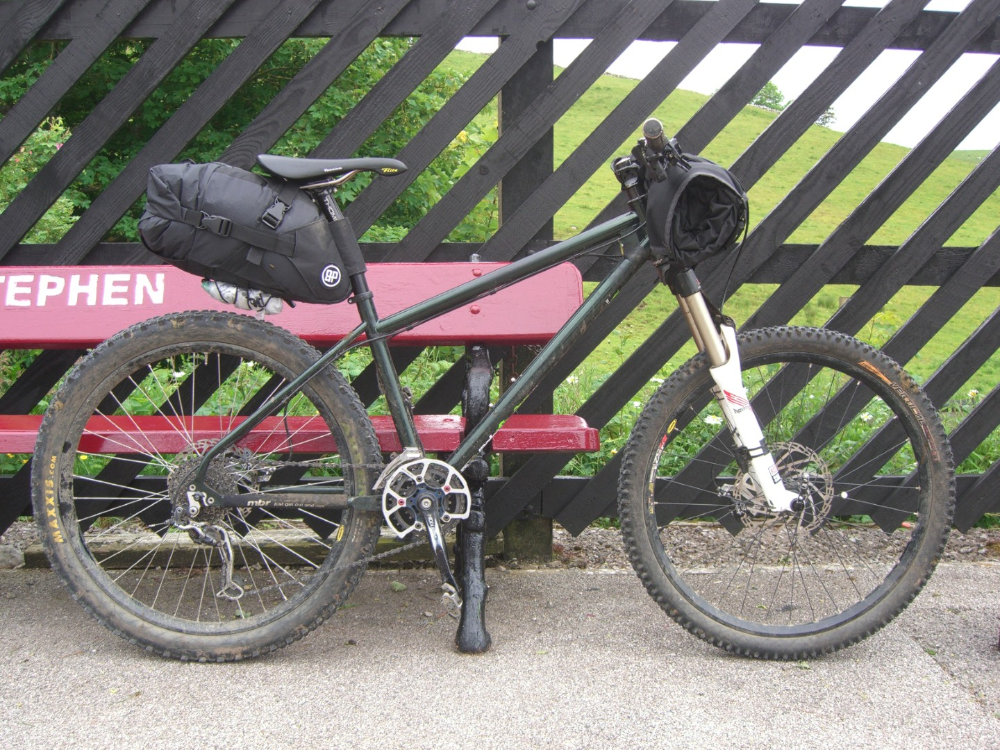
  <figcaption><i>Ragley Blue Pig loaded up</i></figcaption>
</figure>

At least I'm on the train which is due in to Kirby Stephen at 12.30 ish. It's dark at 10pm which leaves plenty of time to make progress. Hopefully.

I hadn't bothered to take a cooker or proper food, mostly cos I couldn't be arsed carrying the cooker and extra food. Plus I hadn't actually gone to the supermarket to buy suitable food. My plan was to carry enough dark chocolate digestives for snacks and visit pubs and cafes for a decent meal. I was also not carrying maps except for an A4 sheet of the start; I'd feel a bit stupid if I got out of the train station but couldn't find the start of the route. I decided there would be enough signposts and I knew a lot of the areas it passed through. At least I had a toothbrush, toothpaste and a tiny bit of soap. Another potential hiccup was a brand new saddle which I hadn't even tested. I was also keen to see what my Ragley Blue Pig X was like on a long, multiday trip. In theory it was designed for freeride type stuff, which this ride was nothing like.

<figure style="text-align: center;">
  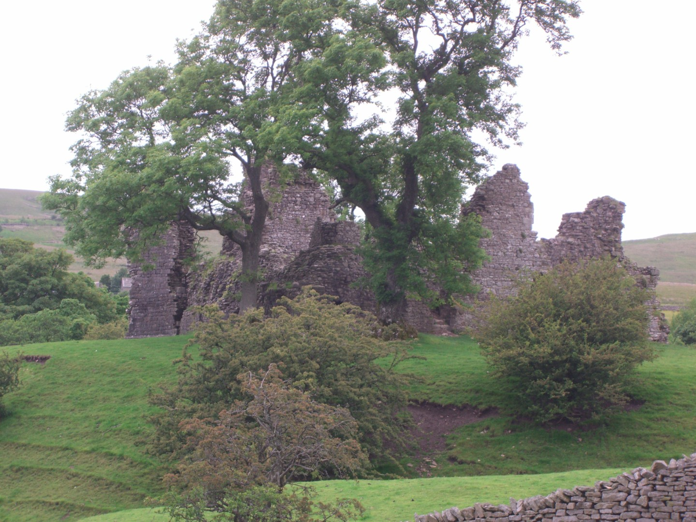
  <figcaption><i>Pendragon Castle has seen better days.</i></figcaption>
</figure>

<figure style="text-align: center;">
  
  <figcaption><i>The climb up to the Mary Anne Clifford Highway</i></figcaption>
</figure>

<figure style="text-align: center;">
  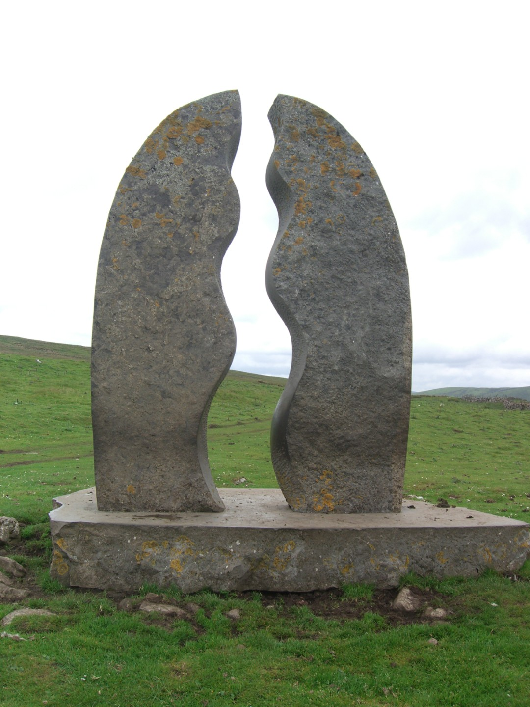
  <figcaption><i>MAC Highway thing</i></figcaption>
</figure>

My only bit of real planning turned out to be fortuitous, the route isn't sign posted from the station. The weather was good, cloudy and dry but a bit chilly. It was easy going to the first real climb of the route, the hardpack ascent onto the Mary Ann Clifford highway, at the top of which there's a large monument which is supposed to look like a winding river or a giant vagina, I'm not sure which. The Mary Ann Clifford highway is the what the Dales does best, a big climb then a high level cruise on good tracks with great views. Unfortunately it isn't followed to it's end near Hardraw which was a pity as the best pub in the Dales, The Green Dragon, is there. Instead it follows a new grass track, marked by unpainted posts, down to the Moorcock Inn. This would be a pain to push up if coming from the south. There's two more of these high level tracks to follow, the bridleway off the Coal road to Newby Head and the Cam high road, both preceded by tough climbs.

<figure style="text-align: center;">
  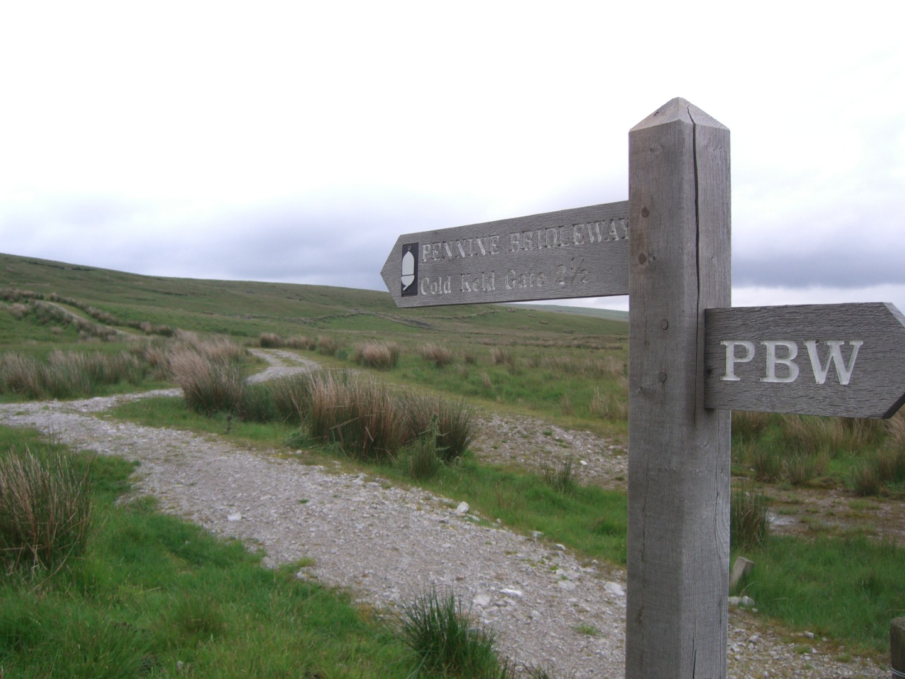
  <figcaption><i>Sign at Newby Head</i></figcaption>
</figure>

<figure style="text-align: center;">
  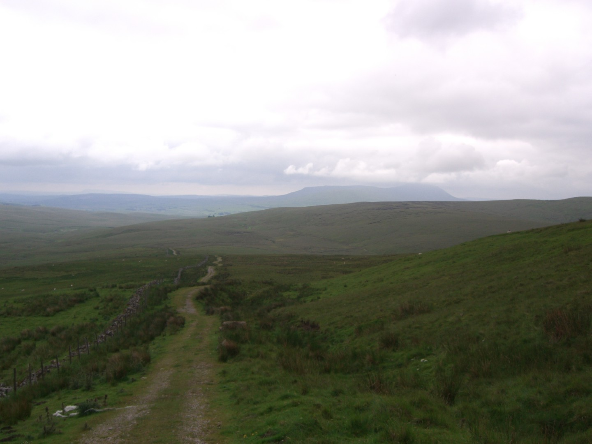
  <figcaption><i>Descent to Newby Head</i></figcaption>
</figure>

<figure style="text-align: center;">
  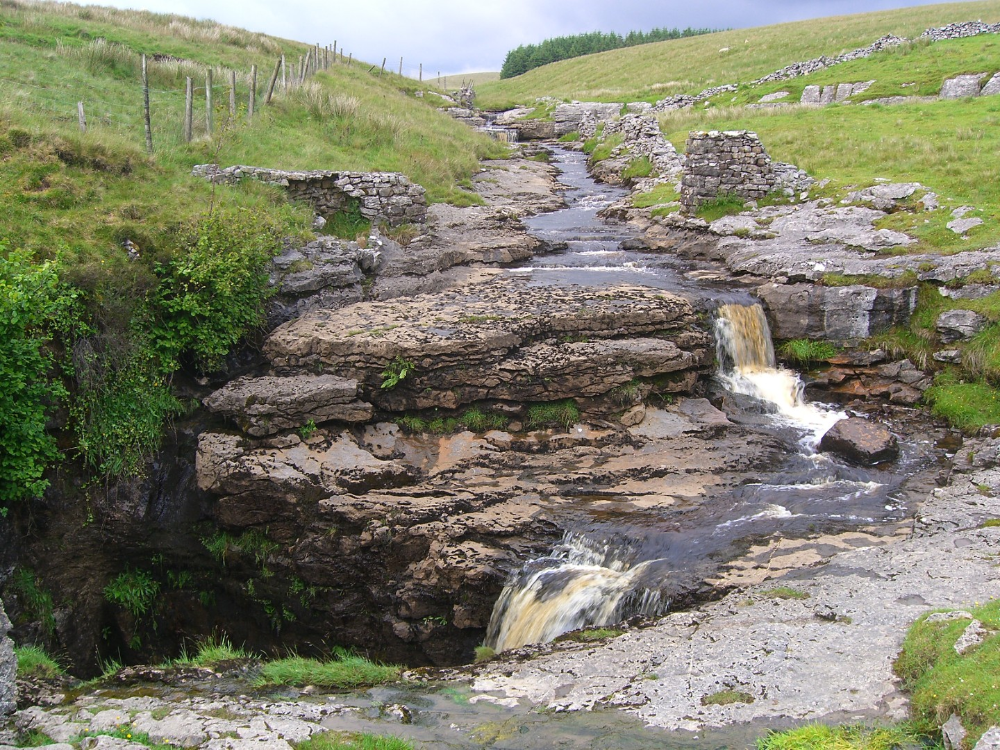
  <figcaption><i>Calf Holes Cave</i></figcaption>
</figure>

<figure style="text-align: center;">
  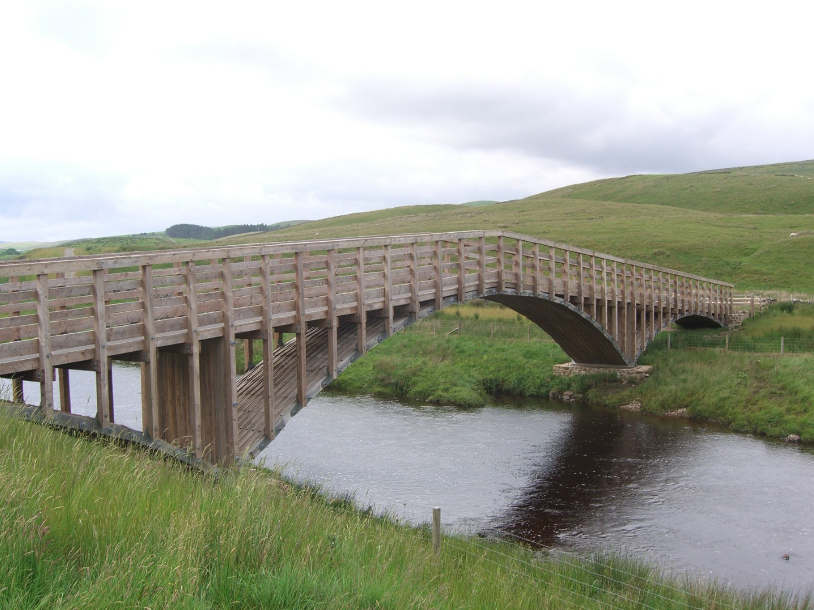
  <figcaption><i>It's won 2 awards, don't you know.</i></figcaption>
</figure>

<figure style="text-align: center;">
  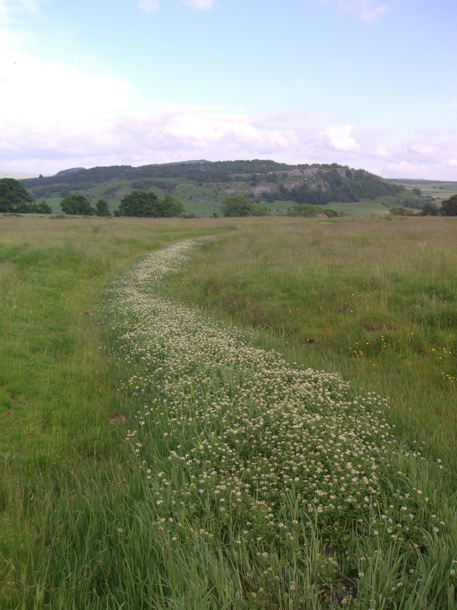
  <figcaption><i>A river of flowers.</i></figcaption>
</figure>

<figure style="text-align: center;">
  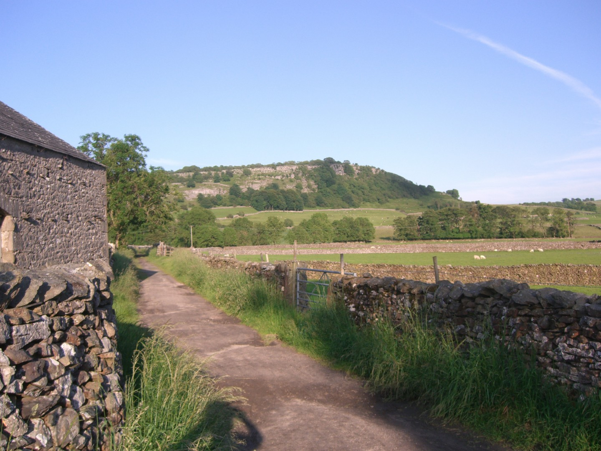
  <figcaption><i>Oxenber Scar</i></figcaption>
</figure>

I'd soon traversed the flanks of Ingleborough and the sun had come out. It had been well signposted so far although one or two junctions were not obvious but I knew where I was going. The route passes close to The Gamecock in Austwick so I stopped of for a pizza and a pint of Thwaites Nutty Black, it would have been rude not to. It was 6:30 in the evening and I spent a leisurely hour and a half eating, drinking and chatting. Because it was so nice I decided to carry on till sunset and I ended up above Long Preston, via Helwith Bridge, Stainforth and Settle, not far from home. It was a beautiful sunset and as it got colder the midges froze and buggered off. Perfect. This had been the furthest I'd ever ridden offroad in a day but it felt quite easy. There were only really four proper hills on it and all of it was good riding.

<figure style="text-align: center;">
  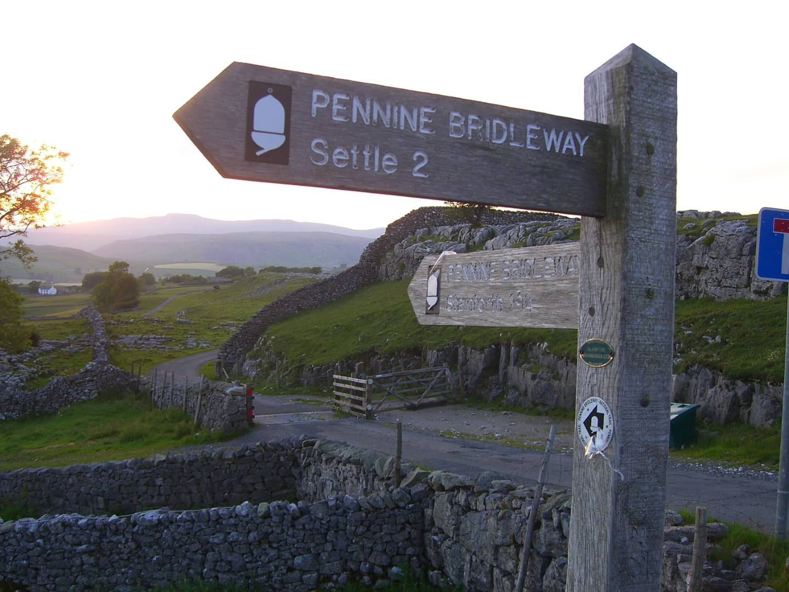
  <figcaption><i>Above Stainforth</i></figcaption>
</figure>

<figure style="text-align: center;">
  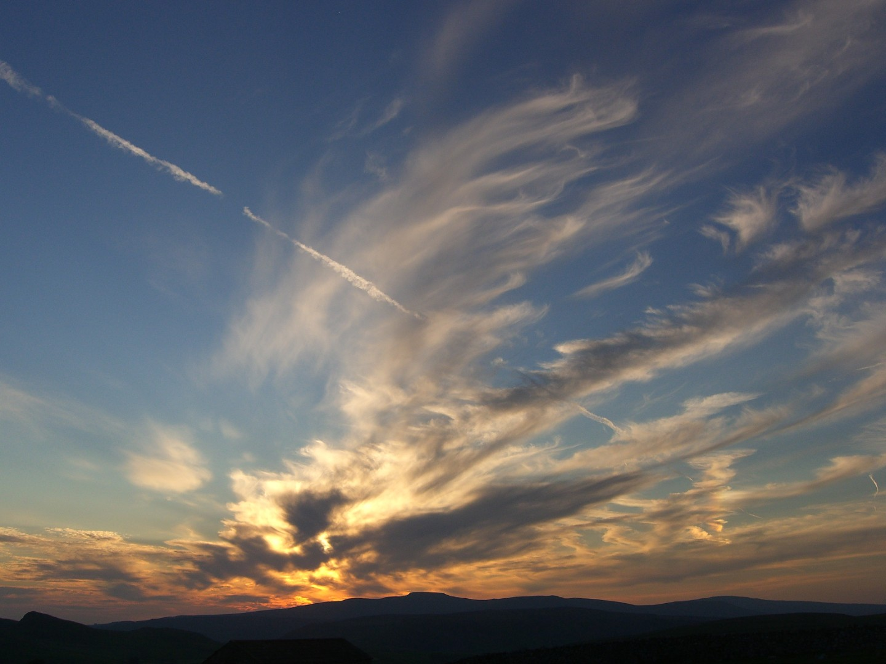
  <figcaption><i>The sunset from Stainforth</i></figcaption>
</figure>

<figure style="text-align: center;">
  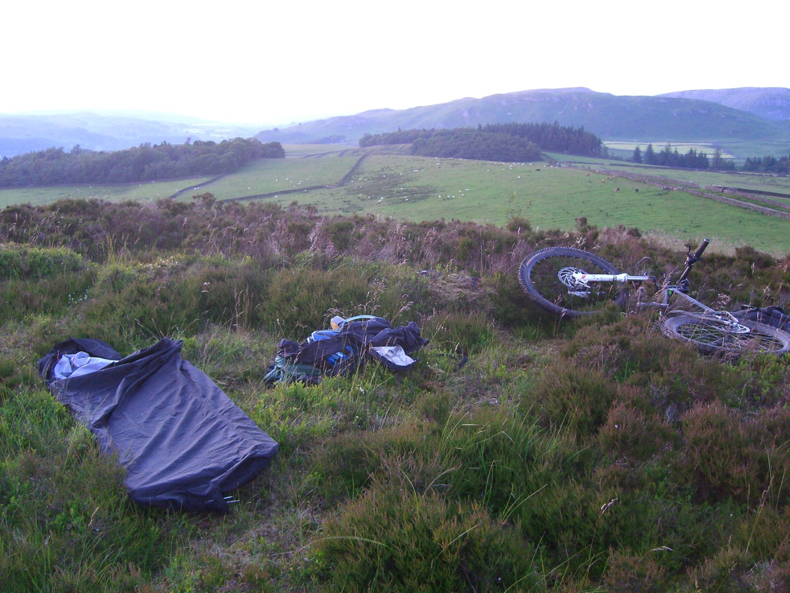
  <figcaption><i>No tarp required tonight.</i></figcaption>
</figure>

<figure style="text-align: center;">
  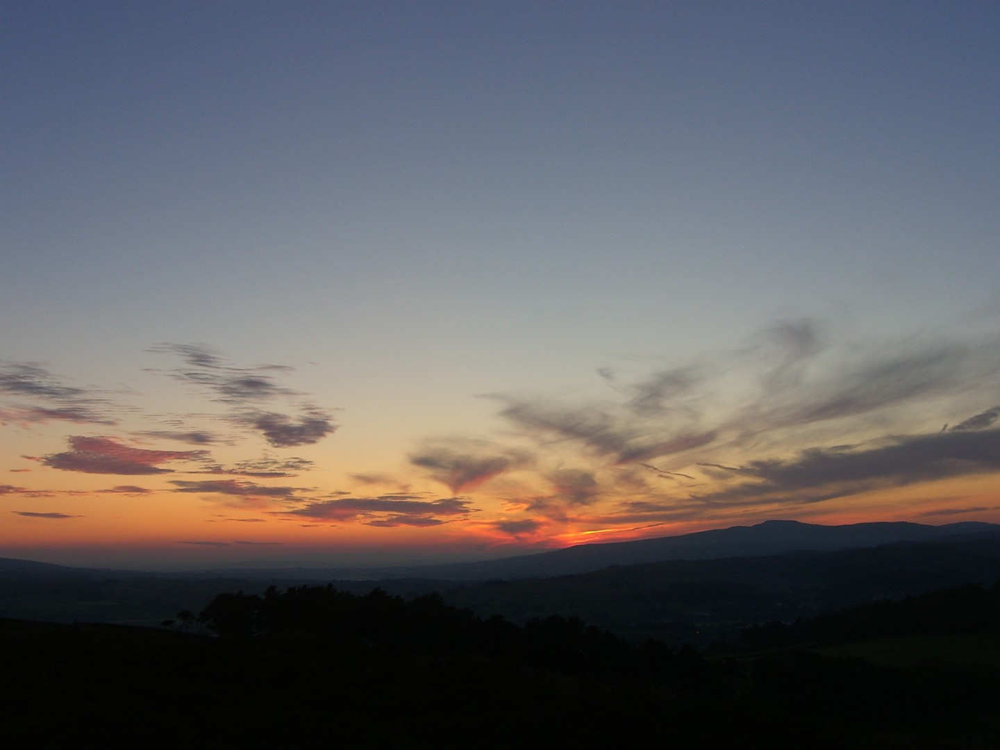
  <figcaption><i>Sunset from camp</i></figcaption>
</figure>

Set off at 12.30, camped at 21.50. Spent at least an hour and a half in the pub, stuffing my face.

Ride time 6.06 hrs

Distance 77.64 km

Average 12.7 km/hr

Max 54.6 km/hr

Smell factor - medium, but manageable.

## Day two.

<figure style="text-align: center;">
  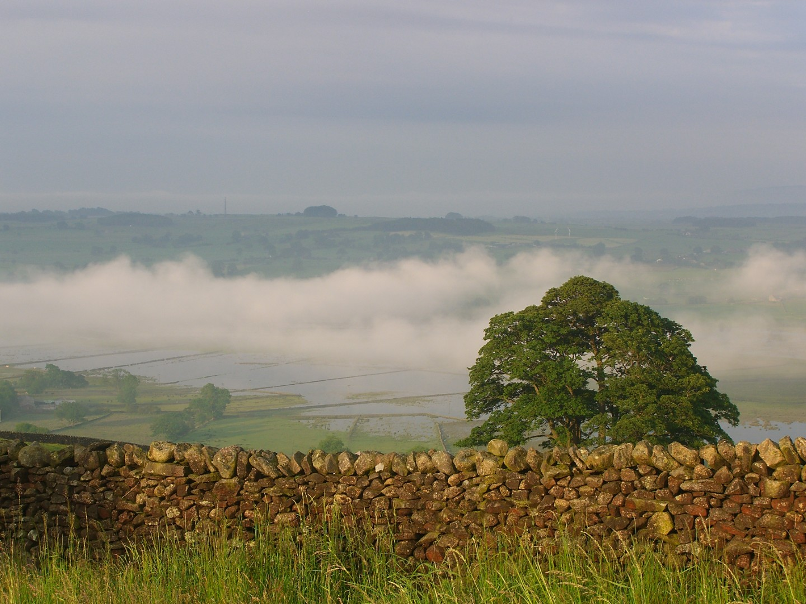
  <figcaption><i>Early morning mist.</i></figcaption>
</figure>

<figure style="text-align: center;">
  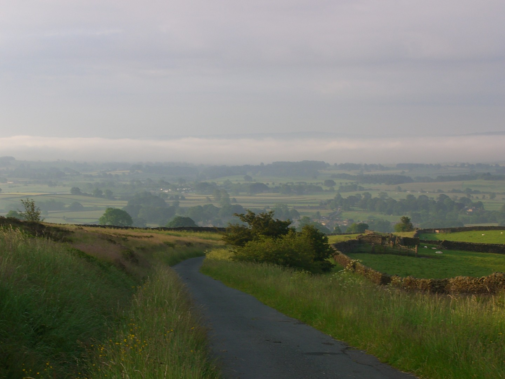
  <figcaption><i>Temperature inversion over Lancashire. Or smog?</i></figcaption>
</figure>

Ah, the joys of bivvying; meant I was awake at bloody 5am, having only dozed since 4am! The first sight to greet me was a fantastic sunrise but somehow the sun rose to my left and it had set directly behind me! I soon decided that the earth hadn't shifted and I was just a bit tired. There was a temperature inversion down in the valley, with Pendle hill poking out from the mist - typical of Lancashire that it should be covered in cloud. I wanted to get to Buxton today but this was based on not knowing how far it actually was!

From here the route crosses lots of fields as it avoids Gisburn, Barnoldswick, Earby and Colne. It was slow, there's lots of gates and wet grass and it was mostly well signposted but occasionally not signposted at all. I ran out of water at 10am and gave myself till 11am to find some. By midday, thoroughly dehydrated and a bit fed up with the route, I arrived at Wycoller cafe and ate a lot. A milkshake, diet coke, coffee and bacon butty. Then another diet coke and a cheese ham toasty.

<figure style="text-align: center;">
  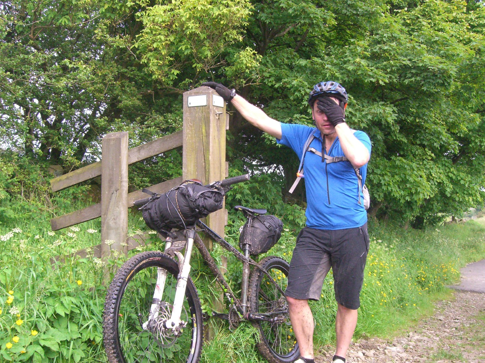
  <figcaption><i>I got a bit hot going up Weets hill.</i></figcaption>
</figure>

It was 50km to here, a typical long day ride for me, and my legs were a bit tired. Too much stopping at gates and looking for signs and too many boggy, wet fields. The weather had been great so far but Lancashire produced some rain. Luckily it was like being spat on by a nun, wet but pleasant.

<figure style="text-align: center;">
  
  <figcaption><i>What an odd sign.</i></figcaption>
</figure>

From Wycoller the riding improved, it became higher, wilder and less boggy poo. At the Mary Townley loop I forgot which was the shortest way round and had to faff around downloading pdfs to my phone. It's east, if you're wondering. At Widdop I met a paraglider who had cycled up from Hebden Bridge on a folding bicycle, in full paraglider suit, towing a 70kg trailer with five days camping kit in it! I think he was a bit mad. Especially when he told me the forecast for his stay was rubbish and not flyable conditions.

<figure style="text-align: center;">
  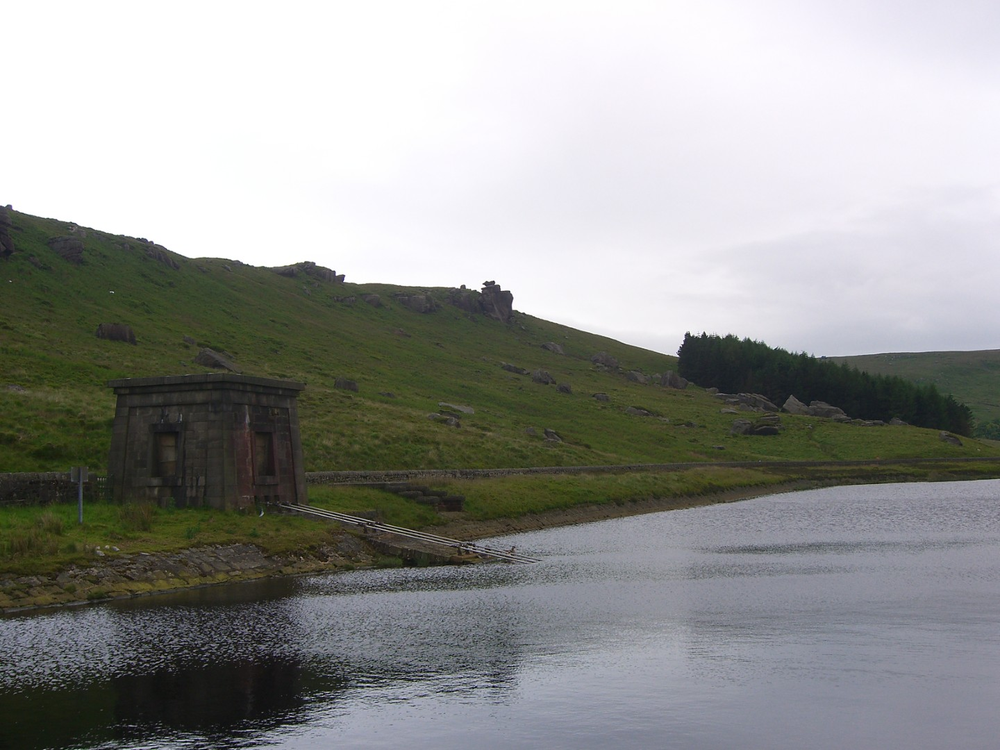
  <figcaption><i>Widdop</i></figcaption>
</figure>

I lost the track near Jack Bridge and found myself on the main road to Hebden Bridge. Rain and hunger and the fact that it was dinner time (tea time if you're odd) forced me first into a Co-op for food supplies and then into a chippy. I was quite happy sitting under a tree, sheltering from the rain and eating my fish butty until a jackdaw crapped on my sleeve. At least it missed my food. I actually think it was aiming for my food as when I saw it on the ground it kept picking up bits of stale bread, then looking at me and my food and then dropping the stale bread. I'm convinced it aimed to poo on my food as a way of making me drop it so it could steal it. Clever birds corvids. Good job it was a crap shot.

It was raining hard enough to need waterproofs now and I rejoined the route at Callis Bridge, climbed out of Calderdale on a bridleway only to drop back into it 12km later at Bottomley, the second best place name on the route. The Pennine Bridleway is aimed at bicycles and horses but it's designed around the needs of horse riders. This means that roads are avoided as much as possible and there's a part of the route here that climbs a big hill, traverses a bit and then drops back down two kilometres later. If it was just a cycling route it would have stuck to the road.

<figure style="text-align: center;">
  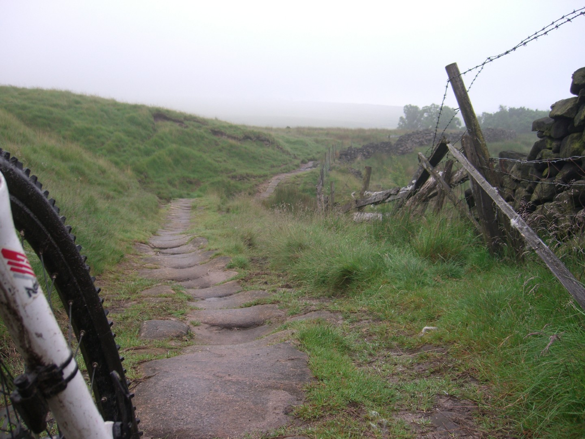
  <figcaption><i>Packhorse trail near Lumbutts</i></figcaption>
</figure>

The route climbs out of Calderdale again and follows some fantastic pack horse trails. Following these lumpy gritstone paths was the only place where I wished I had a full suspension bike again, but only because I was tired and wanted to stay in the saddle. There are soon signs for Hollingworth Lake, which always seemed to say 2 miles! It was above Hollingworth Lake that I hit the 100km mark, the first time I'd done this distance off road. It was late, I was tired and sweaty and saddle sore and I wanted to set up camp. Unfortunately I was also really close to the M62 and it was noisy. Two local bikers out for an evening ride confirmed that the route dropped down towards the motorway and civilisation, not somewhere I wanted to camp.

I decided to ride back a bit to where it was quieter but not before I'd had a wash, there was a bit too much chafing going on! I'd seen no streams nearby and could only find a puddle fed by a trickle, it would have to do. I got my soap out, stripped to my lycra shorts and started to wash, always keeping a beady eye out for passers by. Especially as any passers by up here at this time of night might not be the most salubrious characters around. I then hit my first snag; rinsing your privates from a puddle whilst still wearing cycling shorts is easy enough but trying to spoon water over your bum whilst wearing lyrca shorts is not easy. There was nothing I could do except drop my shorts, squat in the puddle and frantically splash around, desperately hoping no one came round the corner.

With the threat of prosecution for indecent exposure over, I started to look for a campsite. What had initially seemed like a nice breeze to keep the midges down turned out to be a mini gale designed to blow my tarp away. I was reluctant to leave the Pennine Bridleway and found myself riding along the trail down towards civilisation, despite telling myself I wouldn't. Luckily I found a sheltered but breezy spot near some remote houses and started to set up camp in the fading light. Half way through the midges found me, as well as the dogs from the nearby houses and I hastily repacked and buggered off.

<figure style="text-align: center;">
  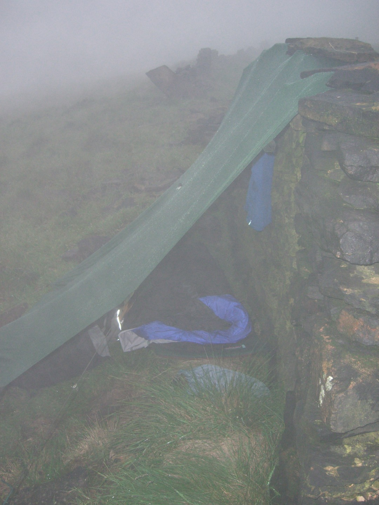
  <figcaption><i>My bivvy spot above Piethornes Reservoir. It was better than it looks inside.</i></figcaption>
</figure>

I was getting slightly concerned now. It was late, getting dark, there was no where to camp and I was near the M62 and Rochdale. All I could do was carry on riding along the route until I came to a suitable location. 10kms later I found it above Piethornes reservoir. It was breezy, there was a wall for my tarp and just enough of a flat area at the base of the wall to be comfortable. The M62 was a distant hum, blending in with the wind. On the downside I was muddy and sweaty again and I was slightly concerned that slugs would crawl over my face at night.

For the second day in a row, this was the furthest I had ridden in a day off road.

Start 6 am, finish 10.15pm. At least 2.30 hours for diner and lunch, 30 minutes faffing about at the Mary Townley loop deciding on which direction to go and 30 minutes washing and faffing on my first attempt at setting up camp.

Ride 9.30 hrs

Distance 108.85 km

Av 11.4 km/hr

Max 57.7 km/hr

Smell factor - medium. It had reached high but a few showers and the generally damp, misty evening knocked the edge off it. The only people I came in close contact with were too polite to say anything.

It's amazing how much time you spend on a ride looking at views, taking pictures and opening gates. There's at least 3 hours "missing" from the above figures.

## Day three.

After a decent nights sleep, I awoke to intermittent rain and permanent clag. I could see at least 20 metres. The riding over Castleshaw Moor was technically easy but it felt very wild and remote, even though it wasn't really. The signage was good, which was handy considering I had no map or compass and visibility was close to the end of my bike.

<figure style="text-align: center;">
  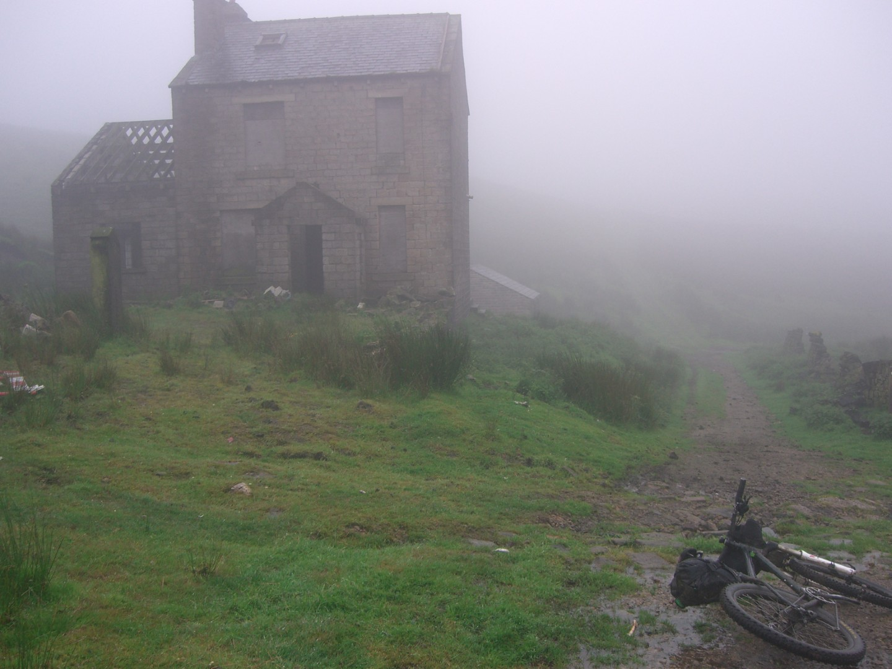
  <figcaption><i>An abandoned house near Diggle.</i></figcaption>
</figure>

At Diggle, the best place name on the route, I could actually see things. It became quite urban here, especially through Uppermill where you're in the valley bottom riding past leisure centres. I didn't stop in case any one passed out due to the stench I was emitting. I was starting to tire now and at Greenfield I made a navigation error. There is a signpost that points straight across the road but I missed it and followed the one that sends you down the road towards Dove Stones reservoir, which is not actually on the route but is a staging post for horse riders. Half an hour later I was back on route climbing up the valley side, seriously beginning to tire after only doing about 30kms and struggling with saddle sores. It turned briefly wild again before dropping into Longdendale.

<figure style="text-align: center;">
  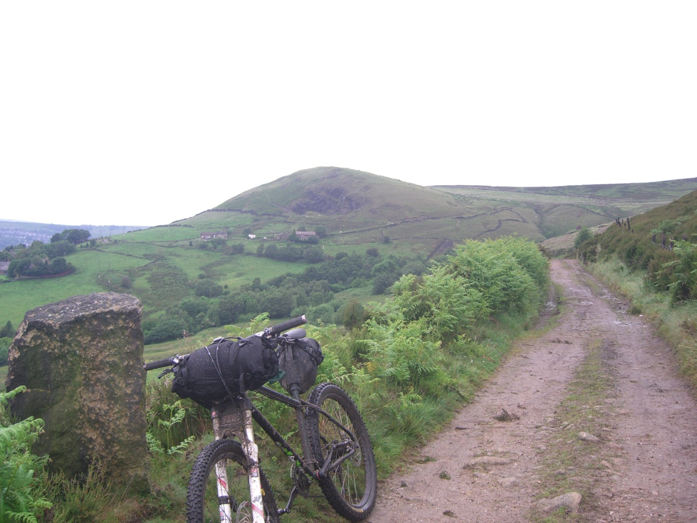
  <figcaption><i>Moor Edge Road above Greenfield</i></figcaption>
</figure>

I wasn't exactly sure of the route around Tintwistle and Glossop but I knew where it came out of the other side. My parents live nearby and as it was lunch time I decided to stop off to eat all their food but try and disguise it as a visit to see them. I failed. I had two egg butties and coffee. Then I fell asleep, woke up and had two bacon butties and another coffee. I then had to explain to my mum that I wanted some Vaseline to apply to my bum! I applied it myself though.

<figure style="text-align: center;">
  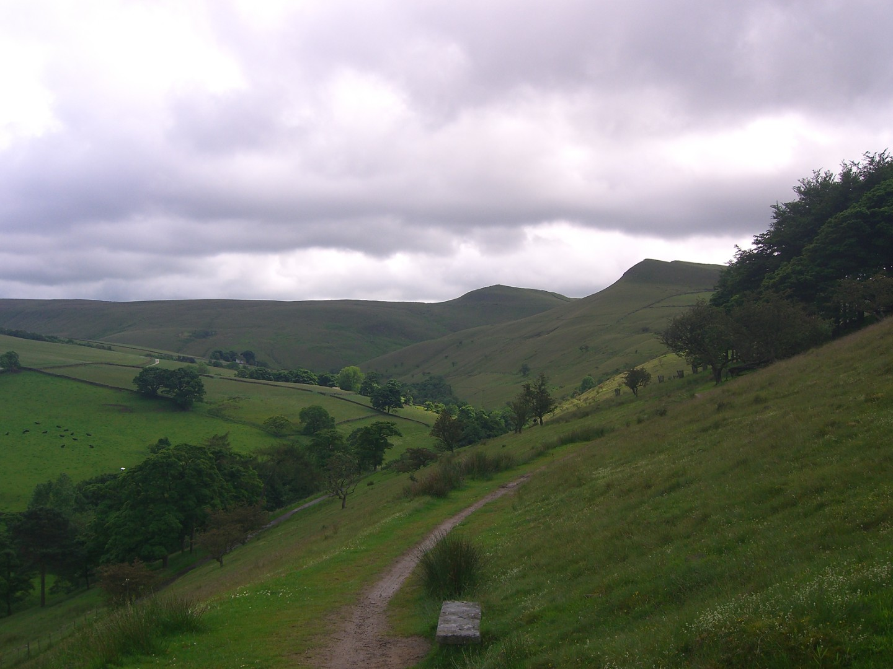
  <figcaption><i>The route to South Head on Roych Clough</i></figcaption>
</figure>

<figure style="text-align: center;">
  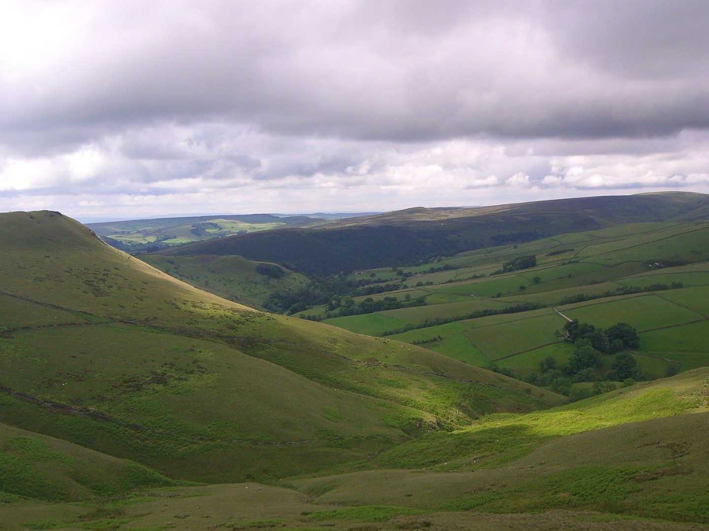
  <figcaption><i>The Peak District from Roych Clough</i></figcaption>
</figure>

At Charlesworth I left where I thought the route went, it wasn't well sign posted, and decided to climb up Monk's Road instead of what I remember as a horrible bridleway. I say climb but in actual fact I pushed it a lot of the way. I was knackered, full of food and still wishing I was asleep. I had a long stop below Lantern Pike, ostensibly to delete photos from my camera because I had run out of memory but really so I could have another rest. The blast down to Hayfield was through some of the biggest rain drops I'd ever seen and then I began the slow ascent up to South Head on Roych Clough. I was properly tired now. I was in granny gear almost everywhere, I was pushing up all of the serious hills and I still had quite a way to go. At least the sun had come out, in fact it was turning into a gorgeous day. As it turned out Rushop Edge was the end of the interesting riding, except the descent and view into Cheedale. From Rushop Edge onwards the countryside was beautiful, especially in the sun, but the riding was boring. I left the Pennine Bridleway at the A515, opting not to follow the converted railway line that is the High Peak Trail for 25km of mind numbingly boring riding and instead ride on the road for 20 km to a friends house, a shower and a descent bed. Thanks Dan and Cath and thanks for the lift to the station.

<figure style="text-align: center;">
  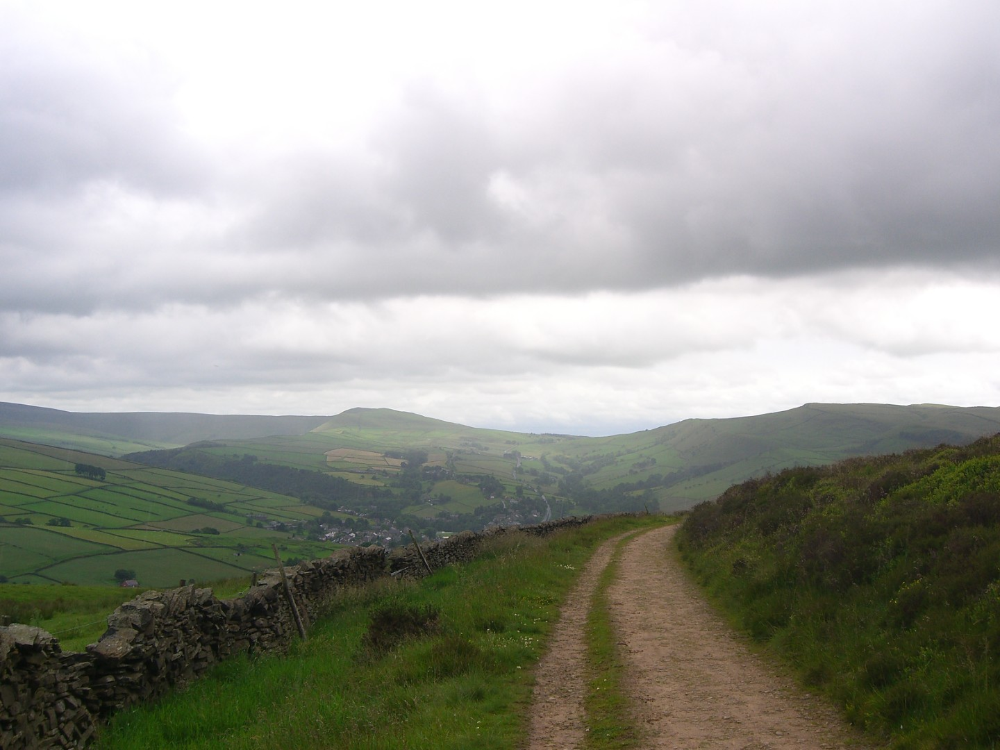
  <figcaption><i>Hayfield from Lantern Pike</i></figcaption>
</figure>

Start 07.20am, finish 8.44pm. Lots of stopping everywhere, including at least an hour and a half at my parents house. The dining room floor was very comfortable to sleep on.

Ride 8.10 hrs

Distance 103 km

Av 12.6 km/hr My average would have been a lot slower if I'd stopped at Rushop Edge. All the roads afterwards really increased my average from what I'm sure was the slowest of the three days.

Max 68.6 km/hr

Smell factor - off the scale. The worst smell came from my socks which had now been wet for three days but because of the heat from my feet there had been an accelerated growth rate of whatever was living in there. Luckily Cath has no sense of smell so when I turned up at her house she didn't have to feign politeness and pretend I smelled nice. I think she's also a bit deaf because I knocked twice and she claimed not to have heard. Maybe she does have a sense of smell and she was delaying the inevitable. Anyway, she gave me toast and boiled eggs and a clean towel, so I can't complain. I bet Dan would have answered the door first time though. Having said that, he does have a very keen sense of smell and would probably have refused me entry.

PS. Maxxis 2.4 Ardent tyres don't fit in the V slot of bike racks on trains and 710mm bars don't fit in the bike compartments on trains either. They do make a steel hardtail really comfortable though.

PPS. Take chamois cream!

<figure style="text-align: center;">
  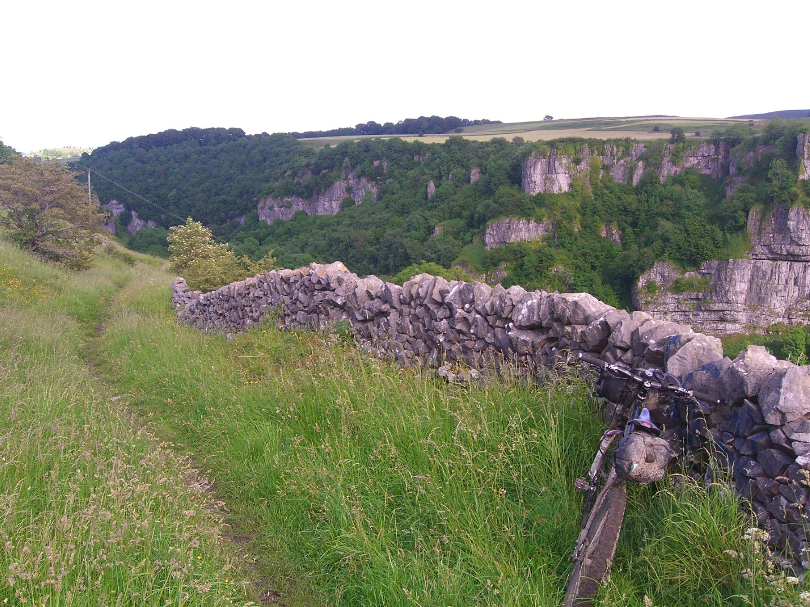
  <figcaption><i>Chee Dale</i></figcaption>
</figure>