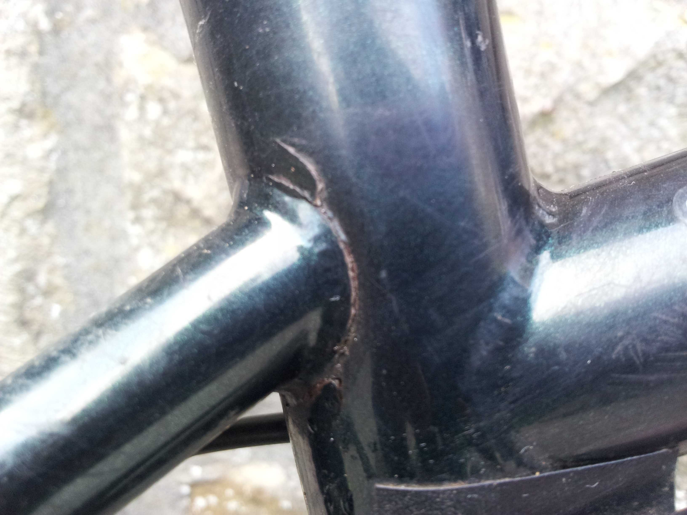

---
tags:
  - mtb
  - kit
title: The Ragley Blue Pig X is dead
description: A cracked frame spells the end of my Ragley Blue Pig X
draft: false
date: 2013-03-13
author: Tompkins Jonathan
---
Drop the van off for a service, ride home the long way on my Blue Pig on a glorious sunny day. Visit Stuart at [RCC](http://riderscyclecentre.com/) in Skipton first where he notices a crack on the seat stay / down tube weld. Bugger. Ride home gingerly.

<figure style="text-align: center;">
  
  <figcaption><i></i></figcaption>
</figure>

Luckily it was noticed 6 days within the one year frame warranty, unluckily the new frame isn't the same quality steel and doesn't have Swopout dropouts. Not sure yet what will happen.

**Update**
New frame arrived (in awful colours) with a NukeProof headset and a seatpost (which doesn't fit the frame) to bump up the price. Got my old frame rewelded by Chris Marshall.

**Another update a year later**
It died again, in the same place. The welding by Chris Marshall was still good but the steel around it failed. Not the best quality steel on the Ragleys, I wonder if the new ones are any better? I won't find out as after various test rides and lots of reading reviews I bought a Yeti SB5c, awesome bike.