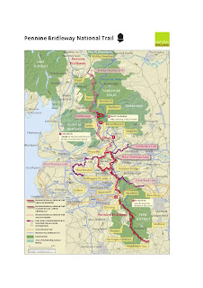
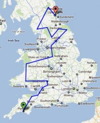

# Things to drive in 2012

Years ago I did the mountain bike Coast to Coast solo from St Bees to Scarborough, stopping in B&Bs and youth hostels along the way. I vaguely remember the Lakes bit being superb but hard and the eastern bit being a little bit boring.

A few years ago I planned a ride from Pooley Bridge in the Lakes to Malhamdale in the Dales over two days. There were 6 of us; Ian, Dan, Cath and Doug stayed in B&Bs and Stuart and I bivvied. We had perfect weather both days. Day one consisted of High Street, Longsleddale, Borrowdale (the one near the Howgills) and over the Calf into Sedbergh. This was about 70kms in 11 hours. The descent into Sedbergh was one of the best I've ever done; no gates to stop at and no walkers because it was late. I was knackered and I remember having a takeaway supper in a graveyard. Day two was much easier. We went over the flanks of Whernside to Ribblehead, offroad to Horton and then over to Malham.

That ride really got me in the mood for long distance multi day mountain bike rides and later in the year I did a 5 day tour of the Lakes with Cath. 

It was wet. 

Every day.

Last year I planned a Tour de Dales ride over 5 days with Stuart, Dan, Cath and Jim. It was the biggest loop over the best trails I could think of in the Dales and generally it was great. A lack of planning on my part led to a mini disaster though. The route over Dufton Fell to Dufton that I had wanted to do turned out to be closed due to MOD live firing and we spent a whole day searching out alternative bridleways that were generally rubbish. We found a sheep that day that was stuck in a wire fence. Jim or Dan tried to release it and they succeeded but not before they pulled a horn off and were splattered with blood. Lovely.

<figure style="text-align: center;">
  
  <figcaption><i>Pennine Bridleway</i></figcaption>
</figure>

I had big plans for this year but for one reason or another they came to nothing. So my next big ride will be the [Pennine bridleway](http://www.nationaltrail.co.uk/penninebridleway/), probably over winter as a kick start to my training. There's nothing quite like setting out on an endeavour that you know you aren't really fit enough to do to make you get your arse in gear. Luckily my parents live at the end of a long first day on the route and I live near the start of the last day, the rest I'll bivi. Some of it is boring, especially the southern start which follows old railway routes, but it traverses a big chunk of the Pennines so that makes it interesting enough for me. This will be a long ride but will only be preparation for Mr Riders plans.

<figure style="text-align: center;">
  
  <figcaption><i>EWE</i></figcaption>
</figure>

Stuart is keen on a big ride next year due to advancing age and a mid life crisis. He's seen this - [EWE](http://www.aidanharding.com/ewe/) devised by [Aidan Harding](http://www.aidanharding.com/). It stands for England Wales England and it basically covers as much of the hilly bits in England and Wales as possible and looks superb. It's not finalised yet but should be soon. The plan is to be self supported, bivvying with the occasional pub meal. The "rules" will be based on the [Colorado Trail Race.](http://www.climbingdreams.net/ctr/ctr_rules.html)

800 miles will require a certain level of fitness though. Better get training.

Non biking goals are all to do with caving. Specifically doing more. I plan to do my CIC training next year and the assessment when I'm ready, hopefully at the end of 2012.