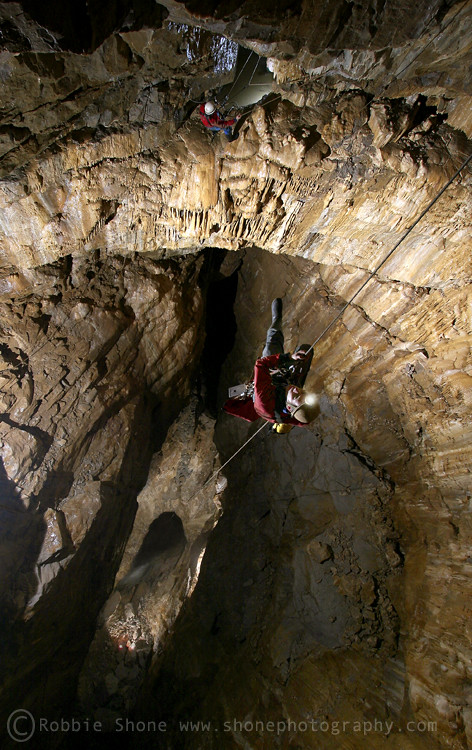
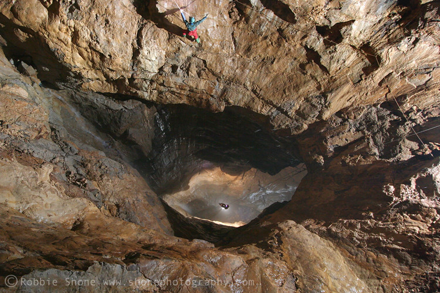

---
# Titan
**27/12/12**

**Me, Olly Rees, Henry Exon - chief driver, thanks!**

Firstly, thanks to Nigel Ball for arranging access.

Only three of us turned up, originally I think there should have been six. An early start led to breakfast at the Woodbine Cafe in Hope where we met Nigel who produced a hand drawn topo of the route from Titan to Speedwell. He was entering Speedwell to visit some water level data loggers and there was half a plan to meet up and exit via Speedwell. With only three of us and no possibility of an exchange this wasn't going to happen.

Personally I think the first pitch is the most impressive, purely because it shows the determination and resolve of the diggers who decided to excavate the 50 metre entrance pitch. At the bottom a short stoop leads to a window near the top of the Titan shaft. Rigging this is straight forward although a little daunting if you don't like big drops and don't trust your gear, Olly! Plus, if you're less than 5 foot 8 then you may struggle to reach the Y hang above the massive single bolt. Don't be tempted to go off the single bolt as the rope will rub. It's a massive drop here and an impressive place, pity my light wasn't really good enough to show it to me.

80 metres later you arrive at the Event Horizon where there is a hanging rebelay that isn't as bad to rig as had been made out. Another 60 metre drop sees you land at the boulder choked floor. The stream falling down the last pitch didn't appear to be in flood but most of the bottom half of this pitch was wet from it, plus there is some water dribbling down from the rebelay. 

Once we had regrouped at the bottom we climbed down through the choke and followed Nigel's survey for a while. When I say followed, I mean we remembered as much of it as we could as we'd left it in the car. When I say we, I mean Olly and Henry had left it and I couldn't remember any of it.

The prussik back up was hard work and wet on the first pitch; not a place to be if you are unfit, and I was definitely tired by the top.

It's a great trip but personally I'll only go again when I have a light that can do the place justice. I have a Petzl Duo with a [Custom Duo](http://www.customduo.co.uk/Pages/cdshop.aspx) insert and whilst it's very good for most of my caving it doesn't light up Titan. I'll have to get a [Rude Nora](http://www.littlemonkeycaving.co.uk/Pages/RudeNora.aspx) for that. Don't go unless you are proficient in SRT on big pitches, are fit and know how to do mid rope rescues. This is not the place to get stuck or drop some kit!

There are some excellent [Robbie Shone](https://www.flickr.com/photos/robbieshone) photos on Flickr. Both photos below are from Robbie Shone.

<figure style="text-align: center;">
  
  <figcaption><i>Titan</i></figcaption>
</figure>

<figure style="text-align: center;">
  
  <figcaption><i>Lower part of Titan</i></figcaption>
</figure>