---
tags:
  - Wales
  - bikepacking
  - wildcamping
  - mtb
title: Welsh 550 bikepacking trip
description: A bikepacking trip on the Welsh version of the Highland 550 devised by Mike Raine
draft: false
date: 2024-09-05
author: Tompkins Jonathan
---
# Welsh 550 bikepacking trip
**September 2024**

A Welsh version of the Highland 550 devised by Mike Raine - [https://www.walesbikepacking.co.uk/post/the-welsh-550-cylchdaith-cymru](https://www.walesbikepacking.co.uk/post/the-welsh-550-cylchdaith-cymru)

Overall I really enjoyed it, despite the headwind for the first week and despite numerous items breaking. The route does need some tweaking though and I didn't do the full route in the end as I missed out the Gower Penninsula.

<figure style="text-align: center;">
  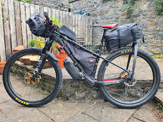
  <figcaption><i>Spot Rocker loaded up</i></figcaption>
</figure>

<figure style="text-align: center;">
  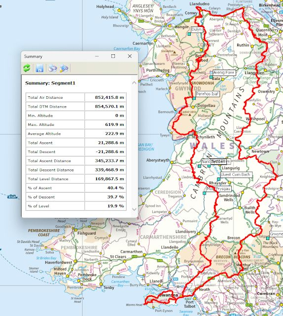
  <figcaption><i>The route.</i></figcaption>
</figure>

 
## Day 1 Rhyl to Conwy mountain.

**44.6km, 3hr 17min, 365m elevation**

A delayed start by a day due to an unexpected visit to the dentist. Today was mostly tarmac cycle path from Rhyl into a strong headwind. With wall to wall holiday caravans from Rhyl it wasn't quite my idea of a mountain biking bikepacking trip although Llandudno was nice with some great buildings and the Great Orme is a nice diversion, the sandy track  after it isn't though. It was forecast to rain after 7ish, with high winds later on and I couldn't find a hostel or campsite. Luckily I found a perfect sheltered wildcamp on Conwy mountain behind a massive wall just before it rained. Just before the campsite my bike computer mount broke. At first I wasn't sure how to fix it but luckily my Tailfin top tube bag is just the right width to hold the computer in place.

<figure style="text-align: center;">
  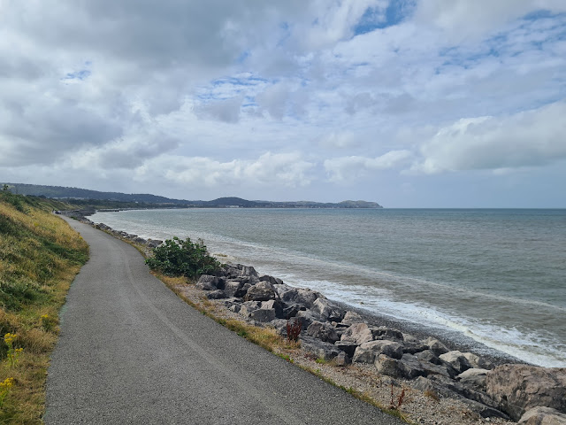
  <figcaption><i>North Wales coast path</i></figcaption>
</figure>

<figure style="text-align: center;">
  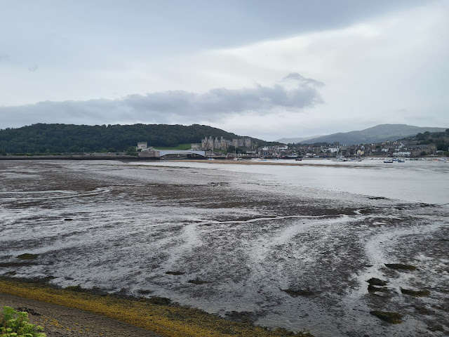
  <figcaption><i>Conwy</i></figcaption>
</figure>

<figure style="text-align: center;">
  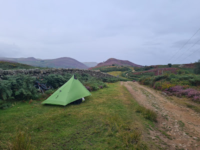
  <figcaption><i>Conwy Mountain wildcamp</i></figcaption>
</figure>

## Day 2 Conwy Mountain to Cae Adda near Trawsfynydd. 

**77km, 6hr10m, 1454m elevation**

Not so sheltered after all. I was camped next to a wall which should have protected me from the forecast wind and at first all that happened was a lot of tent flapping. I got up once to check the pegs but everything was fine. I wasn't getting much sleep, even with ear plugs in and then I got even less when the pole snapped in two places. I wrapped the tent fabric round me like a funeral shroud and waited for daylight. 

Getting changed and packing bags in a collapsed tent in high winds is fun. Eventually everything was sorted and I set off with my duvet jacket, hat and full waterproofs on. It was forecast an easterly and I was heading south overall but it was still hard going. At least it wasn't raining and the sun eventually came out. 

<figure style="text-align: center;">
  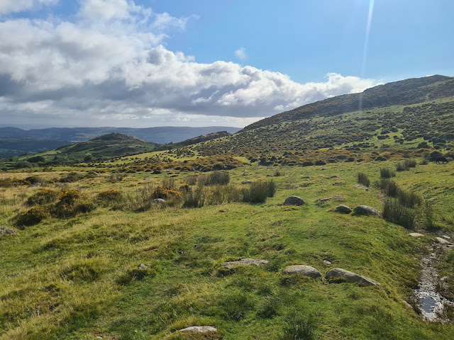
  <figcaption><i></i></figcaption>
</figure>

I have a metal widget on the front of my bike which keeps my bar bag away from the steerer tube. It has worked well on the last trip but now I noticed that it was bending and the bottom part was very close to my steerer tube, if it rubbed the steerer severely enough it would be the end of the frame. I had to remove it but that meant I was then missing a steerer tube spacer. Not a disaster, having confirmed it with an emergency call to John. So, ride gingerly off road down hill, past the 12th Century St Celynnins Church (which would have made a great bothy stop!), get to the road and head to the bike shop in Llanrwst. I wasn't getting very far this morning.

<figure style="text-align: center;">
  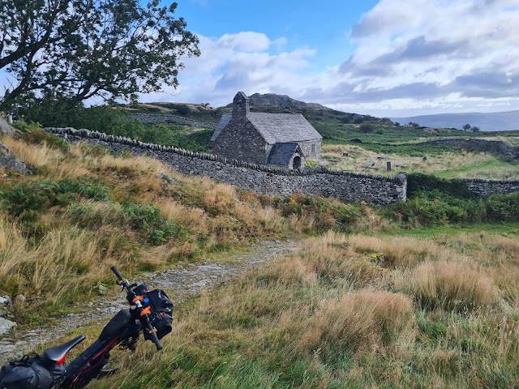
  <figcaption><i>St Celynnins Church</i></figcaption>
</figure>

<figure style="text-align: center;">
  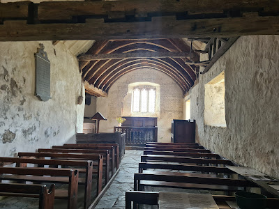
  <figcaption><i>Would have been the perfect accommodation last night!</i></figcaption>
</figure>
 
The bike shop in Llanrwst had what I needed, there was a cafe next door with outside seating, the sun was out and they let me charge some batteries. Perfect, it finally felt like summer. Just need a trekking pole for my tent now. The road climb out of Llanwrst was at least 20% in places, all for a little bit of bridleway at the top, most of which was too narrow and overgrown to be worth it. In a way I was lucky that my tent pole had broken last night because today I was going near Betws-y-coed where I successfully bought a pole at Alpkit.

<figure style="text-align: center;">
  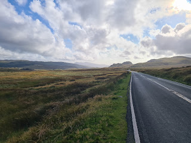
  <figcaption><i>Carreg y Foal gron</i></figcaption>
</figure>

<figure style="text-align: center;">
  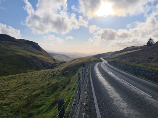
  <figcaption><i>Carreg y Foal gron</i></figcaption>
</figure>

The road climb out of Penmacho was brutal, at least 15% with a strong headwind. I resisted the lure of a room at The Cross Foxes cafe & bunkhouse and instead went to Cae Adda campsite, just in time as it was going dark. The sign said full but they always let cyclists and walkers on. I had to modify the new pole to make it shorter but the tent went up successfully, until it ripped near the apex. Bugger.

<figure style="text-align: center;">
  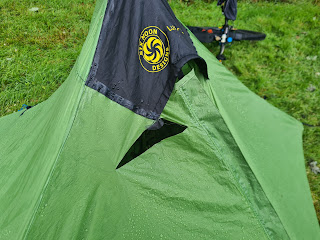
  <figcaption><i>A less than optimum situation.</i></figcaption>
</figure>

## Day 3 Cae Adda to Gwerniago campsite near Machynlleth. 

**66.2km, 5hr 44min, 1317m elevation**

A decent night's sleep and the rain didn't seem to come through the hole in my tent although the groundsheet doesn't seem to be as waterproof as it used to be. The forecast has improved to less rain and not windy. A grey start, overcast with occasional showers and a light breeze. Chamois cream applied, not too much as I don't want a repeat of the infamous LEJOG incident where I felt like I was sloshing around in my own juices. Undercarriage is happy and I've only taken two Imodium as a precaution. Legs don't seem to ache.

<figure style="text-align: center;">
  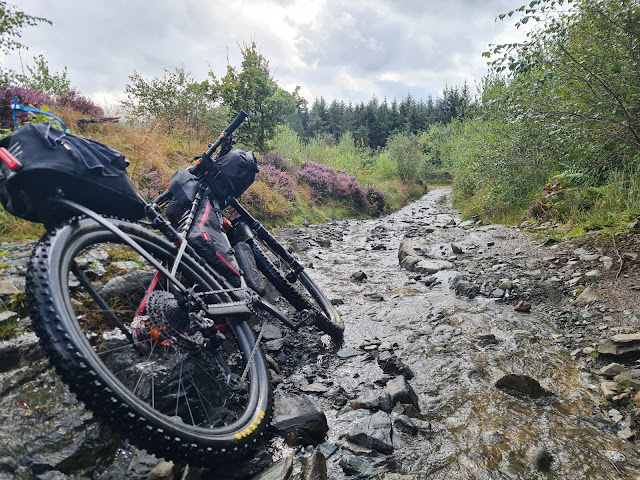
  <figcaption><i>Sarn Helen</i></figcaption>
</figure>

After a pleasant climb to above Coed-y-Brenin the route joins part of the Sarn Helen, infamous for being unrideable in places and even impossible to find. Here it was just a rocky river. The climb over Mynydd Glan-llyn-y-forwyn started with a horrendously steep road, then turned into a steep, muddy, rocky push and finally a rideable forest road. Over the toll bridge at Penmaenpool, resist the urge to have a pint at the George III pub, have lunch in a sunny spot along Afon Mawddach and then pootle on towards Arthog along the Llwybr Mawddach trail. The initial climb out of Arthog is a horrendous push, it shouldn't be on the route, especially as there's a suitable short road climb nearby. Once you join the Sustrans 82 to go over to Llanegryn it's superb; awesome views over to Barmouth and all rideable. 

 <figure style="text-align: center;">
  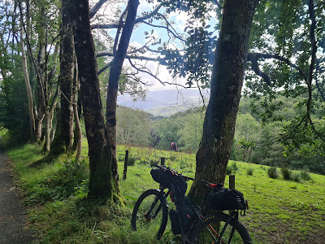
  <figcaption><i></i></figcaption>
</figure>

<figure style="text-align: center;">
  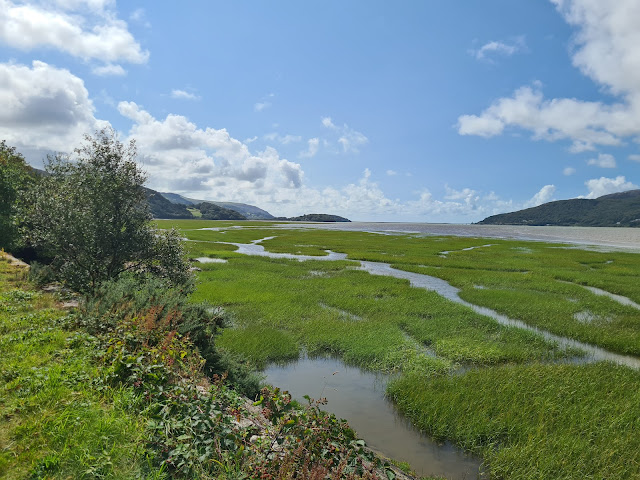
  <figcaption><i></i></figcaption>
</figure>

<figure style="text-align: center;">
  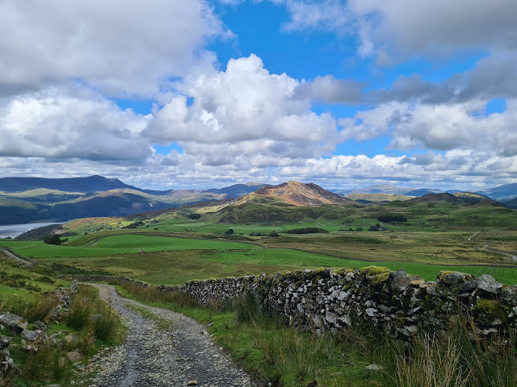
  <figcaption><i>Mawddach Valley</i></figcaption>
</figure>

<figure style="text-align: center;">
  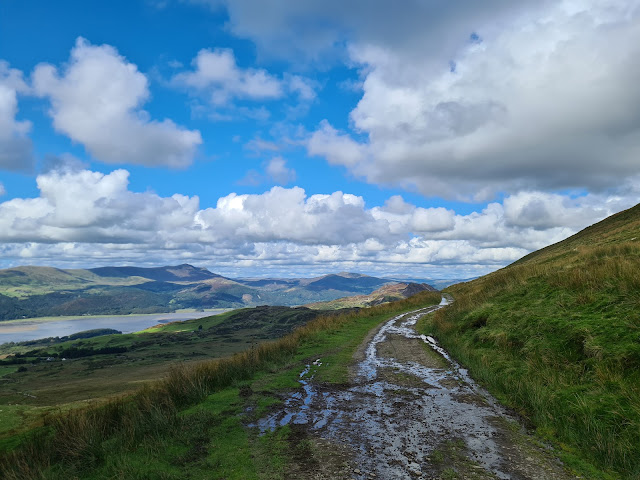
  <figcaption><i></i></figcaption>
</figure>

The Rhyd-yr-onen station on the narrow gauge railway would make a good cheeky bothy stop but I was carrying on towards Machynlleth. The track from Brycrug over to Machynlleth is also superb, really technical in places in a great location. Wildcamp locations looked a bit thin and as it was forecast wind and rain tonight I opted for Gwerniago campsite just outside Pennal near Machynlleth. I managed to blag a shopping bag from the campsite owner and fashioned a tent condom to keep me dry.

<figure style="text-align: center;">
  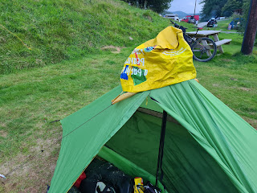
  <figcaption><i>Tent condom</i></figcaption>
</figure>

## Day 4 Machynlleth to Devil's Bridge.

**45km 4hr 30min moving, same time stationary! 1250m elevation gain**

The tent condom worked. Had a few thunder and lightning bursts overhead late yesterday evening and a massive downpour but the condom held true, plus the tent didn't rip any further. The dog food bag that I put underneath the groundsheet also helped. Undercarriage and legs are happy, had some more Imodium, less on the precautionary side this time. The weather doesn't seem as bad as forecast, it's damp but not lashing it down.

The climb out of Machynlleth avoids Glyndwr's Way at the start and goes up another brutal 20% road climb, I guess Glyndwr's Way is even worse. It joins it later on and is a great track, rideable, slightly technical in places, nice views and easy to follow, except for the short section where you have to fight through bracken as the path disappears. 

<figure style="text-align: center;">
  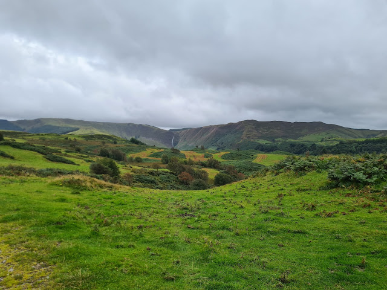
  <figcaption><i></i></figcaption>
</figure>

<figure style="text-align: center;">
  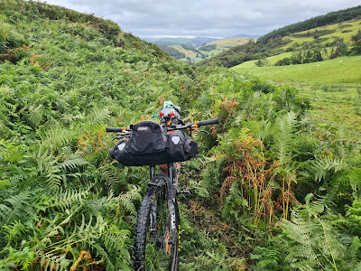
  <figcaption><i>Perfect riding conditions.</i></figcaption>
</figure>

Around Pen-y-Darren it feels remote and wild, lots of really steep hills and good tracks. It was incredibly windy by now and I hunkered down in some woodland to eat a family pack sized malt loaf, without feeling sick afterwards! Soon after came the Chute on Mach 3, which was a horrible push. The whole section over to Nant-y-Arian was great, long and wild. Very slow going though.  At the Nant-y-Arian cafe I had a large pie, three Bakewell slices and still felt hungry.

<figure style="text-align: center;">
  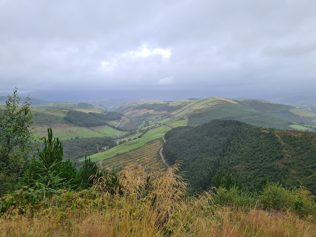
  <figcaption><i></i></figcaption>
</figure>

<figure style="text-align: center;">
  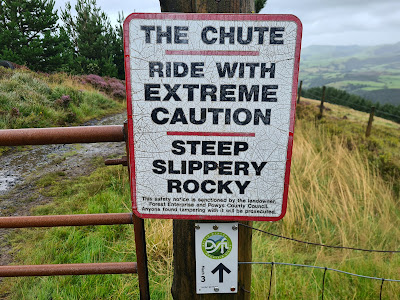
  <figcaption><i>Would have been nicer to ride down it rather than up.</i></figcaption>
</figure>

There was a cracking single-track descent to Afon Rheidol followed by a wide but only mid calf deep river crossing. Unfortunately the climb up the other side went up the steepest  mining incline I've ever been on. If I'd known I would have ridden down the road instead. Super slow and pointless. I was cursing Mike Raine at this point.

<figure style="text-align: center;">
  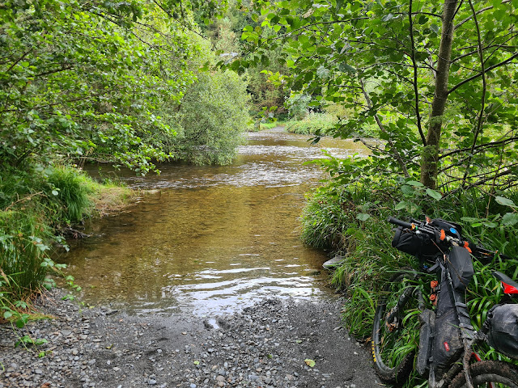
  <figcaption><i>Afon Rheidol</i></figcaption>
</figure>

It was getting near five o'clock and I'd hardly make any progress today. The forecast was too windy for a remote wildcamp so I diverted off the route slightly to a campsite at Devil's Bridge.

## Day 5 Devil's Bridge to Mynydd Myddfai
**89km, 7hr 47min, 2075m elevation gain**

TL,DR - Rode all day in perfect weather over superb tracks. Rescued a one eyed dog called Bonny.

This route seems to often include bridleways at the expense of having a sensible route. Today's start looked like it went up and down hills just to include a bridleway so I diverted round to get to the climb up to Claerwen Reservoir. This was perfect; C road up hill with a tailwind, good gravel track across the hills to the dam in a fantastic position.

<figure style="text-align: center;">
  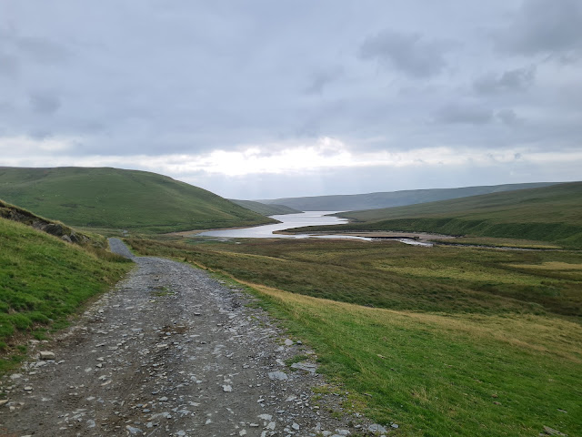
  <figcaption><i>Claerwen Reservoir</i></figcaption>
</figure>

<figure style="text-align: center;">
  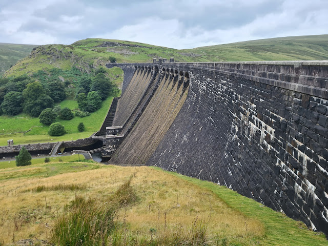
  <figcaption><i>Claerwen Reservoir dam</i></figcaption>
</figure>

The route out of Claerwen valley over Carnau to Llanwrtyd Wells was also superb but completely different. Moorland single-track, sometimes there, sometimes not, sometimes perfect rideable single-track, sometimes a boggy mess.

<figure style="text-align: center;">
  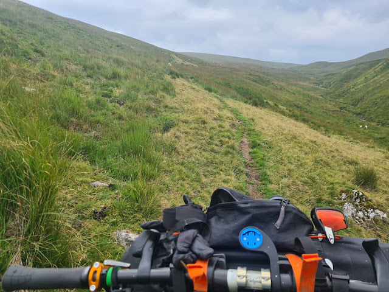
  <figcaption><i>Towards Carnau</i></figcaption>
</figure>

After Llantrid Wells it was a pleasant pootle along C roads and forest tracks. This is where I found Bonny, a one eyed sausage terrier daschund hound thingy. She was very placid and friendly and was just sat down, probably tired. There was a phone number on her collar tag but I had no signal. After calling out and getting no response I picked her up, balanced her on my legs and freewheeled downhill. Up hill was harder, I had to stand her on the front bag, hold onto her and push. It would have helped if she'd been less like a limp bean bag and actually put some effort in. After a few kilometres I luckily found her house and the owner turned up just as I was about to leave. She'd run off on a walk apparently and he'd been looking for her for hours.

<figure style="text-align: center;">
  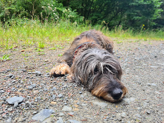
  <figcaption><i>Bonny</i></figcaption>
</figure>

## Day 6 Mynydd Myddfai to Swansea

**58km, 5hrs, 900m elevation gain**

A slow start today. Getting off Mynydd Myddfai involved a slow ride across grass and a slower three kilometre descent through bracken and gorse. I should have turned around but I felt committed. 

<figure style="text-align: center;">
  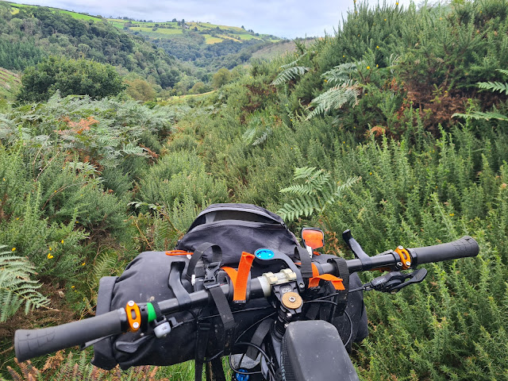
  <figcaption><i>A bit more traffic would help.</i></figcaption>
</figure>

<figure style="text-align: center;">
  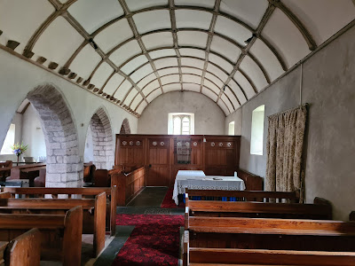
  <figcaption><i>Llanddeusant Church</i></figcaption>
</figure>

After a pleasant visit to St Simon & St Jude Church in Llanddeusant with it's unusual ceiling I had to cross the Brecon Beacons. This involved a one hour push up to Carreg yr Ogof. I was again cursing Mike Raine but once on the top it was all worth it. The route headed south east towards Disgwylfa and eventually down towards Dan-yr-Ogof showcave (unfortunately closed). Typical moorland single-track, not always rideable but in a superb setting. The descent was awesome. Then it was just an easy ride along Sustrans 43 to Swansea.

I'm definitely starting to feel it now, it feels like I've had a headwind all week.

<figure style="text-align: center;">
  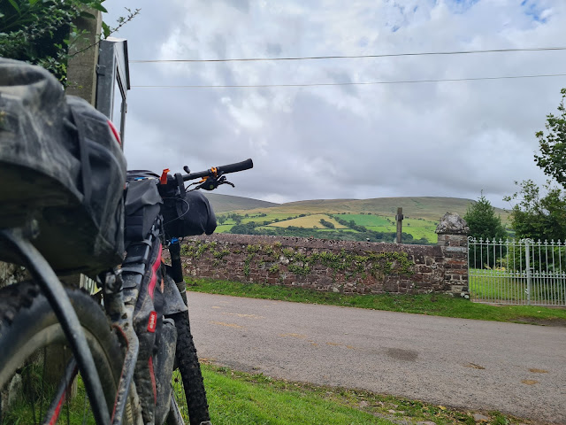
  <figcaption><i></i></figcaption>
</figure>

<figure style="text-align: center;">
  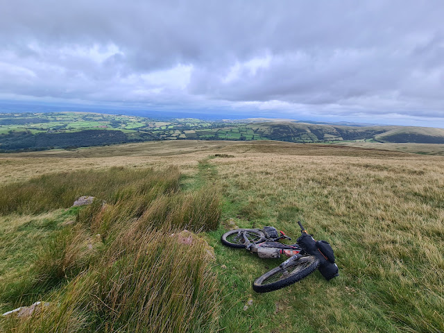
  <figcaption><i></i></figcaption>
</figure>

## Day 7 amble round Swansea

The "official" route does a 80km ish loop round the Gower Penninsula but once I got up I just couldn't be bothered, it was mostly road anyway. Instead I had a pleasant bimble around the harbour, went to see the castle, did some stretching, went to the cinema, had a great Chinese meal and got bitten by bed bugs in the hostel.

<figure style="text-align: center;">
  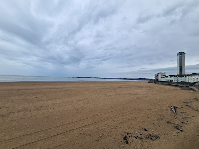
  <figcaption><i>I didn't go for a swim</i></figcaption>
</figure>

<figure style="text-align: center;">
  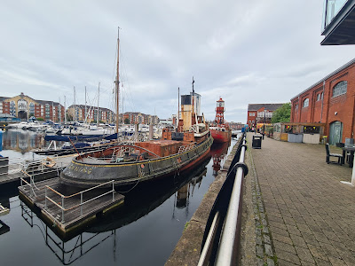
  <figcaption><i></i></figcaption>
</figure>

<figure style="text-align: center;">
  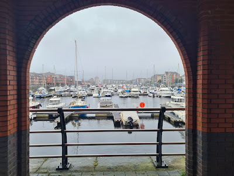
  <figcaption><i></i></figcaption>
</figure>

<figure style="text-align: center;">
  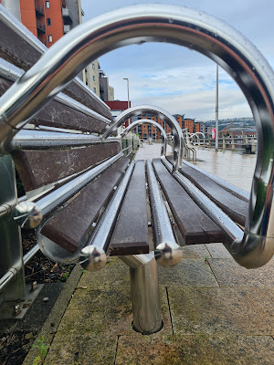
  <figcaption><i></i></figcaption>
</figure>

<figure style="text-align: center;">
  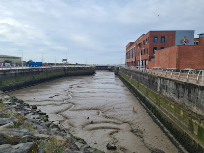
  <figcaption><i></i></figcaption>
</figure>

## Day 8 Swansea to Talgarth

**102km, 1550m elevation, 7hr 40min riding**

An easy start to the day; follow Sustrans 4 out of Swansea, then Sustrans 47 and 46 along the picturesque Neath Canal and past Neath Abbey, who knew? Easy riding so far, basically flat and traffic free. Bit of road climbing up to Hirwaun and down to Gellideg then leave the Sustrans route 46 and join the Taff Trail, a tarmac old railway gently rising up to Pontsticill (which has the most beautiful water treatment works I've ever seen). Quick stop at the Old Barn Tea Room a bit further on after a stress free 65km with perfect weather the whole way. I did struggle to leave the cafe, I kept ordering extra drinks and an ice cream to delay leaving.

<figure style="text-align: center;">
  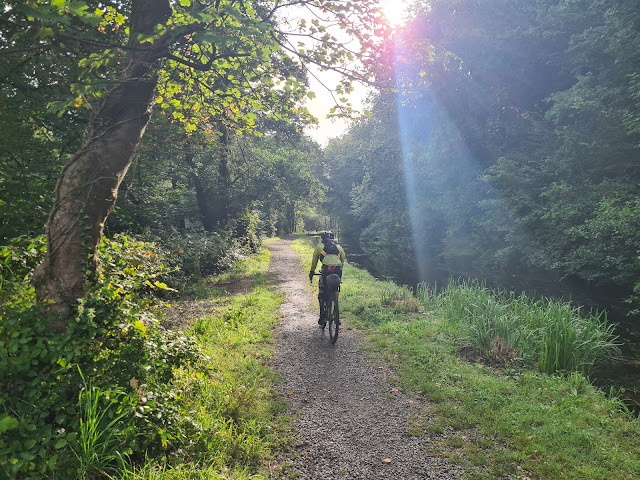
  <figcaption><i>Neath Canal</i></figcaption>
</figure>

<figure style="text-align: center;">
  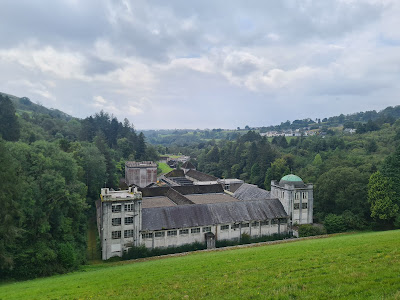
  <figcaption><i>Pontsticill water treatment plant</i></figcaption>
</figure>

From here the old Roman road through the Gap near Fan y Big is a classic and must do. Perfect for bikepacking; there's a lot of road climbing initially, the off-road climbing is only about 3.5km at an easy gradient with a good line available. The descent down the north side is rockier and feels longer, plus the whole setting is just superb.

<figure style="text-align: center;">
  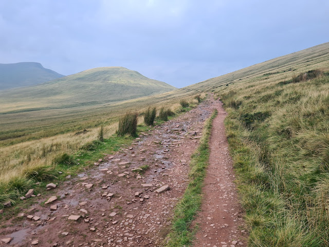
  <figcaption><i>Gap road ascent</i></figcaption>
</figure>

<figure style="text-align: center;">
  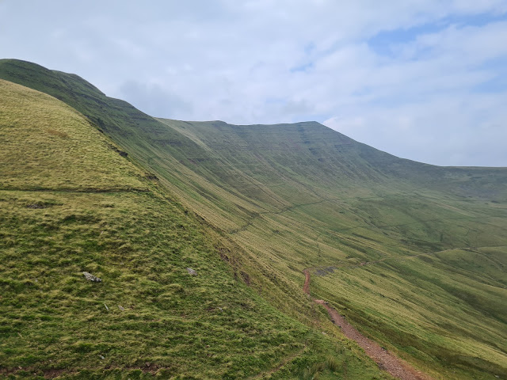
  <figcaption><i>Gap road north side</i></figcaption>
</figure>

Lots of easy riding today so I made good progress and carried on through Brecon (the cathedral is a real gem) and went to a campsite in an orchard that brews it's own beer and cider near Talgarth. [Sombremesa Drinks](https://www.sobremesadrinks.co.uk/) at [Lower Porthamel](https://www.lowerporthamel.co.uk), highly recommended. Glad I had a rest day yesterday, legs felt great today. 

<figure style="text-align: center;">
  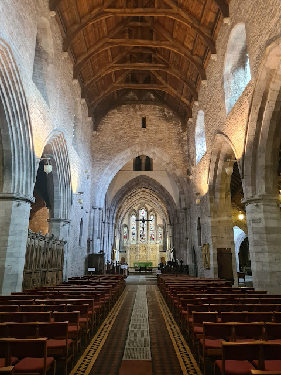
  <figcaption><i>Brecon Cathedral</i></figcaption>
</figure>

## Day 9 Talgarth to Knighton

**60km, 5hr 35min riding, 1527m elevation**

A quick pootle down to Glasbury and a very leisurely breakfast at the Paddlers Rest - two bacon butties, two coffees and a scone. Chatted to a young French bloke who was riding to Bangor on his gravel bike, loved British pubs and was appalled at the price of coffee.

Glorious weather today, sunny, warm and only a gentle breeze. Lots of C roads and sunken bridleways over rolling farmland after Glasbury, grassy moorland over The Roundabout (the name of a hill apparently). Red Hill and Glascwm Hill was like the North Yorkshire Moors and Little Hill to New Radnor was the land of thankfully dry farm tracks but thousands of gates, more gates than kilometres I reckon.

<figure style="text-align: center;">
  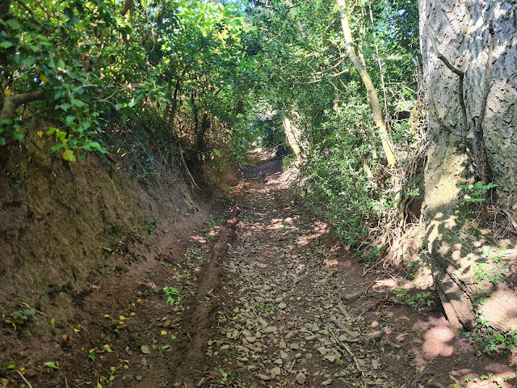
  <figcaption><i></i></figcaption>
</figure>

<figure style="text-align: center;">
  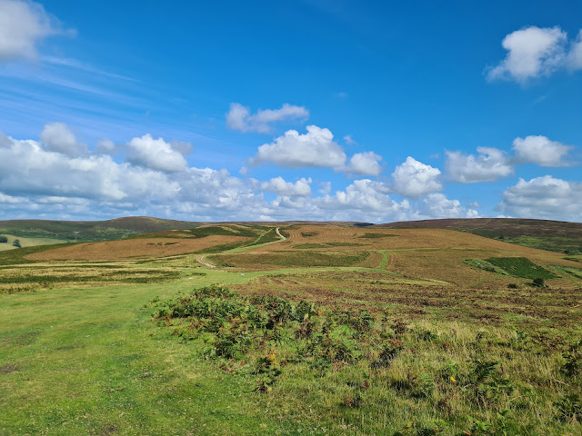
  <figcaption><i>Near Glasbury</i></figcaption>
</figure>

<figure style="text-align: center;">
  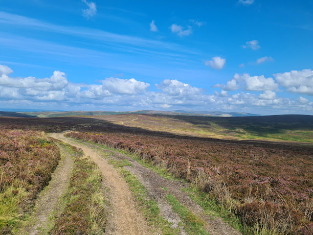
  <figcaption><i></i></figcaption>
</figure>

New Radnor is tiny, only 327 people but it's got a pub and a shop. Turns out the community has bought the pub and it's been renovated and the shop was closed. Luckily a local turned up and it was his sister who ran the shop. He needed food, I needed food so he called his sister and she came and opened it early. In the mean time he gave me a piece of banana cake a client had given him and two of his mother's homemade Welsh cakes, one of the best things I've ever eaten. Once again I ate a bit too much in one go and had to wait awhile before I could ride. In fact I totted it up: I had a Welsh cake, small pork pie, banana, another Welsh cake, banana cake, 450ml greek yogurt, blueberries, 110ml ice cream and a pear juice drink. 1700 calories. Possibly a tad too much. The massive push up the hill afterwards wasn't nice.

Just a really pleasant day's riding with lots of leisurely breaks, no real trail fighting required.

<figure style="text-align: center;">
  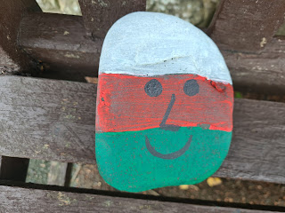
  <figcaption><i></i></figcaption>
</figure>

## Day 10 Knighton to Llanfair Caereinion

**76km 5hr 35min riding, 1450m elevation**

I really should have made the effort to dry my tent yesterday. It was sopping when I put it up  and there was a lot of condensation this morning. The forecast was for sun in the morning but of course that only appeared after I'd packed my tent away and then promptly disappeared when I set off later. At least I made the effort to eat some porridge this morning, which I've been lugging around since the start. Just as I was about to leave my bike computer started playing up, plus I had to rejig the route to avoid a stupid height loss. By the time that was fixed the snack shack at the campsite was open so I had a double espresso and another homemade Welsh cake. Two hours forty five minutes from getting up to leaving, a personal worst.

Legs still seem to be happy, which I'm surprised about. I'm definitely not as strong as at the start but a lot of that is due to the less than perfect sleep, judging by the ever increasing bags under my eyes. Undercarriage is fine, which is quite remarkable considering I've only got one pair of bib shorts which have been washed once in Swansea. Between showering when on campsites and religious use of chamois cream (Bum Butter to be precise) I don't get any problems. At least my cycling top is merino which never really smells, I think. I've not noticed anyone taking a step back when I enter a shop, maybe everyone in Wales is exceptionally polite.

Took two semi precautionary, semi needed Imodium. I'm sure you're all pleased to read about that again.

After a short warmup on the road it was up and along Offa's Dyke but not in the wall to wall sunshine that the Met Office forecast, it was overcast and quite chilly. By Kerry's Ridge it had brightened up enough for the tent to come out at a picnic spot. Only 2000 calories this time and half of that were banana chips. I only meant to have a few whilst doing Wordle but finished the lot. Luckily there was less volume than yesterday's epic consumption so I felt ok. Left the lunch spot in warm sunshine and went past the noisiest wind turbine farm I've been through. At least a third weren't working, they were all rusty and sounded like they were about to explode. Past the shop in Caersws, headed to Llanfair Caereinion which I think is the last shop till Rhyl, which is max two days away. Found a campsite nearby because it's all farmland round here and difficult to wildcamp. 
 
No exciting riding today but it was pleasant with lots of small hills, quiet C roads and tame bridleways.

## Day 11 Llanfair Caereinion to Carrog

**58km 5hrs 1500m elevation**

Misty and damp all day. My body has given up today. I'm pushing up roads which I'd normally ride. Had a snooze on a bus stop bench and felt a bit better. Finished early in Carrog and got some intel from the campsite owner / farmer about mtb routes for tomorrow. I'm going to remove all the pointless bits and just get to the good stuff.

<figure style="text-align: center;">
  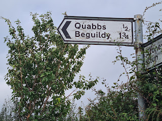
  <figcaption><i></i></figcaption>
</figure>

## Day 12 Carrog to Rhyll

**53.6km, 3hrs 20min,  407m elevation**

During my well deserved meal and pint in The Grouse last night I'd carefully rejiged today's route. After getting up and setting off in the rain and low cloud that plan went out of the window. I followed roads to Ruthin for a coffee and cake, briefly looked at the castle and then set off to Rhyll via the castle in Denbigh, the fantastic cathedral in St Asaph and the castle in Rhuddlan. Zero enthusiasm for wet, slow bridleways today.

<figure style="text-align: center;">
  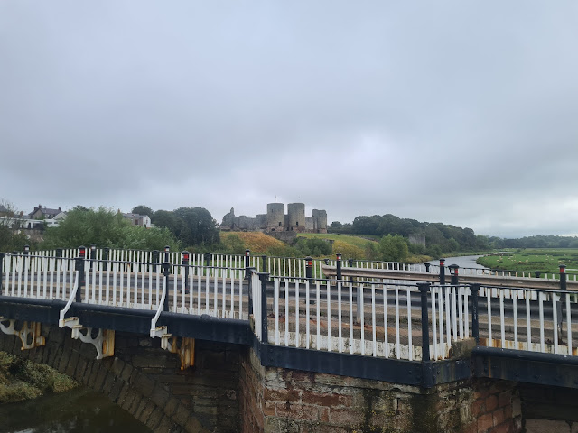
  <figcaption><i>Ruddlan Castle</i></figcaption>
</figure>

<figure style="text-align: center;">
  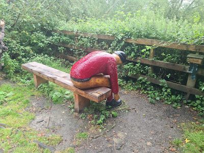
  <figcaption><i></i></figcaption>
</figure>

Overall it's a route that is worth doing and goes through some awesome scenery and great places. It does feel harder than the Highland 550 but that's because it's constantly up and down. Often this is to avoid an A or B road, or take a smaller C road than the one you're already on. Personally I think this spoils the route a bit as it's not always easy to make progress. There are also some avoidable pushes. The Highland 550 has two avoidable flat pushes but all the others seem to serve a point, they are usually the connection between two great sections of riding. The Welsh 550 feels like it has some pushes just because they are a bridleway and are trying to avoid a road. The Highland 550 has lots of good estate tracks which get you to awesome places and riding and you often feel like you are quite remote for a long time. The Welsh 550 is more broken up, just due to the nature of Wales. To be really good I'd consider cutting out Swansea and the north coast which involves a lot of road / cycle track riding but then it wouldn't be a tour of Wales I guess.