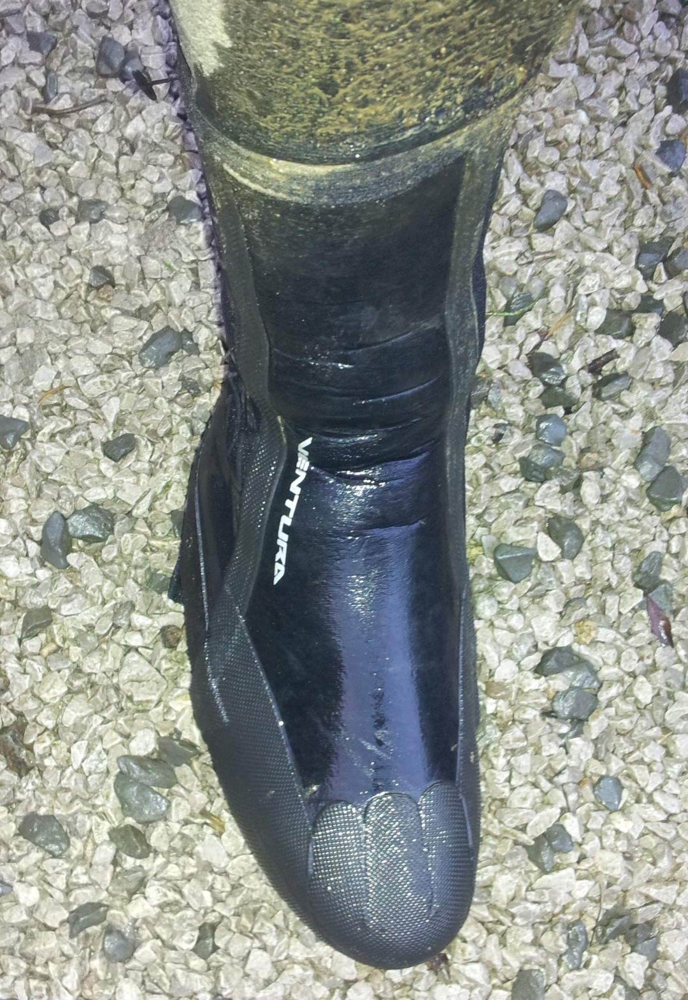
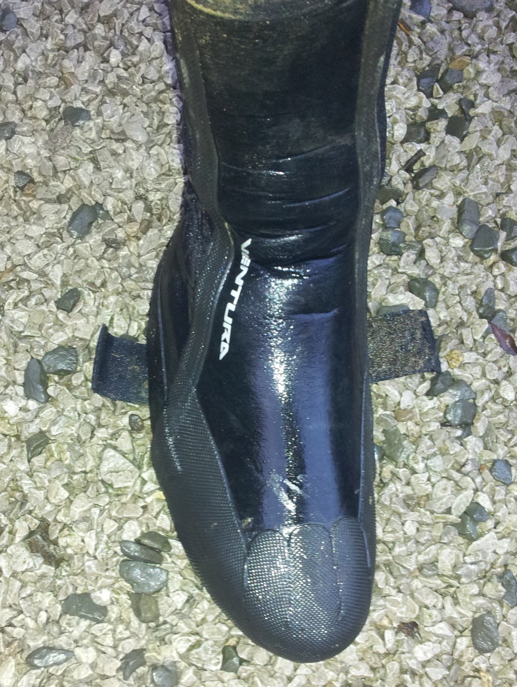
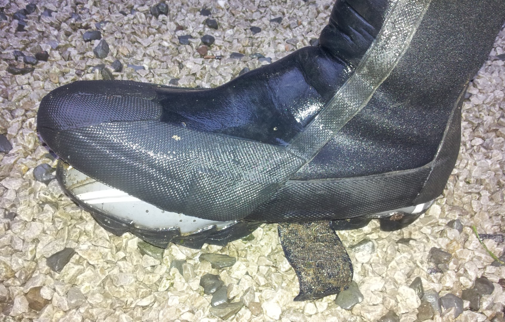
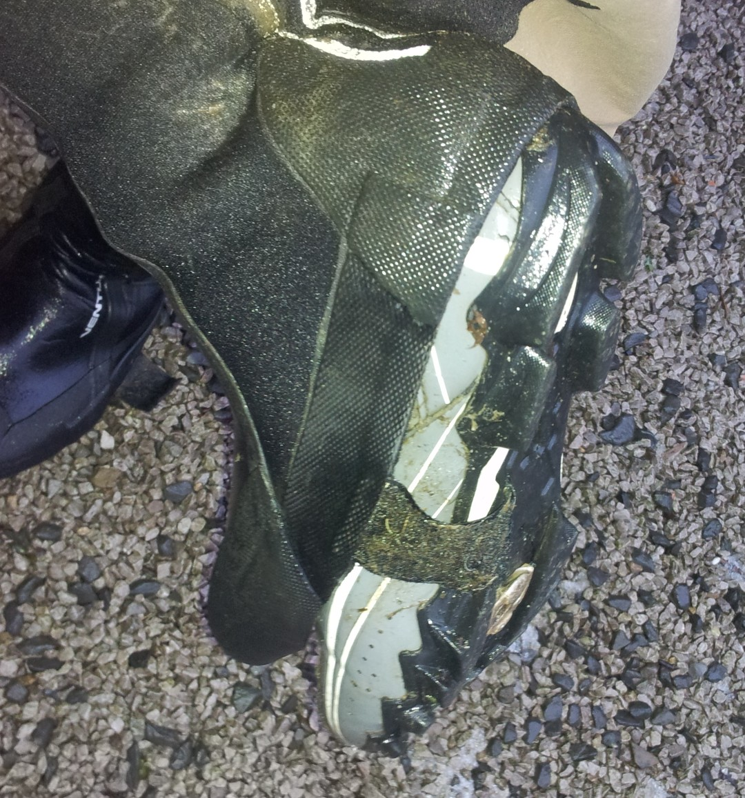
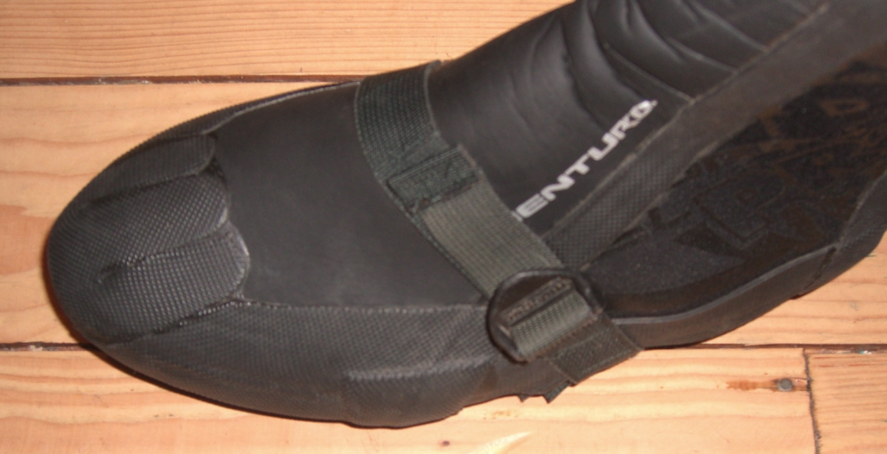
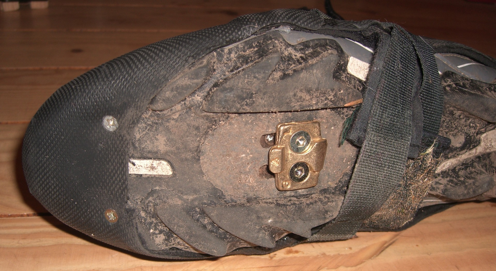

---
tags:
  - kit
  - mtb
title: Why velcro on overshoes is rubbish.
description: Velcro & mountain biking don't mix
draft: false
date: 2012-01-09
author: Tompkins Jonathan
---
As with [gloves](http://jonathantompkins.blogspot.com/2011/11/why-velcro-is-rubbish-on-mountain-bike.html), as with overshoes. My overshoes are great for mountain biking in winter except when you have to get off and walk.

<figure style="text-align: center;">
  
  <figcaption><i>This is how it should look.</i></figcaption>
</figure>

<figure style="text-align: center;">
  
  <figcaption><i>Then the velcro comes off</i></figcaption>
</figure>

<figure style="text-align: center;">
  
  <figcaption><i>Then the front comes off.</i></figcaption>
</figure>

<figure style="text-align: center;">
  
  <figcaption><i></i></figcaption>
</figure>

<figure style="text-align: center;">
  
  <figcaption><i>And then it's useless.</i></figcaption>
</figure>
So I'm going to sew a strap to the velcro that will go over the top of the shoe and fasten with a buckle. Seems like a good solution to me but there must be a reason why nobody does it!

<figure style="text-align: center;">
  
  <figcaption><i>The solution: 1 - a strap over the top.</i></figcaption>
</figure>

Didn't work! Well it sort of did but it didn't stop the front coming off all the time. So I've also added two screws to the front to keep it on.
<figure style="text-align: center;">
  
  <figcaption><i>The solution: 2 - two screws in the front.</i></figcaption>
</figure>

