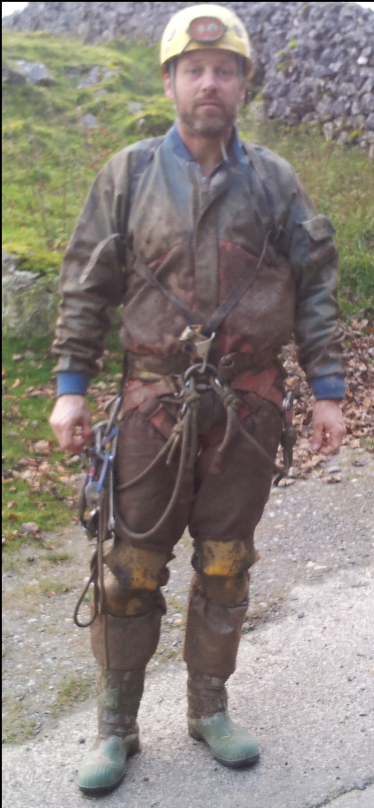
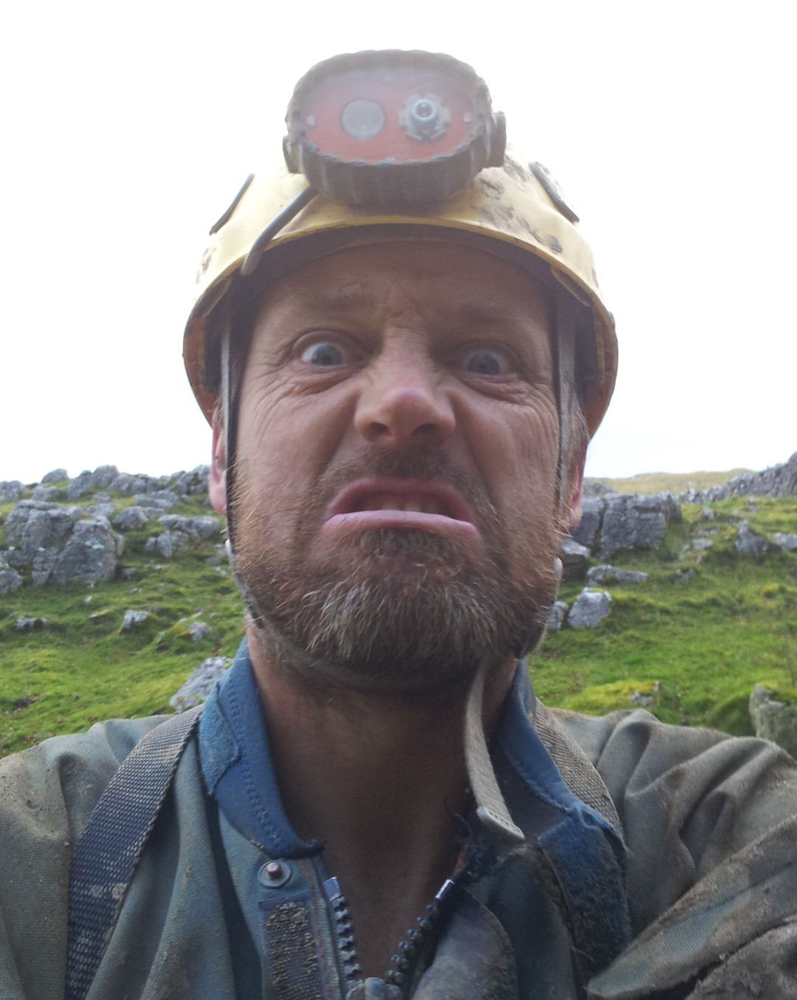

# Wizard's Chasm - Thursday 25th October 2012

**Jonathan Tompkins, Henry Exxon**

Great name for a cave, not a great cave, but definitely worth a visit.

The cave has some wonderful formations in easily accessible positions and because of fear of damage due to clumsy cavers the exact location isn't published. Luckily a friend knew I wasn't a numpty so told me the grid ref for the entrance. A bit of research [online](http://ukcaving.com/board/index.php?topic=13045.msg167947#msg167947) mentioned iffy belay points, dodgy naturals, spits and talk of getting so muddy that jammers wouldn't jam.

Turns out none it was true, or we were happy with the belay points, didn't use naturals and took our srt kit off before crawling through the mud. The mud does deserve a special mention as it reminded me of caving in Derbyshire again; maybe it's actually the longest cave in the UK and ends up under Derbyshire? Luckily it's not particularly gloopy, it's actually quite sticky. It was with my cordura suit, not sure Henry would agree in his banana suit.

The entrance pitch is easily free climbable but a loop at the top to pull on and maybe stand in is useful. Had to use my spits for the entrance, glad I bought them now! A short, awkward crawl brings you out to the head of the second pitch which has two bolts of an unusual variety and a spit to provide a y hang that still rubs. Very strange setup and the perfect place to test Henry's second hand 8mm string. It's nice and light, and grips well in a Petzl Stop despite being outside the recommended diameter but it doesn't half go twang when it rubs on rock! For well bolted, p hangered caves only I think.

The base of this pitch is a large cavern with lots of break down and roof fall. And mud. And some more mud. In fact, most of the mud in Yorkshire is in this cave although some of it is now in my garage forming a rock hard crust on my suit. We had a quick look up Sandstone Pass where there is a unusually flat dry river (it's calcite on mud), before heading off to the main attraction. At the end of this chamber / passage there is a short crawl and a pitch to get to the Blue Room but you can avoid it by crawling down a hole in the floor. Through mud. And some more mud.

We decided to ditch the srt kit at the end of this passage, partly because the tales of jammers not jamming put me off and partly because we didn't have another rope although we did have a ladder. There are some very nice straws and stalagmites in this chamber but they actually turn out to be the least impressive stuff in the cave.  Lots of crawling through mud, squeezing through tight bits caked in mud and referring to the survey and covering it in mud later brought us to Red Stal Chamber. Unsurprisingly this had some red stalagmites in it, and very nice they are to. Still not the best thing in the cave though.

Next up was a look at Y.S.S. rift because it looked fantastic on the survey. Hmm, those surveys can be deceptive sometimes. It's a narrow rift, with mud all over it of course, and an electron ladder jammed in it. Judging by the survey no one has been to the top but I suspect it doesn't really go anywhere. Interestingly the ladder had some calcite on it, as did the big knot at the end of the insitu rope. Never seen that before.

We turned around and headed for the Blue Room. After more walking, crawling and squeezing through and over and under muddy constrictions we found it. And very impressive it was too. I'd never seen such a vivid blue calcite layer before, almost looked like it had been photoshopped. I'd come back for photos except I'm rubbish at photography and there's a lot of mud.

We were at the far point of the cave now and to get back involved retracing our steps, and mud. We hoped we could take a shortcut and so went to have a look at the base of the third pitch. It looked short and free climbable, if chimneying up smooth walls plastered in mud in a muddy suit and pulling on half detached blocks is your idea of free climbable. I had a quick look and thought better of it and I also tried to put Henry off but he obviously thought I was soft and decided to give it a go. After a bit of indecision he made it, only to find that just out of site was the rest of the pitch, a vertical, smoothed walled phreatic tube. That was the least of his worries though as he had to get back down. I was also worried, he had the car keys. Then I realised that most likely he'd fall off trying it and then I'd be able to easily retrieve the keys. Henry was so worried that he used our belts as a makeshift sling but luckily for me he made it safely meaning I didn't have to deliver his car to Jill without Henry in it.

<figure style="text-align: center;">
  
  <figcaption><i>Wizard's Mud</i></figcaption>
</figure>

Back at our kit we briefly thought about climbing back up the second pitch and using a jammer as protection, mostly because we didn't want to get our srt kit muddy when putting it back on. We soon abandoned this idea and a good job we did as it would have been a hard climb. I've never hung by one jammer on a belt and attempted to put a harness on and I don't want to.

<figure style="text-align: center;">
  
  <figcaption><i>Angry Wizard</i></figcaption>
</figure>

All in all a good trip and well worth the mud. I think sections of the cave need taping off to avoid damage and I might do it when Henry goes back for photos.

Don't go if you're a clumsy buffoon.